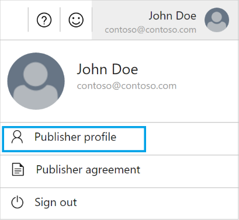
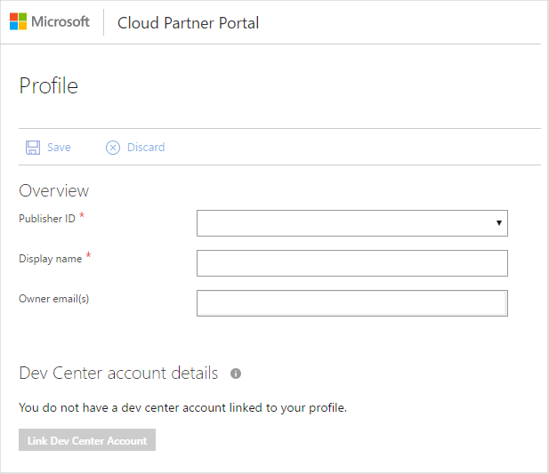
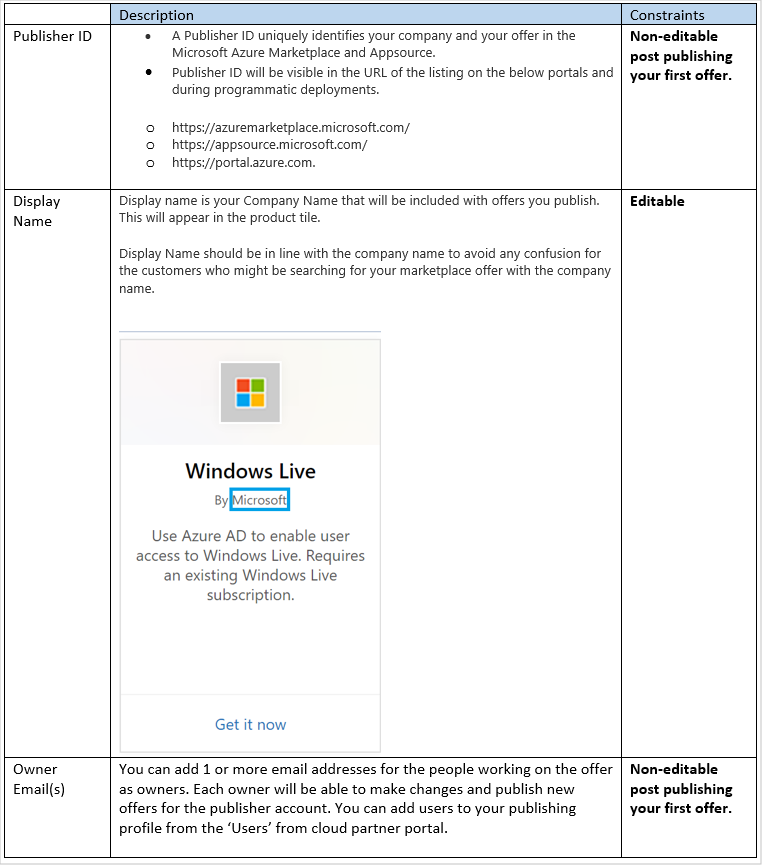

# Manage your Azure Marketplace and AppSource publisher profile

This article explains how to use the [Cloud Partner Portal](https://cloudpartner.azure.com/) to view and manage your publisher profile.  You must already be a registered Microsoft cloud partner to access this portal.  For more information, see [Get started with the cloud partner portal](../../cloud-partner-portal-orig/cloud-partner-portal-getting-started-with-the-cloud-partner-portal.md).

By this time, you've completed the steps to become an Azure Marketplace and AppSource publisher. The publisher profile is registered on the Cloud Partner Portal following approval of your partner request. Your publisher profile will apply to all the offers and SKUs published from the account used during
partner registration.

## Publisher profile

Your publisher profile distinguishes your company on the Azure Marketplace and AppSource. It consists of your publisher ID, display name, and owner email(s). A well-managed profile will increase your visibility and help marketplace users easily identify and select an appropriate offer.

> [!NOTE]
> Your publisher ID and registered owner email isn't editable once you publish your first offer. However you can view your profile and edit the publisher display name from the Cloud Partner Portal.   
> Add users (contributors and owners) to your publishing profile from the Users section on the left navigation pane from the Users Section of the Cloud Partner Portal.

### View and manage your publisher profile

To view and manage your publisher profile, from the top-right menu bar, click the **Publisher profile** tab.

Your **Profile** dialog will be displayed.

### Link your Dev Center account

You can also link your existing Dev Center account with your publisher profile on the Cloud Partner Portal.  First sign in to the portal with the same email address used to register your Dev Center account. Then your publisher profile page displays your Dev Center account status, Dev Center account owner email, and Dev Center account name.

> [!NOTE]
> Developer Center Account registration is mandatory for publishing paid market place SKUs.

If you don't have a Developer Center Account, you can create an account as described in [Register in Dev Center](https://docs.microsoft.com/azure/marketplace/register-dev-center).  Then add the registered email address as an owner on the Cloud Partner Portal for your offer. An owner can only add the registered email address to your publishing profile from the
**User** section. Then, sign in to the portal using the same email address, and link your Dev Center account.

## Next steps

You can also use the portal to [manage user accounts](./cpp-manage-users.md).
