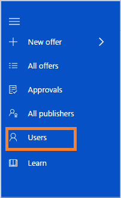
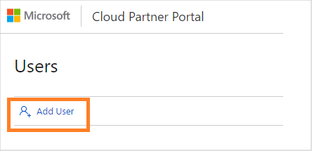
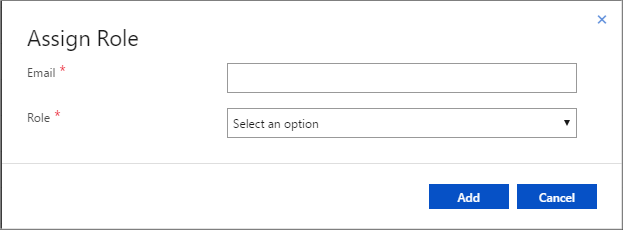
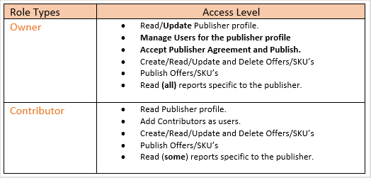
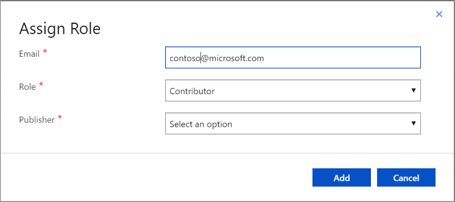

# Managing users on the Cloud Partner Portal

The [Cloud Partner Portal](https://cloudpartner.azure.com) enables you to add users with role-based access to virtual machine offers. It helps to manage access and
permissions while multiple people are working on offers.

## Add users and assign roles 

Use the following steps to add users and assign roles for offer publishing.

1. Click the **Users** tab on the left side navigation pane.

    

2. Click **Add User**.

    

3. Type the user's email address and select a role assignment.  You can add the new user as an "owner" or "contributor".

    **Email**: Add the email addresses of teammates who will be working on publishing the offer. Microsoft accounts (Outlook, Hotmail, and Live)
and organization IDs are supported.

    - Add a "team/group email alias/security group" to guard against the individual leaving the organization.
    - Ensure that email IDs provided on the Cloud Partner Portal are monitored for any communication from Microsoft.
    
    

    **Role**: Refer to the table below to identify the appropriate user role type.

    

    Only owners can access the Azure Payouts and Azure Customer tabs in [Seller Insights](../../cloud-partner-portal-orig/si-getting-started.md).

4. Select the publisher name you want to add to the new user, then click Add to complete user addition.

    > [!NOTE]
    > The "publisher names" for which your email is added as an owner or contributor will show up in the drop-down list of **Publisher** for selection.

    

## Delete an existing user

To remove an existing user, search for their email in the **Users** tab, and then press the **Delete** button on the right-hand side.

## Next steps

You can also use the portal to [manage publisher profiles](./cpp-manage-publisher-profile.md).
