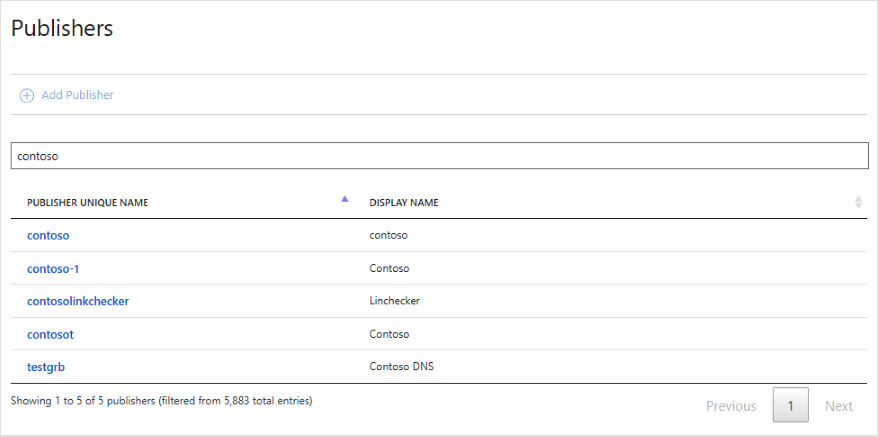
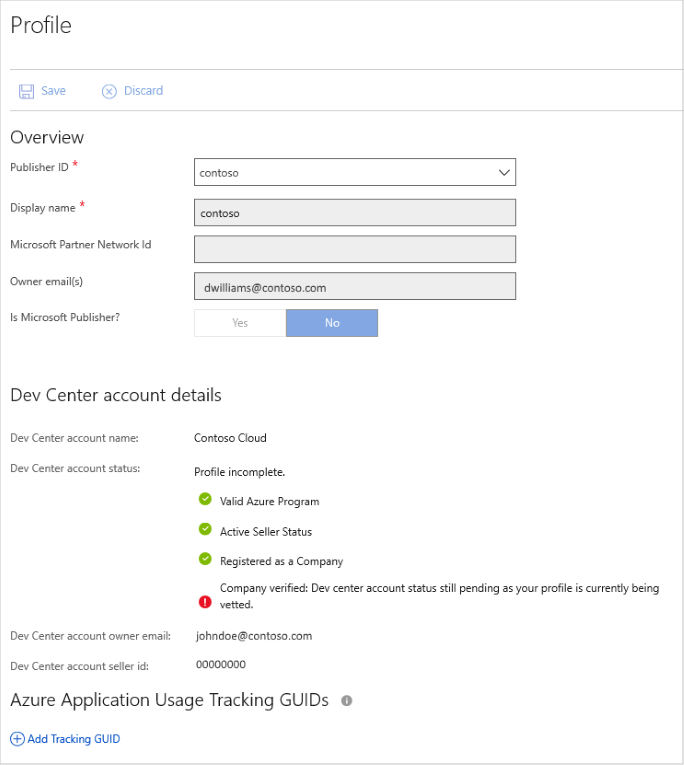

# All publishers page

The [**All publishers**](https://cloudpartner.azure.com/#publishers) page displays a list of all registered Microsoft cloud publishers, including their publisher unique name and display name. You can order the results by column or specify a string to filter the results.  This page also displays an **Add Publisher** button, but this button is only enabled for portal administrators.  Selecting a publisher in this list will display the profile for that publisher.  For more information, see [Managing Publisher Profile](./../../cloud-partner-portal-orig/cloud-partner-portal-manage-publisher-profile.md).

## Example page

The following image shows the publisher listing filtered on the string contoso`.  

Clicking on the first entry will display the profile page for Contoso.  You can only edit your own publisher profile.

## Next steps

The next navigation menubar item displays a [Users page](./cpp-users-page.md), which lists all registered users. 
