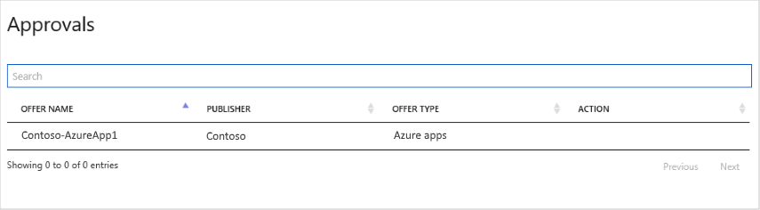

# Approvals page

The [**Approvals**](https://cloudpartner.azure.com/#approvals) page provides a list of approved offers, including the offer name, publisher, offer type, and current action.  Approved offers are either already published or in the process of being published.  The results can be ordered by column or filtered on a specified string.  The status area at the bottom of the page displays aggregate and page counts, and enables you to navigate between list pages.  Selecting an offer in this list will display that offer in the associated offer editor. 

## Example page

The following image shows the **Approvals** page for Contoso.

## Next steps

The next navigation menubar item displays an [All Publishers page](./cpp-all-publishers-page.md), which lists all the registered publishers.
