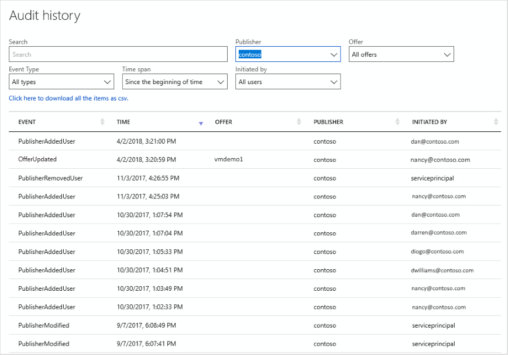

# Audit history page

The [**Audit history**](https://cloudpartner.azure.com/#history) page displays a list of the publishing events for all marketplace offers.  The columns include event type, occurrence datetime, offer name, publisher, and user who initiated the action.  The results can be ordered by column or filtered on a specified string.  This page also enables the user to download a comma-separated values (.csv) file of the current audit listing.

## Example page

The following image shows the **Audit history** page filtered on the string `contoso`.

## Next steps

The next navigation menubar item accesses the [Seller Insights](./cpp-insights-page.md) capability of the Cloud Partner Portal, which provides sets of customizable  dashboards into your marketplace offers.
