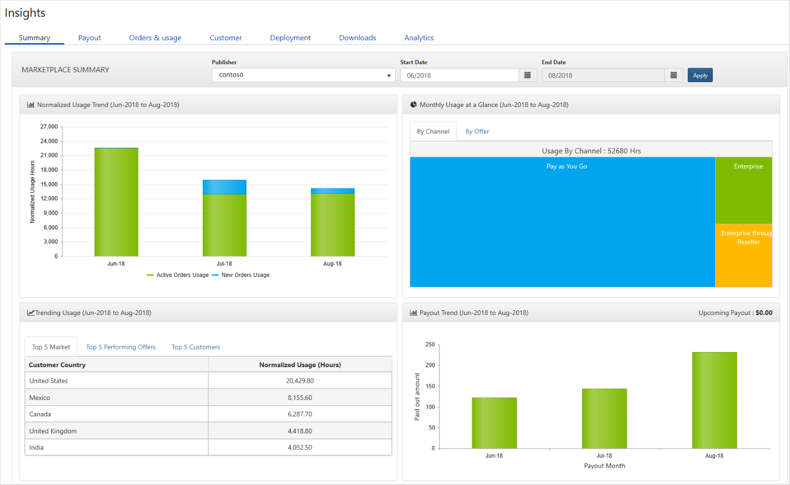

# Insights page

The [**Insights**](https://cloudpartner.azure.com/#insights) page provides the following sets of dashboards to assist you in understanding and maximizing sales of your marketplace offers.  Each dashboard is accessed through a tab of the same name along the top of the page.

|  **Dashboard**    |  **Displayed content**               |
|  -------------    |  ---------------------               |
| **Summary**       | graphs, trends, and values of aggregate data that summarizes marketplace activity for the publisher's offers |
| **Payout**        | payouts and related transactions in graphical and downloadable formats |
| **Orders & usage** | orders and usage information in graphical and downloadable formats |
| **Customer**      | customer information, including their purchasing profile |
| **Deployment**    | deployment success and failure information in both graphical and event-level formats |
| **Downloads**     | list of download requests for the last 30 days |
| **Analytics**     | summary of web analytics and analysis of campaign performance |
|  |  |

## Summary dashboard
The Summary dashboard is the first tab and is the default tab displayed when you navigate to the Insights page.  This intentional design reflects that this dashboard gives publishers the broadest view of the sales activity of their offers.  It provides graphical representations of the normalized usage trend; monthly usage; trending usage by geographical market, offer, and customer; and the payout trend.  The output can be customized by specifying start and end dates for the analysis.  The following image shows an example summary dashboard for Contoso for June through August of 2018.

## Next steps

For more information about using Seller Insights to optimize sales, see the section [Getting Started with Seller Insights](./../../cloud-partner-portal-orig/si-getting-started.md).

