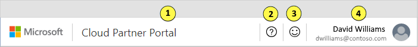
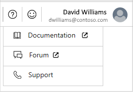
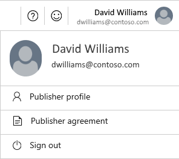

# Cloud Partner Portal navigation

There are two primary user interface (UI) mechanisms for navigating around in the [Cloud Partner Portal](https://cloudpartner.azure.com): the top menu bar and the left-side navigation pane.  These UI elements are invariant, available no matter what page on the portal you navigate to.

## Menu bar

The menu bar runs across the top of the portal site.  It has the following four active areas:

Clicking on these areas results in the following actions:

1. Title area - navigates to the portal home page.
2. **Help** button - displays the help menu, which provides resources for assisting the user.
3. **Feedback** button - displays the **Send us feedback** form.
4. **Publisher** button - displays a menu that enables the user to manage their profile.

These menus and forms are described next.

### Help menu

The **Help** menu provides resources to assist the user with the Cloud Partner Portal.

The Help menu contains the following items:

- **Documentation** - Launches a new tab in the browser and navigates to the documentation home page for the Cloud Partner Portal. 
- **Forum** - Launches a new tab and navigates to the documentation home page for the Partner Community for the AppSource and Azure Marketplaces.
- **Support** - Launches a new tab and navigates to the support page for Marketplace Publishing, where you can create an incident report.  We triage and review all feedback, and we'll always respect your privacy. We'll only contact you if you request or ask for more information.

### Send us feedback form

The **Send us feedback** form provides you with a direct method to provide feedback to the Marketplace Publisher Onboarding Team.  We'll only contact you for additional information if you've checked the **OK to contact you about your feedback** checkbox.

> [!TIP]
> If your feedback is about a specific page on the Cloud Partner Portal, please navigate to that page before clicking on the **Feedback** button.  Verify that the **Include screenshot** checkbox is selected before submitting your feedback so that your session's UI state can be captured. 

### Publisher menu

This menu enables you to manage your profile and session: direct access to your publisher profile page, view the Microsoft Publisher Agreement, or sign out of the current session. 

## Left navigation pane

A collapsible navigation pane occupies the left side of the portal.  It contains a menubar with the following items that enable partners to:

|    **Menu item**     |      **Description**                       |
|    -------------     |      ---------------                       |
|  | [New Offer menu](./cpp-new-offer-menu.md) to create new offers of the specified type. |
|  | [All offers](./cpp-all-offers-page.md) page to view all submitted offers and some of their primary characteristics. |
|  | [Approvals](./cpp-approvals-page.md) page to view all their currently approved offers. |
|  | [All Publishers](./cpp-all-publishers-page.md) page lists all the current registered cloud partner publishers. |
|  | [Users](./cpp-users-page.md) page lists all the current user accounts associated with registered cloud partners. |
|  | [History](./cpp-history-page.md) page lists the offer publishing and modification events for all publishers. |
|  | [insights](./cpp-insights-page.md) page contains the various dashboards that comprise the *Seller Insights* feature of this portal. |
|  | Launches a new tab to the documentation home page for the Cloud Partner Portal (duplicates entry in the **Help** menu). |
|   | Launches a new tab to the documentation home page for the Partner Community for the AppSource and Azure Marketplaces (duplicates entry in the **Help** menu). |
|  |  |

> [!NOTE]
> Because this menubar is periodically updated to reflect new features of the portal, the items you see may not exactly match those in the table above.

## Next steps

The next article, [New Offer menu](./cpp-new-offer-menu.md), lists the types of offers that you can create with the **New offer** menu.
