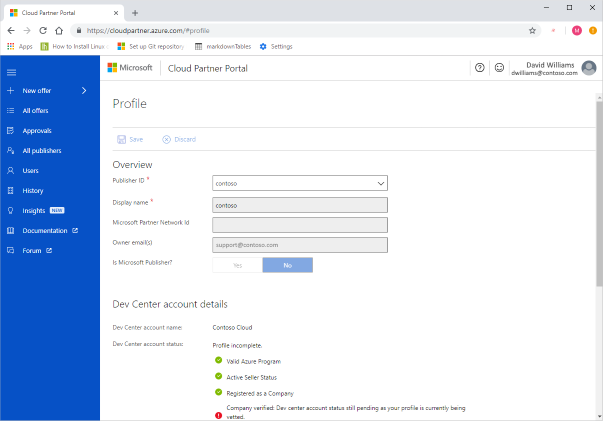

# Cloud Partner Portal Tour

This article provides an introduction to the [Cloud Partner Portal](https://cloudpartner.azure.com): its contents, navigation mechanisms, and functionality.   This portal enables registered partners to create new offers and manage existing offers for the [Azure Marketplace](https://azuremarketplace.microsoft.com) and [AppSource Marketplace](https://azuremarketplace.microsoft.com).  The Cloud Partner Portal is only accessible to registered partners; for more information, see [Become a Cloud Marketplace Publisher](https://docs.microsoft.com/azure/marketplace/become-publisher).

    (*Click on image to enlarge.*)

## Section contents

After explaining the [navigation](./cpp-portal-navigation.md) mechanisms of the portal, we will examine the primary entries in the left navigation pane in its corresponding article: 
- [New Offer](./cpp-new-offer-menu.md) menu enables users to create new offers of the specified type.
- [All offers](./cpp-all-offers-page.md) page enables partners to view all submitted offers and some of their primary characteristics. 
- [Approvals](./cpp-approvals-page.md) page enables partners to view all their currently approved offers.
- [All Publishers](./cpp-all-publishers-page.md) page lists all the current registered cloud partner publishers.
- [Users](./cpp-users-page.md) page lists all the current user accounts associated with registered cloud partners.
- [History](./cpp-history-page.md) page lists the offer publishing and modification events for all publishers. 
- [Insights](./cpp-insights-page.md) page contains the various dashboards that comprise the *Seller Insights* feature of this portal.

## Next steps

The next article, [Cloud Partner Portal Navigation](./cpp-portal-navigation.md), examines the various navigational mechanisms available on the site.
