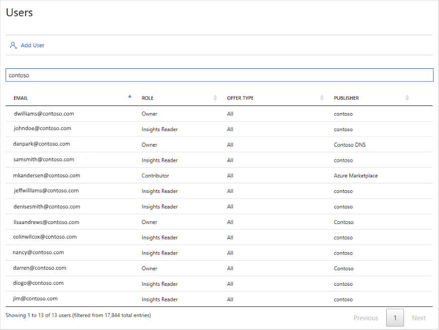

# Users page

The [**Users**](https://cloudpartner.azure.com/#users) page displays a list of all registered users of the Cloud Partner Portal.  The columns include each user's email address, portal role, offer type, and publishing organization. The results can be ordered by column or filtered on a specified string.  

This page also displays an **Add User** button for adding users to your publishing organization.  For more information, see [Managing users on the Cloud Partner Portal](./../../cloud-partner-portal-orig/cloud-partner-portal-manage-users.md).

## Example page

The following image shows the **Users** page filtered on the string `contoso`.

## Next steps

The next navigation menubar item displays an [audit history page](./cpp-history-page.md), which lists the publishing events for all offers. 
