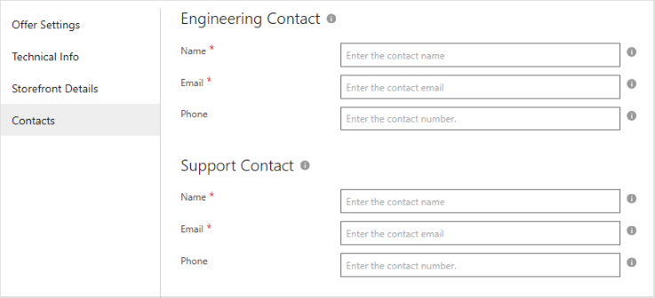

# Power BI App Contacts tab

Use the **Contacts** tab of the **New Offer** page to provide technical and user support resources for your offer. It is divided into two sections: 
**Engineering** and **Customer Support**.

## Contacts fields 

The following table describes the purpose of each field.  Required fields are indicted by an asterisk (*). 

|   Field               |   Description                                                            |
|-----------------------|--------------------------------------------------------------------------|
| *Engineering Contact* | Serves as a technical contact between AppSource and your organization.    |
| **Name\***              | The name of the person or group that serves as technical or engineering support. |
| **Email\***             | The email address of this technical contact.                                  |
| **Phone\***             | The phone number of technical support.                                       |
| *Support Contact*     | Receives support tickets opened by customers within AppSource.            |
| **Name\***              | The name of the person or group that serves as customer support.              |
| **Email\***             | The email address of customer support.                                        |
|   |   |

## Next steps

After you've completed your Power BI App offer, confirm that you've created all the associated [technical assets](./cpp-create-technical-assets.md) for the offer.
