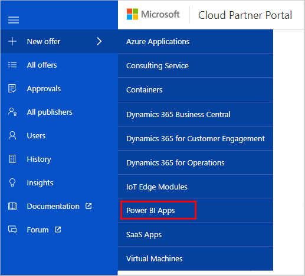

# Create a Power BI App offer

>[!Important]
>Starting March 30th, 2020, we'll begin moving management of your Power BI app offers to Partner Center. After the migration, you'll create and manage your offers in Partner Center. Follow the instructions in [Power BI app creation overview](https://aka.ms/AzureCreatePBIServiceApp) to manage your migrated offers.

This article lists the steps to follow to create a new Power BI App offer for [AppSource](https://appsource.microsoft.com). Every offer appears as its own entity in AppSource. When you create a new offer in the [Cloud Partner Portal](https://cloudpartner.azure.com/), you're required to supply four groups of assets for your offer.

The asset groups are described in the following table:

|   Asset group      | Description                                                                         |
| ----------------   | ----------------                                                                    |
| Offer Settings     | The primary identifications and the name for the offer.                                      |
| Technical Info     | The installer URL that you use to install the app in the client's Power BI workspace. For more information about how to generate this URL, see [Power BI App documentation](https://go.microsoft.com/fwlink/?linkid=2028636). |
| Storefront Details | Contains marketing, legal, and lead management assets. Marketing assets include an offer description and logos. Legal assets include a privacy policy, terms of use, and other legal documentation. The lead management policy lets you specify how to handle leads from the AppSource user portal. |
| Contacts           | Contains support contact and policy information.                                     |

## New Offer form

After you sign in to the Cloud Partner Portal, select **New Offer** in the left pane. Then, to display the New Offer form and start the process of defining assets for a new app offer, select **Power BI Apps**.

> [!NOTE] 
> If the **Power BI Apps** option is not shown or is not enabled, your account doesn't have permission to create this offer type. Check to ensure that you've met all the [prerequisites](./cpp-prerequisites.md) for this offer type, including registering for a developer account.

## Next steps

The following articles explain the tabs on the **New Offer** page for a Power BI App offer type. Each article describes the asset groups and supporting services for your new Power BI App offer.

-  [Offer Settings tab](./cpp-offer-settings-tab.md)
-  [Technical Info tab](./cpp-technical-info-tab.md)
-  [Storefront Details tab](./cpp-storefront-details-tab.md)
-  [Contacts tab](./cpp-contacts-tab.md)
