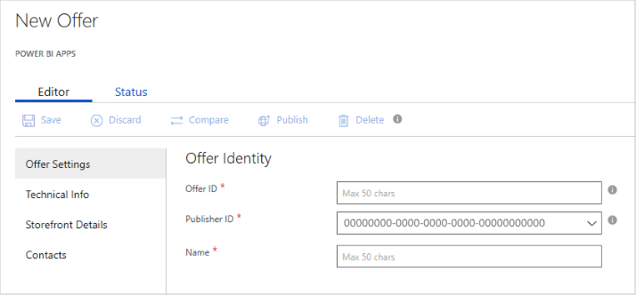

# Power BI Apps Offer Settings tab

When you open the **New Offer** page for service apps, you first see the **Offer Settings** tab. You provide the primary identifiers and the name for your offer on this tab. An asterisk (*) indicates a required field.

## Offer Settings fields 

On the **Offer Settings** tab, you need to enter information in the following required fields. Required fields are indicted by an asterisk (*).

|  Field        |  Description                                                               |
|---------------|----------------------------------------------------------------------------|
| **Offer ID\***  | A unique identifier (within a publisher profile) for the offer. This identifier will be visible in product URLs, Azure Resource Manager templates, and billing reports. The maximum length is 50 characters. It can contain only lowercase alphanumeric characters and dashes (-). It can't end with a dash. This identifier can't be changed after an offer goes live. If Contoso publishes an offer with offer ID `sample-SvcApp`, the offer is assigned the AppSource URL `https://appsource.microsoft.com/marketplace/apps/contoso.sample-SvcApp`.      |
| **Publisher\*** | Your organization's unique identifier in [AppSource](https://appsource.microsoft.com). All your offerings should be associated with your publisher ID. This value can't be changed after the offer is saved.                         |
| **Name\***      | A display name for your offer. This name will appear on AppSource and on the Cloud Partner Portal. The maximum length is 50 characters. Use a brand name that's recognizable for your product. Don’t include your organization's name here unless the app is marketed with that name. If you're providing this offer on other websites and publications, use the same name in all publications.     If you release an offer during the preview period for Power BI Apps, add the string `(Preview)` at the end of your application’s name, like this: `Sample Scv App (Preview)`. |
|     |     |

## Next steps

On the next tab, you'll specify [technical info](./cpp-technical-info-tab.md) for your offer.
