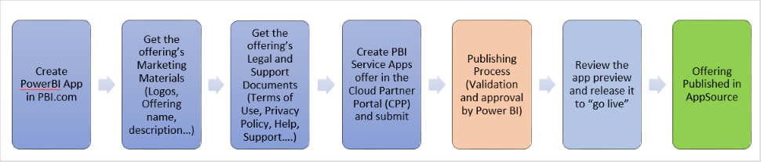

# Power BI App offer

|              |                                |
|--------------|--------------------------------|
| This article explains how to publish a Power BI App to the Microsoft [AppSource marketplace](https://appsource.microsoft.com/).  A Power BI app packages customizable Power BI content including datasets, reports, and dashboards. You can then deploy the app to other Power BI tenants via AppSource, perform the adjustments and customizations allowed by the developer and connect it to your own data. |  |

This article is divided into three main parts:

-   [Prerequisites](./cpp-prerequisites.md). The technical and business requirements for creating and publishing a Power BI App offer.
-   [Create a Power BI App offer](./cpp-create-offer.md). How to create a Power BI App offer entry by using the [Cloud Partner Portal](https://cloudpartner.azure.com).
-   [Publish a Power BI App offer](./cpp-publish-offer.md). How to submit a new offer to AppSource for publishing, and how to update an existing offer.

## Publishing steps

Here are the high-level steps for publishing a Power BI App offer:

Here's the Power BI App offer publishing process:

1. Create a template application in Power BI. This action generates a package installation URL, which represents the primary technical asset for the offer. Also at this time, promote the test package to pre-production. For more information, see [What are Power BI template apps?](https://docs.microsoft.com/power-bi/service-template-apps-overview). 
2. Collect or create the offer's marketing materials, including: official name, description, logos, etc. 
3. Collect or create the offer's legal and support documents: *terms of use*, *privacy policy*, *support policy*, user help, etc.
4. Create the offer: use the Cloud Partner Portal to configure the details of the offer, including the offer description, marketing materials, legal information, support information, and asset specifications.  After the offer is fully specified, submit it for publishing.
5. Monitor the publishing process in the Cloud Partner Portal.  During this step, the AppSource onboarding team tests, validates, and certifies your application. 
6. After the app is successfully certified, review it in its test environment and release it. 
7. The Power BI App is listed on AppSource (it "goes live").
8. In Power BI, promote the pre-production package to production. For more information, see [Manage the template app release](https://docs.microsoft.com/power-bi/service-template-apps-create#manage-the-template-app-release).

## Next steps

Before you create your Power BI App offer and publish it to AppSource, you must meet the [requirements](./cpp-prerequisites.md) for publishing a Power BI App to AppSource.
