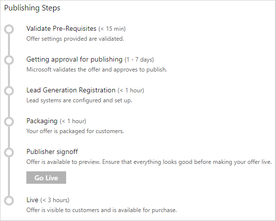

# Publish a Power BI App offer

The last step, after you've defined an offer in the Cloud Partner Portal and created the associated technical assets, is to submit the offer for publishing. To start this process, in the left pane of the **New Offer** window, select **Publish**. For more information, see [Publish Azure Marketplace and AppSource offers](../manage-offers/cpp-publish-offer.md).

## Publishing steps

These are the main steps in the publishing process:

This table describes each step and provides its estimated completion time:

|   Publishing step            |   Time     |   Description                                                                  |
| --------------------         |------------| ----------------                                                               |
| Validate prerequisites       | 15 minutes     | Offer information and offer settings are validated.                            |
| Certification                | 1-7 days   | The Power BI Certification Team analyzes your offer. The team runs your Power BI app through a manual verification test by installing the app via the provided installation URL. Primary validations are performed as part of the app certification process (described later in this document).         |
| Packaging                    | \< 1 hour  | The offer’s technical assets are packaged for customer use.                        |
| Lead generation registration | \< 1 hour  | Lead systems are configured and deployed.                                      |
| Publisher signoff            | \-         | You complete a final review and confirmation before the offer goes live. You'll also now have a link to preview your offering. After you're happy with how your preview looks, select **Go Live** on the **Status** tab. This sends a request to the onboarding team to list your app on AppSource.    |
| Live                         | \< 3 hours | Your offer is now publicly listed ("live") on AppSource, and customers can view your app and deploy it in their Power BI subscriptions. You'll also receive a confirmation email. In the right column on the **All offers** tab, you can see the status of all your offers. On the **Status** tab, you can see the detailed publishing flow status for your offer. |
|   |   |

Allow up to eight days for this process to complete. After you go through these publishing steps, your Power BI App offer will be listed in the
[AppSource](https://appsource.microsoft.com/marketplace/apps?product=power-bi%20) Power BI apps section.

### App certification process

The Microsoft onboarding team uses this process to validate your Power BI App offer submission:

1. Review legal documents and help links.
2. Validate support contact information.
3. Use the installer URL to verify proper installation.
4. Scan the app for malware and other malicious content.
5. Verify that the displayed content matches the app’s description.
6. Verify that app-related operations work as expected in Power BI. The team opens reports and dashboards with sample data, connects to custom data sources, refreshes data, and so on.

The Certification Team provides feedback if they find any issues.  For more information about Power BI app requirements, see the [Power BI app documentation](https://go.microsoft.com/fwlink/?linkid=2028636).

## Next steps

We recommend that you regularly monitor your app in the [AppSource marketplace](https://appsource.microsoft.com).  You should also use the [Seller Insights](../../cloud-partner-portal-orig/si-getting-started.md) feature of the [Cloud Partner Portal](https://cloudpartner.azure.com/#insights) to get insights about your marketplace customers and app usage. Finally, you can [update your offer](./cpp-update-existing-offer.md).
