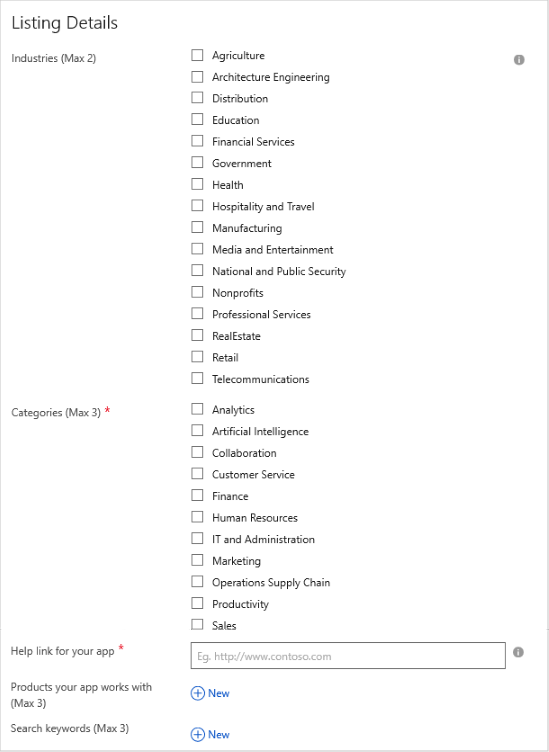
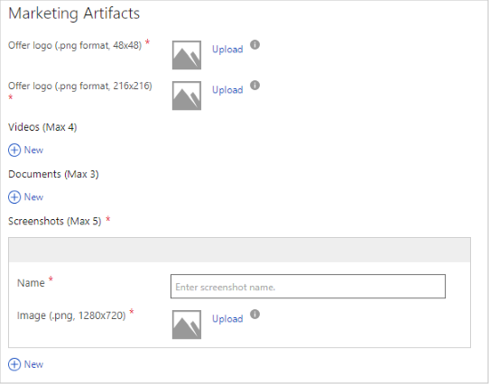
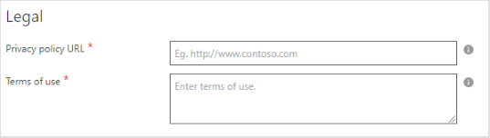

# Power BI app Storefront Details tab

On the **New Offer** page, use the **Storefront Details** tab to provide marketing, sales, and legal information for your prospective customers. On this tab you can also set up management for leads that the Azure Marketplace generates. This long form is divided into six sections: **Offer Details**, **Listing Details**, **Marketing Artifacts**, **Legal**, **Customer Support**, and **Lead Management**.  An asterisk (*) at the end of a field label means the field is required.

## Offer Details section

In the **Offer Details** section, enter general information about your AppSource offer.

The following table provides more information about these fields. Required fields are indicted by an asterisk (*).  

|   Field               |   Description                                                                           |
|-----------------------|-----------------------------------------------------------------------------------------|
| **Offer summary\***     | A brief purpose of the app, using up to 100 characters.                             |
| **Offer description\*** | A description of the app, using up to 3,000 characters. This field supports simple HTML formatting. |
|   |    |

## Listing Details section

The **Listing Details** section gathers information about the context of your app: industries where it's typically used, the app category, compatible products, and associated search terms.

To complete the fields in this section, use the following table.  Required fields are indicted by an asterisk (*).
 
|   Field                                  |   Description                                                        |
| --------------                           | ---------------------                                                |
| **Industries**                           | Select the industry where your app fits best. If your app relates to multiple industries, leave this field blank.      |
| **Categories\***                           | Select up to three categories that relate to your app.     |
| **Help link for your app\***               | Provide a URL to a page that offers online help for your app.           |
| **Products your app works with (Max 3)** | Select the **New** plus sign to create a text field. In the field, enter the name of a product that your app works with. List up to three products.       |
| **Search keywords (Max 3)**              | Enter up to three keywords that users will likely use to search for your application in AppSource. For example, if the application is called "My Emailing app," your keywords might be **emails**, **mailing**, and **mail app**. |
|  |  |

## Marketing Artifacts section

In the **Marketing Artifacts** section, upload branding and marketing materials to display on AppSource.  This section is divided into four subsections: **Logos**, **Videos**, **Documents**, and **Screenshots**. Logos and screenshots are the only required marketing artifacts. But for the best customer appeal, we recommend adding videos and documents as well.

To complete the fields in this section, use the following table. Required fields are indicted by an asterisk (*).
 
|    Field                             |    Description                                                    |
|   -----------                        |    -------------                                                  |
| *Logos*                              |                                                                   |
| **Offer logo (png format, 48x48)\***   | Upload a logo to display in the overview of the app or in app search results. AppSource supports only PNG format, with a resolution of 48 x 48 px.  |
| **Offer logo (png format, 216x216)\*** | Upload a logo to display on your app’s detail page.  AppSource supports only PNG format, with a resolution of 216 x 216 px.  |
| *Videos*                             |                                                                   |
| **Name**                             | Enter your app's name or title.                                          |
| **URL**                              | Enter the URL of a video hosted on YouTube or Vimeo.                              |
| **Thumbnail**                        | Add a thumbnail image of the app.  AppSource supports only PNG format, with a resolution of 1280 x 720 px.   |
| *Documents*                          | Add up to three documents to display on AppSource, under the **Learn more** heading.  |
| **Name**                             | Enter the name or title of a supporting document.                              |
| **File**                             | Upload a PDF file.                             |
| *Screenshots\**                      | Add up to five screenshots.                        |
| **Name**                             | Enter a name or title of a screenshot.                                       |
| **Image**                            | Upload a PNG screenshot. Its resolution must be 1280 x 720 px.  | 
|   |   |

The logos you upload to [Cloud Partner Portal](https://cloudpartner.azure.com) should *not*:

- Use a gradient. The look and feel of your logo should be flat.
- Include your company name, brand name, or other text. 
- Look stretched.

## Legal section

In the **Legal** section, provide the two legal documents required for each offer: your privacy policy and your terms of use.

To complete the fields in this section, use the following table:

|   Field                |   Description                           |
|------------------------|--------------------------------------   |
| **Privacy policy URL\*** | URL for your posted privacy policy       |
| **Terms of use\***       | Your use policy, formatted as plain text or simple HTML     |
|  |  |

## Customer Support section

In the **Customer Support** section, provide the **Support URL** for your online customer support page.  This page should provide multiple contact options, such as phone, email, and live chat. 

## Lead Management section

In the **Lead Management** section, set up your system to collect the customer leads that your AppSource offers generate. To choose your storage options for the leads, use the following table:

|    Field               |   Lead destination                               |
|------------------------|--------------------------------------            |
|  **None**              | Collect no leads. This is the default option.  |
| **Azure Blob (deprecated)** | Specify [Azure Blob storage](https://docs.microsoft.com/azure/storage/blobs/storage-blobs-overview) by using a container name and a connection string.  This choice is deprecated. Use **Azure Table** instead.  |
| **Azure Table**        | Specify [Azure Table storage](https://docs.microsoft.com/azure/cosmos-db/table-storage-overview) by using a connection string.  |
| **Dynamics CRM Online** | Specify [Dynamics 365](https://dynamics.microsoft.com/) by using a URL and authentication credentials. |
| **HTTPS endpoint**     | Specify the HTTPS endpoint by using a JSON payload.   |
| **Marketo**            | Specify a [Marketo](https://www.marketo.com/) instance by using a server ID, munchkin ID, and form ID.   |
| **Salesforce**         | Specify [Salesforce](https://www.salesforce.com/) by using an object identifier. |
|  |  |

After you publish your offer, the lead connection is validated, and a test lead is automatically sent to the specified destination. Continuously manage lead
information, and promptly update your settings to reflect your current customer management architecture.

## Next steps

On the [Contacts](./cpp-contacts-tab.md) tab, provide technical and user support resources for your offer.
