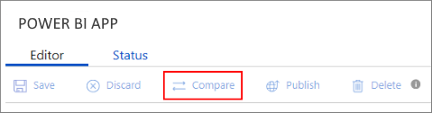

# Update a Power BI App offer

This article shows you how to update your Microsoft Power BI App offer in the [Cloud Partner Portal](https://cloudpartner.azure.com/) and
then to republish the offer. Here are some common reasons to update an offer:

- To update the app's content in Power BI and get an installation URL from the
    newly packaged app
- To update the offer's Azure Marketplace metadata (sales, marketing, or support information and assets)
 
Use the portal's **Compare** and **History** features to keep track of changes like these.

## Common update operations

Some attributes of a Power BI App offer can't be changed after the offer is published in AppSource. Disallowed changes include **Offer ID** and **Publisher ID**. But you can still change a wide range of characteristics. Here are some common changes.

### Update app content in Power BI

Power BI apps are often updated periodically with new content, security patches, features, and so on. When an app is changed, update its installation URL by following these steps:

1.  Sign in to the [Cloud Partner Portal](https://cloudpartner.azure.com/).
2.  Under **All offers**, find the offer you want to update.
3.  On the **Technical Info** tab, enter a new installation URL.
4.  Select **Publish** to start the workflow to publish the new app version to AppSource.

### Update the offer's Marketplace metadata

Your offer's Marketplace metadata includes your company name, logos, and other information. To update metadata, follow these steps:

1.  Sign in to the [Cloud Partner Portal](https://cloudpartner.azure.com/).
2.  Under **All offers**, find the offer you want to update.
3.  On the **Storefront Details** tab, change the metadata by following the instructions in the article [Power BI app Storefront Details tab](./cpp-storefront-details-tab.md).
4.  Select **Publish** to start the workflow to publish your changes.

## The Compare feature

As you update a published offer, you can check the changes you've made. To use the **Compare** feature:

1.  At any point in the editing process, select the offer's **Compare** button.

    

2.  View side-by-side versions of marketing assets and metadata.

## History of publishing actions

To view your offer's publishing history, on the left side of the Cloud Partner Portal, open the **History** tab. Here you'll see a history of time-stamped actions on your AppSource offers.

## Next steps

In the Cloud Partner Portal, regularly use [Seller Insights](../../cloud-partner-portal-orig/si-getting-started.md) to find useful information about your Marketplace customers and usage.  
