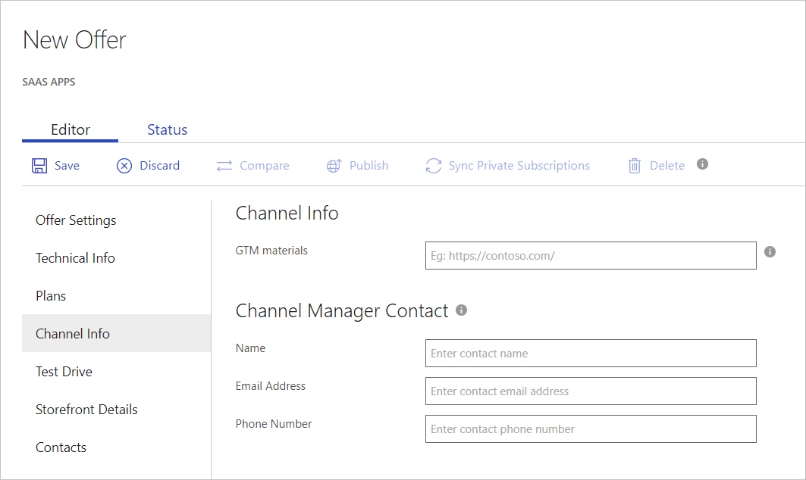

# SaaS application Channel Info tab

Use the Channel Info tab to provide channel information for your app, including go-to-market (GTM) materials and contact information.

## To configure channel information

1. Under **Channel Info>GTM materials**, enter the URL for the website that hosts your GTM materials.
2. Under **Channel Manager Contact**, provide a manager contact Microsoft can reach out to for support and business issues. Enter information for these fields: Name, Email Address, and Phone Number.
3. Select **Save** to finish setting up the channel information. 

## Next steps

[Test Drive](./cpp-testdrive-tab.md)