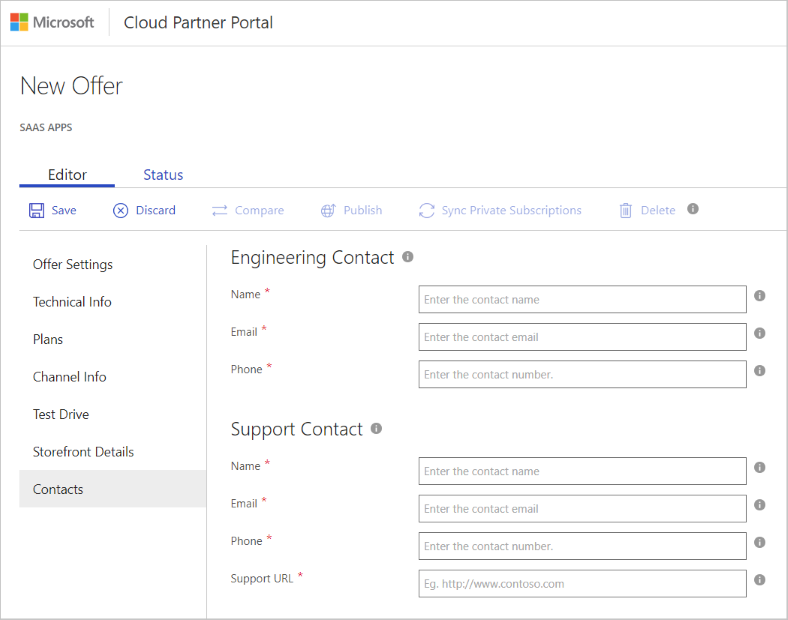

# SaaS application Contacts tab

This article describes how to use the Contacts tab to identify contacts for customers who are using your offer.

## Identify contacts

Use the next screen capture as a guide to provide the required information. All fields with marked with an asterisk (*) must be completed.

1. Under Engineering Contact, provide information for the following fields:

   - Name - Enter the name of the engineering contact for your app. This contact will receive technical communications from Microsoft.
   - Email - Enter the email address of the engineering contact.
   - Phone - Enter the phone number of the engineering contact. ISO phone number notations are supported. For more information, see [E.123](https://en.wikipedia.org/wiki/E.123)
  
2. Under Support Contact, provide information for the following fields:

   - Name - Enter the name of the support contact for your app. This contact will receive support-related communications from Microsoft.
   - Email - Enter the email address of the support contact for your app.
   - Phone - Enter the phone number of the support contact. ISO phone number notations are supported. For more information, see [E.123](https://en.wikipedia.org/wiki/E.123)
   - Support URL - Enter the URL to your support page.

3. Select **Save** when you finish the forms.

## Next steps

[Publish SaaS offer](./cpp-publish-offer.md)
