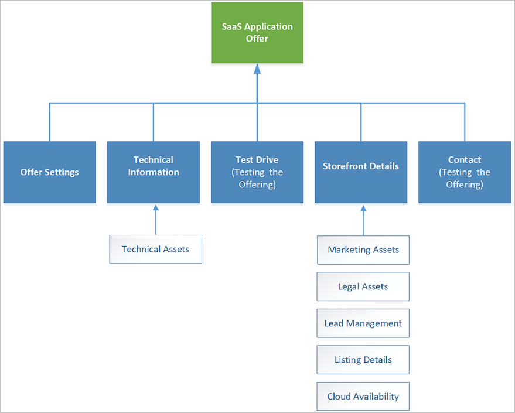
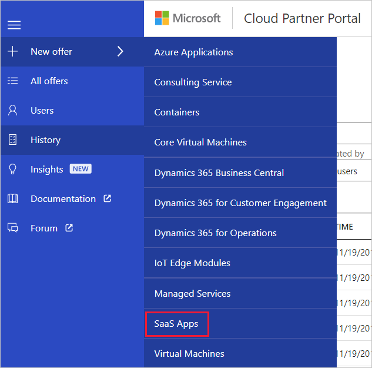

# Create a new SaaS application offer

This article describes how to create and publish a SaaS application (app) offer entry for the Azure Marketplace.

## Offer process

The next diagram shows the process for creating a SaaS App offer.

## Offer components

The SaaS App offer consists of five sections, described in the following table:
|  **Asset group**   |  **Description**  |
|  ---------------   |  ---------------  |
|    Offer Settings  |  Use to configure a unique identity for the SaaS app.                 |
|  Technical Info    |  Use to configure the SaaS Solution type, and provide the connection details for your application.                |
|  Channel Info      |   Provide channel information such as GTM materials and contacts.                |
|  Test Drive        |   Optional section for defining a service that will let  customers test your offer before they purchase it.                |
|  Storefront Details       | Contains marketing, legal and lead management assets and specifications.  <ul><li> Marketing assets include offer name, description, and logos</li> <li> Legal assets include a privacy policy, terms of use, and other legal documentation</li>  <li> Lead management policy enables you to specify how to handle leads from the Azure Marketplace end-user portal.</li> </ul> |
| Contacts            | Contains support contact and policy information |

## New Offer form

Sign in to the [Cloud Partner Portal](http://cloudpartner.azure.com/), and then select **+ New offer** on the left menu bar. On the New offer menu, select **SaaS Apps** to display the New Offer form and start the process of defining assets for a new SaaS application offer.

## Next steps

The New Offer page for the SaaS offer type provides a set of tabs and form fields that you'll use to create a new offer. Each of the following articles explains how to use the tab to define the asset groups and supporting services for your new offer.

- [Offer Settings tab](./cpp-offer-settings-tab.md)
- [Technical Info tab](./cpp-technical-tab.md)
- [Channel Info tab](./cpp-channel-tab.md)
- [Test Drive tab](./cpp-testdrive-tab.md)
- [Storefront Details tab](./cpp-storefront-tab.md)
- [Contacts tab](./cpp-contacts-tab.md)
