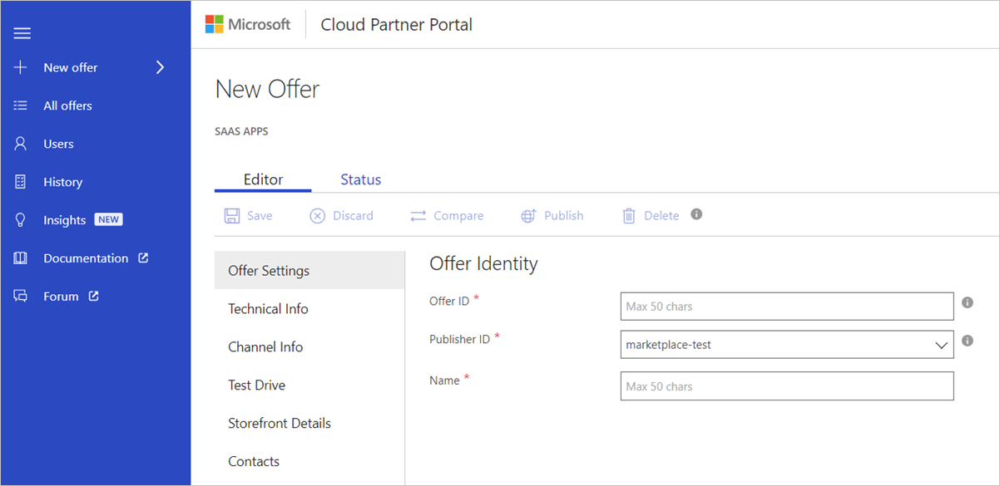

# SaaS application Offer Settings tab

The **SaaS App > New Offer** page opens with the focus on the **Offer Settings** tab. 

Use the Offer Settings tab to configure the **Offer Identity**, shown in the next screen capture. An asterisk (*) appended to the field name indicates that it’s required.

## Offer Identity settings

Under Offer Identity, you must provide information for the fields described in the following table. 

|  **Field name**   |  **Description**  |
|  ---------------   |  ---------------  |
|    Offer ID  |  A unique identifier for the offer within a publisher profile. This ID will be visible in product URLs and billing reports. It can only be composed of lowercase alphanumeric characters or dashes (-). The ID can't end with a dash and is limited to a maximum of 50 characters. Note that this field is locked once an offer goes live. For example, if a publisher, Contoso, publishes an offer with offer ID sample-vm, it will show up in Azure marketplace as: https://azuremarketplace.microsoft.com/marketplace/apps/contoso.sample-vm?tab=Overview.                 |
|  Publisher ID    |  The Publisher ID is your unique identifier in the Marketplace. All your offerings should be attached your publisher ID. The Publisher ID can’t be modified after the offer’s saved..                |
|  Name      |   This is the display name for your offer. This is the name that will show up in Azure Marketplace and in Azure Portal. It can have a maximum of 50 characters. Include a recognizable brand name for your product. Don’t include your company name here unless that is how it is marketed. If you’re marketing this offer at your own website, ensure that the name is exactly how it shows up in your website.               |

Select **Save** to save your progress.

## Next steps

[Technical Info tab](./cpp-technical-tab.md)
