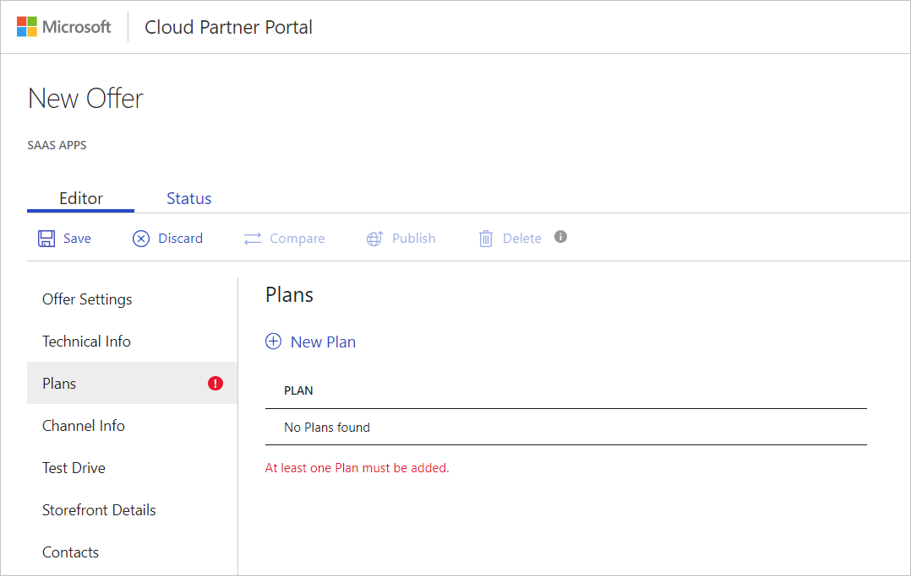
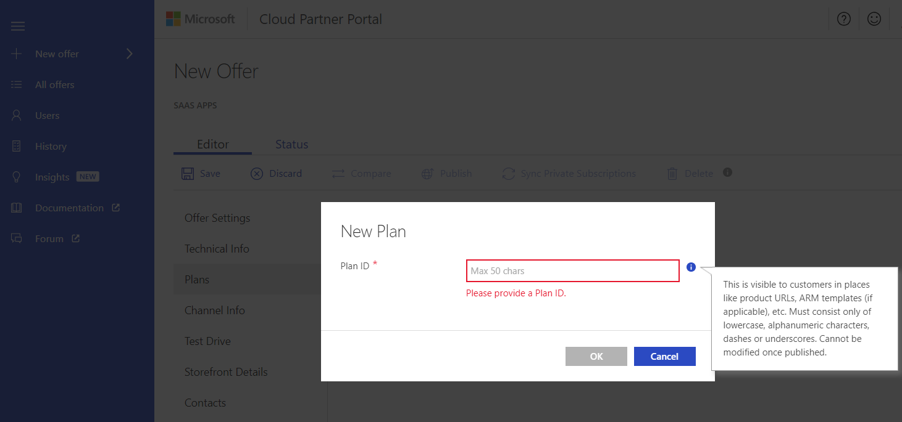
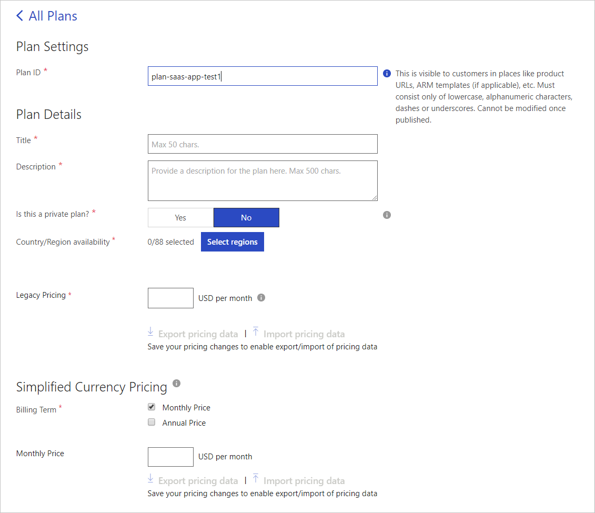

# SaaS application Plans tab

Use the Plans tab to create a new plan. At least 1 plan must be added if you’re using the Sell through Microsoft option for your SaaS app.

## Create a new plan

To create a new plan:

1. Under **Plans**, select **+ New Plan**
2. In the **New Plan** popup window, type a **Plan ID**. This maximum length is 50 characters. This ID must consist only of lowercase, alphanumeric characters, dashes, or underscores. You can’t change this ID after the offer’s published.
3. Select **OK** to save the Plan ID.

   

### To configure the plan:

1. Under **Plan Details**, provide information for the following fields:

   - Title - Provide a title for the plan. The title is limited to 50 characters.
   - Description - Provide a description. The description is limited to up to 500 characters.
   - Is this a private plan? - If the plan's only available to a select group of customers, select **Yes**.
   - Country/Region availability - The plan must be available to at least 1 country or region. Click **Select regions**. Pick a country/region from the **Select Country/Region availability** list, and then select **OK**. 
   - Legacy Pricing - Provide the cost, in USD per month.

2. Under  **Simplified Currency Pricing**, provide the following information:

   - Billing Term - Monthly Price is selected by default. You can also provide annual pricing.
   - Monthly Price - Provide the Monthly price, which must match the Legacy pricing.

   >[NOTE] If you add Annual Price to the billing term, you'll get prompted for the **Annual Price** in USD per year.

3. Select **Save** to finish configuring the plan.

   >[NOTE] After you save your pricing changes you can export/import pricing data.

## Next steps

[Channel Info tab](./cpp-channel-info-tab.md)

