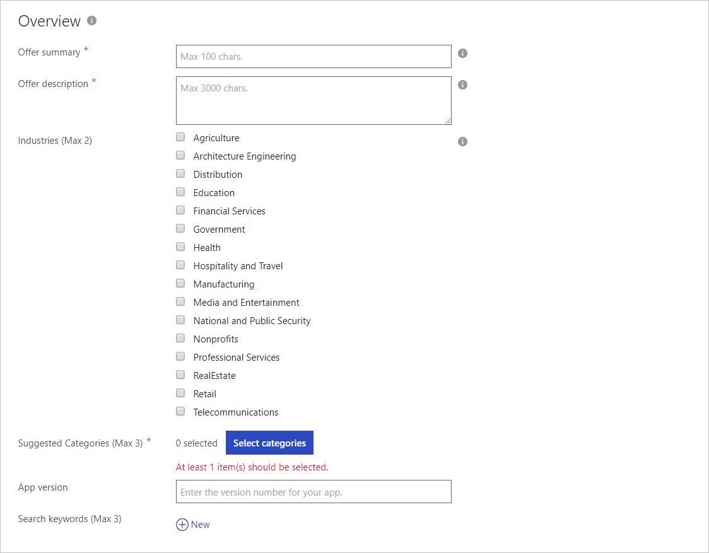
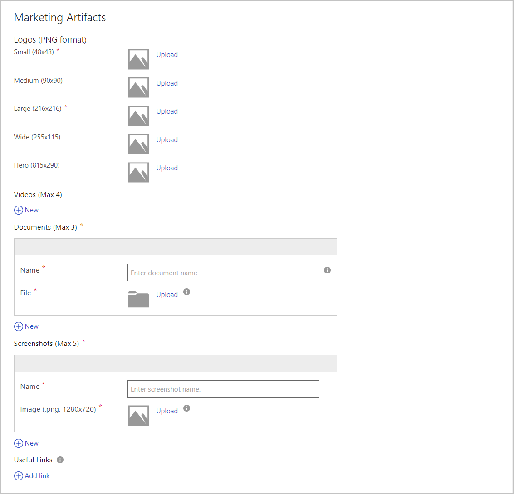
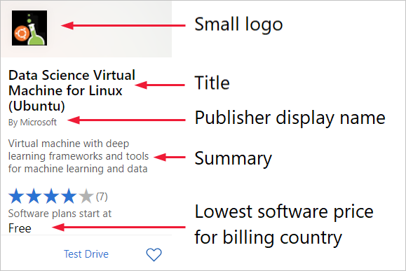
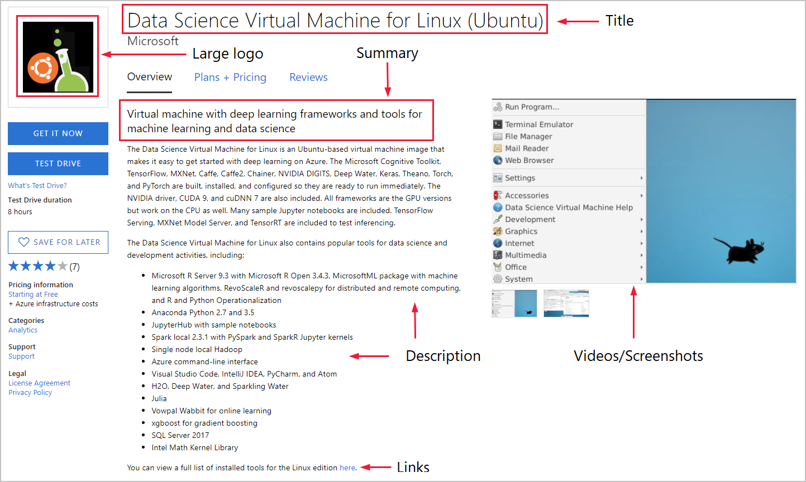
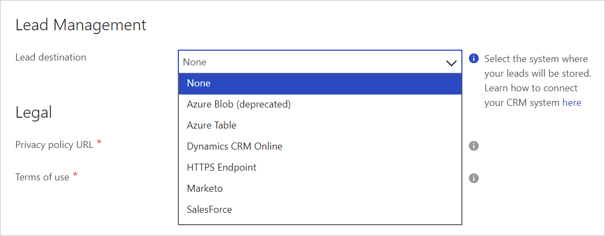
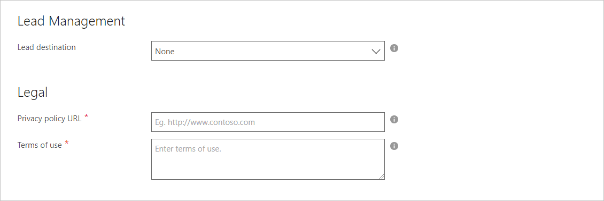

# SaaS application Storefront Details tab

This article shows how to use the Storefront Details tab to describe your SaaS app and provide marketing assets. This tab includes the following forms: Overview, Marketing Artifacts, Lead Management, and Legal. 

## Overview

The Overview form has the required and optional fields shown in the next screen capture. An asterisk (*) appended to the field name indicates that it’s required.

The following table describes the Storefront Details that you can provide for the offer.

|  **Offer fields**   |  **Description**  |
|  ---------------   |  ---------------  |
|      Offer summary              |        Summary of your offer's value proposition. It will appear on your offer's search page. It should be a maximum of 100 characters.           |
|      Offer description              |      The description that will appear on your application’s detail page. Maximum allowed is 1300 characters. You can use basic HTML markup tags to format content. For example, &lt;p&gt;, &lt;h1&gt;, &lt;h2&gt;, and &lt;li&gt;. To see how the formatted description will look, use an online real-time HTML tool like http://htmledit.squarefree.com             |
|          Industries          |        Select the industries that your Offer is best aligned to. If your app relates to multiple industries, you can select a maximum of two.           |
|          Suggested Categories (Max 3)         |        Select the categories that your Offer is best aligned to. You can select a maximum of three categories.           |
|           App version         |        Enter the version number of your application.           |
|          Search keywords (Max 3)          |      Enter up to three search keywords that customers can use to find your application in the Marketplace storefront website.             |

## Marketing Artifacts

Use the Marketing Artifacts form to identify Azure Marketplace marketing assets such as logos, videos, screenshots, and documents.

The following table describes the fields for Marketing Artifacts.

|  **Offer fields**   |  **Description**  |
|  ---------------   |  ---------------  |
|                    |                   |
|                    |                   |
|                    |                   |
|          Logos          |        If this is a Sell through Microsoft SaaS app, you should provide all logo images. If this is a Listing, then only 2 logos are required. Use following guidelines for logos uploaded in the Cloud Partner Portal: <ul><li>Keep the number of primary and secondary colors on your logo low. The Azure design has a simple color palette. </li><li>Avoid using black or white as the background color of your logo. The theme colors of the Azure Portal are black and white. Instead, use some color that would make your logo prominent in the Azure Portal. We recommend simple primary colors. If you’re using a transparent background, then make sure that the logo and text are not black, white, or blue. </li><li>Don’t use a gradient background on the logo. </li><li>Avoid placing text, even your company or brand name, on the logo. The look and feel of your logo should be 'flat' and should avoid gradients.</li><li>The logo image should not be stretched.</li></ul>            |
|          Videos          |         Allows you to add links of videos of your offer. You can use links to YouTube and/or Vimeo videos, which are shown along with your offer to customers. You will also need to enter a thumbnail image of the video, with a png image of 1280 x 720 pixels. You can have a maximum of four videos per offer.          |
|          Documents          |          Allows you to add marketing documents to your offer. All documents must be in PDF format, and you can have a maximum of three documents per offer.         |
|        Screenshots            |         Allows you to add screenshots of your offer. There is a maximum of five screenshots that can be added per offer. The maximum image size is 1280 x 720 pixels.          |
|       Useful links             |       Allows you to add external URLs for your offer to help point to architecture diagrams or other websites that a customer would want to see.            |

### Marketing examples

The next screen capture shows an example of a Marketplace search result.

The following image shows how the offer is displayed in the Marketplace after a customer clicks on the offer’s tile in the search result.

## Lead Management

To configure lead management, select the **Lead destination** from the dropdown list. The next screen capture shows the available destinations.

>[!TIP] 
>Select the information icon to see this message: “Select the system where your leads will be stored. Learn how to connect to your CRM system [here](https://docs.microsoft.com/azure/marketplace/cloud-partner-portal-orig/cloud-partner-portal-get-customer-leads) .”

## Legal

Use the Legal form to provide the legal documentation required for every offer.

Provide the following information:

- Privacy policy URL – Enter a link to your app’s privacy policy.
- Terms of use – Enter the terms of use for your app. Customers are required to accept these terms before they can try your app.

## Next steps

[Contacts tab](./cpp-contacts-tab.md)
