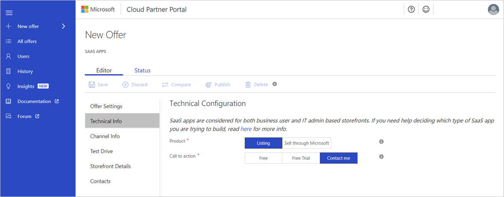
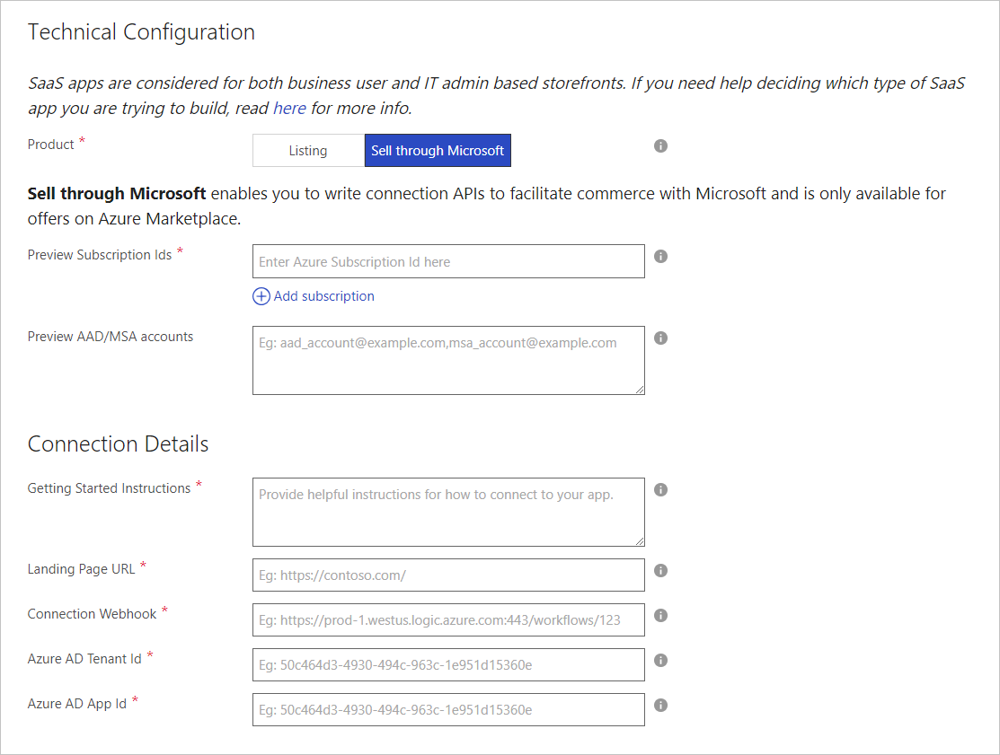

# SaaS application Technical Info tab

The Technical Info tab provides the Technical Configuration form. Use this form to pick the type of SaaS application (app) you’re creating and configure how your app is provided to customers.

## Technical Configuration form

This form has 2 fields: Product and Call to action.

### Product field

You can provide a SaaS app for both of the following storefronts:
- For a business user by selecting the **Listing** option.
- For an IT admin user, by selecting **Sell through Microsoft**.
To help you decide which type of SaaS app you’re building, read [Understand storefront selection](https://docs.microsoft.com/azure/marketplace/determine-your-listing-type#understand-storefront-selection).

#### Sell through Microsoft
To build this experience you need to configure the following pieces:

- Connect your SaaS service website with Microsoft’s SaaS APIs. The [SaaS Sell through Azure – APIs](https://docs.microsoft.com/azure/marketplace/cloud-partner-portal-orig/cloud-partner-portal-saas-subscription-apis) article explains how to create this connection.
- Enable Sell through Azure on Cloud Partner Portal in the Technical Configuration form and provide the required information. For more information about this billing model and how it’s implemented, see [SaaS – Sell through Azure](https://docs.microsoft.com/azure/marketplace/cloud-partner-portal-orig/cloud-partner-portal-saas-offer-subscriptions#overview).

 

The following table describes the required fields for Sell through Microsoft.

|  **Field name**   |  **Description**  |
|  ---------------  |  ---------------  |
|    Preview Subscription IDs               |    All the Azure Subscription identifiers used to test your offer in preview before it is publicly available.               |
|     Getting Started Instructions              |   Directions to share with your customers to help them connect to your SaaS app. Basic HTML tags are allowed, for example: &lt;p&gt;, &lt;h1&gt;, &lt;li&gt;, etc.                |
|    Landing Page URL  |   Your site URL that you will be directing your customers to land on after acquiring from Azure portal. This URL will also be the endpoint that will be receiving the connection APIs to facilitate commerce with Microsoft.                |
|  Connection Webhook    |  For all asynchronous events that Microsoft needs to send to you on behalf of the customer (example: Azure Subscription has gone invalid), we require you to provide us a connection webhook. If you don't already have a webhook system in place, the simplest configuration is to have an HTTP Endpoint Logic App that will listen for any events being posted to it and then handle them appropriately. For more information, see <a href="https://docs.microsoft.com/azure/logic-apps/logic-apps-http-endpoint">Call, trigger, or nest workflows with HTTP endpoints in logic apps</a>                |
|  Azure AD Tenant ID and App ID      |   Inside Azure portal, we require that you create an Active Directory App so that we can validate the connection between our two services is behind an authenticated communication. For these fields, create an AD App and paste in the corresponding Tenant Id and App Id required.               |

Finally, if you select **Sell through Microsoft**, there is another New Offer tab named **Plans**. 

The [plans tab](./cpp-plans-tab.md) lists the specific plans and their corresponding prices that your SaaS app supports. As of today, we allow for monthly pricing, with the ability to allow for 1- or 3- months of free access. These plans and prices should match the exact plans and prices that you have on your own SaaS app site.

>[!NOTE] 
>Plans are only needed if you choose Sell through Microsoft.

### Call to action field

The Call to action field lets you pick the message that appears on your offer’s acquisition button. The following options are available:

- Free – If you pick this option, you’re prompted to enter a Trial URL where customers can get access to your SaaS app. For example: https://contoso.com/trial
- Free Trial– If you pick this option, you’re prompted to enter a Trial URL where customers can get access to your SaaS app. For example: https://contoso.com/trial
- Contact me

For more information about the Call to action options, see Choose a publishing option.

## Next steps

- [Plans tab (Optional)](./cpp-plans-tab.md)
- [Channel Info tab](./cpp-channel-info-tab.md)
