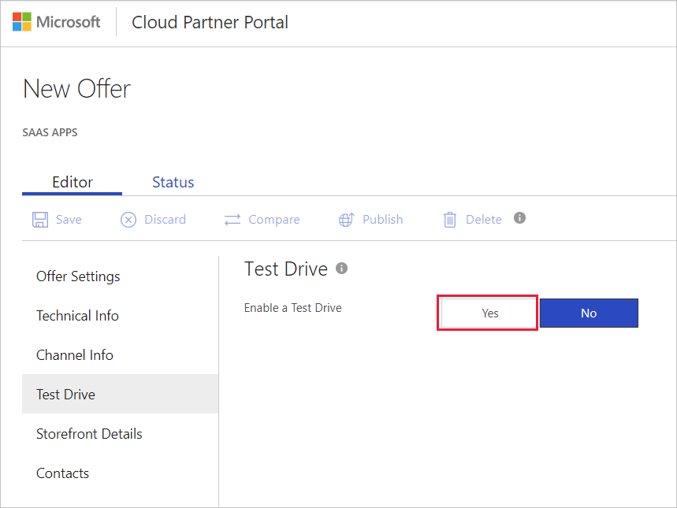
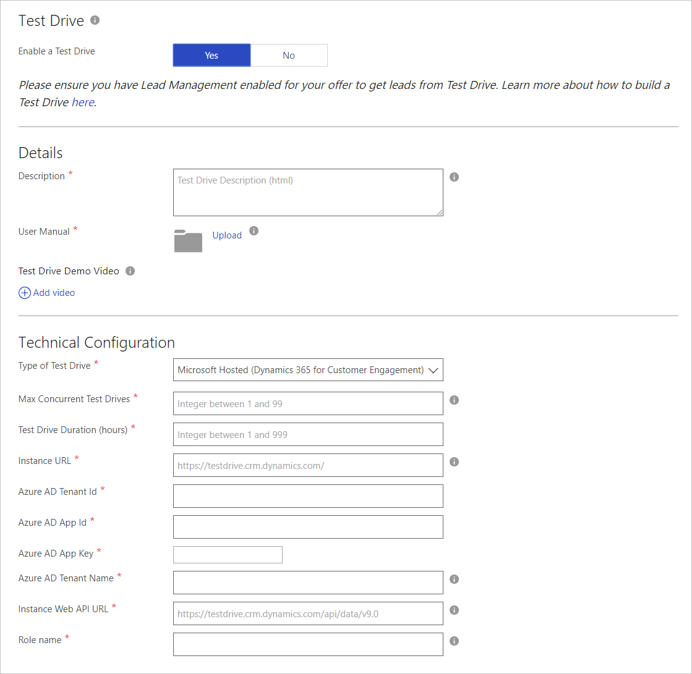

# SaaS application Test Drive tab

Use the Test Drive tab to provide a trial experience for your customers.

## Test Drive benefits

Creating a trial experience for your customers is a best practice to ensure they can buy with confidence. Of the trial options available, Test Drive is the most effective at generating high-quality leads and increased conversion of those leads.

Test drive provides customers with a hands-on, self-guided trial of your product's key features and benefits, demonstrated in a real-world implementation scenario.

## How a test drive works

A potential customer searches and discovers your application on the Marketplace. The customer signs in and agrees to the terms of use. At this point, the customer receives your pre-configured environment to try for a fixed number of hours, while you receive a highly qualified lead to follow up with. For more information, see [What is Test Drive?](https://docs.microsoft.com/en-us/azure/marketplace/cloud-partner-portal-orig/what-is-test-drive)

## Publishing steps

The main publishing steps for adding a test Drive are:

1. Define your Test Drive scenario
2. Build and/or modify your Resource Manager template
3. Create your Test Drive step-by-step manual
4. Republish your offer

## Setting up a test drive

There are four different types of Test Drives available, each based on the type of product, scenario, and marketplace you’re on.
|  **Type**          |  **Description**  |  **Setup instructions**  |
|  ---------------   |  ---------------  |  ---------------  |
|     Azure Resource Manager               |    An Azure ARM Test Drive is a deployment template that contains all the Azure resources that comprise a solution being built by the publisher. Products that fit this type of Test Drive are ones that use only Azure resources.               |       [Azure Resource Manager Test Drive](https://docs.microsoft.com/azure/marketplace/cloud-partner-portal-orig/azure-resource-manager-test-drive)            |
|       Hosted             |       A Hosted Test Drive removes the complexity of setup by Microsoft hosting and maintain the service that performs the Test Drive user provisioning and deprovisioning.             |         [Hosted Test Drive](https://docs.microsoft.com/azure/marketplace/cloud-partner-portal-orig/hosted-test-drive)          |
|      Logic App              |       A Logic App Test Drive is a deployment template which is meant to encompass all complex solution architectures. All Dynamics applications or custom products should use this type of Test Drive.            |      [Logic App Test Drive](https://docs.microsoft.com/azure/marketplace/cloud-partner-portal-orig/logic-app-test-drive)             |
|       Power BI             |         A Power BI Test Drive consists of an embedded link to a custom-built dashboard. Any product that wants to demonstrate an interactive Power BI visual should use this type of Test Drive. All you need to upload is your embedded Power BI URL.          |        [Power BI Test Drive](#Power-BI-test-drive)           |

### Power BI test drive

Use the following steps to configure a test drive.

1. Under New Offer, select **Test Drive**.
2. On Test Drive, select **Yes**.

   

   When you enable a test drive, you’ll see the Details and Technical Configuration forms, which are shown in the next screen capture.

   

3. Under **Details**, provide information for the following fields:
  
   - Description – Describe your test drive and what users can do with it. You can use basic HTML tags to format this description.
   - User Manual – Upload a User Manual document that your customers can use when they’re taking the test drive. This manual must be a pdf file.
   - Test Drive Demo Video (optional) - You can provide a video (YouTube or Vimeo) for your customers to watch before they take the Test Drive. Provide a URL to the video.

4. Under **Technical Configuration**, provide information for the following fields:

   - Type of Test Drive – Select **Power BI** from the dropdown list.
   - Link to Power BI Dashboard – Provide a link to the dashboard.

5. When you finish configuring the test drive, select **Save**.

## Next steps

[Storefront Details tab](./cpp-storefront-tab.md)