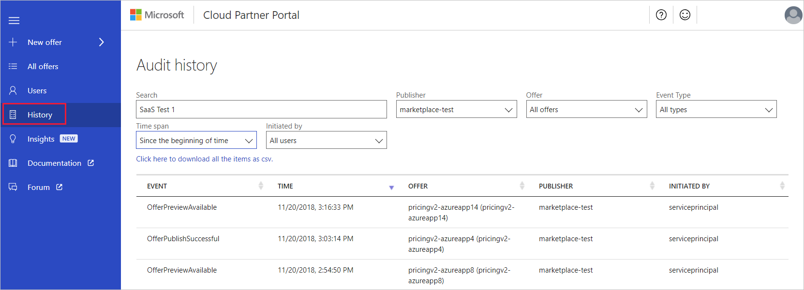

# Update an existing SaaS application offer

There are various kinds of updates that you might want to do to your offer after it's been published and is live. Any change you make to your new version of your offer should be saved and republished to have it reflect in the Marketplace. This article steps through the different aspects of updating your SaaS offer in the [Cloud Partner Portal](https://cloudpartner.azure.com/).

> [!IMPORTANT] 
> SaaS offer functionality is being migrated to the [Microsoft Partner Center](https://partner.microsoft.com/dashboard/directory).  All new publishers must
> use Partner Center for creating new SaaS offers and managing existing offers.  Current publishers with SaaS offers are being batchwise migrated from the 
> Cloud Partner Portal to the Partner Center.  The Cloud Partner Portal will display status messages to indicate when specific existing offers have been migrated.
> For more information, see [Create a new SaaS offer](../../partner-center-portal/create-new-saas-offer.md).

There are several reasons why you might want to update your offer, such as:

- Adding a new version to an existing app.
- Updating an app.
- Adding new features to an app.
- Updating the marketplace metadata for the offer.

To assist you in these modifications, the portal provides the **Compare** and **History** features.

## Unpermitted changes to a SaaS offer

There are attributes of a SaaS offer that can't be changed after the offer is live on the Azure Marketplace. You can't change the following settings:

- Offer ID and Publisher ID of the offer
- Version tags, for example: `1.0.1`
- Billing/license model changes to existing offers.

## Common update operations
 
The following update operations are common.

### Update offer contacts

Use the following steps to update the support contacts for your offer.

1. Sign into the [Cloud Partner Portal](https://cloudpartner.azure.com/).
2. Under **All offers**, find the offer you'd like to update.
3. Go to the **Contacts** tab. Update your contacts.
4. Select **Publish** to start the workflow to publish your changes.

### Update offer marketplace metadata

Use the following steps to update the marketplace metadata associated with your offer. (For example: company name, logos, etc.)

1. Sign into the [Cloud Partner Portal](https://cloudpartner.azure.com/).
2. Under **All offers**, find the offer you'd like to update.
3. Go to the **Storefront Details** tab. Use the instructions in the [Publish SaaS offer](./cpp-publish-offer.md) article to make metadata changes.
4. Select **Publish** to start the workflow to publish your changes.

## Compare feature

When you make changes to a published offer, you can use the Compare feature to audit the changes that you've made. The next screen capture shows the Compare option for a published offer.

### To use the Compare feature:

1. At any point in the editing process, select Compare for your offer.
2. Look at side-by-side versions of marketing assets and metadata.

## Publishing history

To see historical publishing activity, select the **History** tab on the left navigation menu bar of Cloud Partner Portal. You can see the timestamped actions taken during the lifetime of your Azure Marketplace offers.

You can use the Audit history page to search for a specific offer and apply filters such as Publisher, Offer, and Event Type (for example, OfferGoLiveRequested.) You can also download the audit history as a csv file.

## Next steps

[SaaS application offer](./cpp-saas-offer.md)