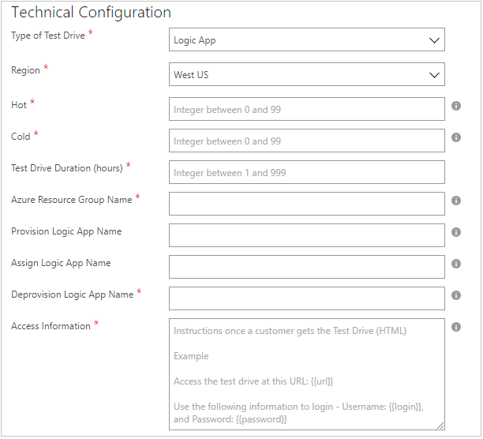

Logic App Test Drive
====================

This article is for Publishers who have their offer on AppSource and want to build their Test Drive that connects with a Dynamics AX/CRM instance or any other resource beyond just Azure.

How to build a Logic App Test Drive
-----------------------------------

Test Drive documentation for Logic App Test Drives is currently still on GitHub for
[Operations](https://github.com/Microsoft/AppSource/blob/master/Setup-your-Azure-subscription-for-Dynamics365-Operations-Test-Drives.md) and [Customer Engagement](https://github.com/Microsoft/AppSource/wiki/Setting-up-Test-Drives-for-Dynamics-365-app), go there to read more.

How to publish a Test Drive
---------------------------

Now that you have your Test Drive built, this section walks through each of the fields required for you to successfully publish your Test Drive.

The first and most important field is to toggle whether you want Test of the form with all of the required fields are presented for you to fill out. When you select **No,** the form becomes disabled and if you
republish with the Test Drive disabled, your Test Drive is removed from production.

*Note*: If there is any Test Drives actively used by users, those Test Drives will continue to run until their session expires.

### Details

The next section to fill out is the details about your Test Drive offer.

**Description -** *[Required Field]* This is where you write the main description about what is on your Test Drive. The customer will come here to read what scenarios your Test Drive will be covering about your
product. 

**User Manual -** *[Required Field]* This is the in-depth walkthrough of your Test Drive experience. The customer will open this and can walk through exactly what you want them to do throughout their Test Drive. It is important that this content is easy to understand and follow! (Must be a .pdf file)

**Test Drive Demo Video -** \[Recommended\] Similar to the User Manual, it is best to include a video tutorial of your Test Drive experience. The customer will watch this prior or during their Test Drive and can walk through exactly what you want them to do throughout their Test Drive. It is important that this content is easy to understand and follow!

- **Name** - Title of your Video
- **Link** - Must be an embedded URL from YouTube or Vimeo. Example on how to get the embedded url is below:
- **Thumbnail** - Must be a high-quality image (533x324) pixels. It is recommended to take a screenshot of some part of your Test Drive experience here.

Below is how these fields show up for your customer during their Test Drive experience.

### Technical Configuration

The next section to fill out is where you configure your Test Drive Logic App and define how specifically your Test Drive instances work.

- **Region** - *[Required Field]* The region you select is where you pick where your Test Drive Logic App resources are deployed in.

    *Note:* If your Logic App has any custom resources that are stored in a region, make sure that region is selected here. The best way to do this is to **fully deploy your Logic App locally on your Azure subscription in the portal and verify that it works** before writing it in here.

- **Maximum Concurrent Test Drives** - *[Required Field]* Number of Test Drive instances that are already deployed and awaiting access per selected region. Customers can instantly access this Test Drives rather than having to wait for a deployment.

    *Note:* If you are running a webinar/class where you want all of your N number of students to take a Test Drive, it is recommended to publish with N number of Hot instances and then once the class is over to republish back to your normal number of Hot instances.

- **Test Drive Duration (hours) -** *[Required Field]* Duration for how long the Test Drive will stay active, in \# of hours. The Test Drive terminates automatically after this time period ends.

- **Azure Resource Group Name -** *[Required Field]* Write in the Resource Group name where your Logic App Test Drives are saved.

- **Assign Logic App Name -** *[Required Field]* Write in the Logic App that is used to assign a user in the Test Drive before the customer gets it, write in the name of that Logic App here. Make sure this file is saved in the Resource Group above.

- **Deprovision Logic App Name -** *[Required Field]* Write in the Logic App name for your deprovisioning of all the resources created in the Test Drive. Make sure this file is saved in the Resource Group above.

- **Access Information -** *[Required Field]* After a customer gets their Test Drive, the access information is presented to them. These instructions are meant to share the useful output parameters from your Test Drive Resource Manager template. To include output parameters, use double curly brackets (for example, **{{outputname}}**), and they will be inserted correctly in the location. (HTML string formatting is recommended here to render in the front end).

### Test Drive Deployment Subscription Details

The final section to fill out is to be able to deploy the Test Drives automatically by connecting your Azure Subscription and Azure Active Directory (AD).

**Azure Subscription ID** *[Required Field]* This grants access to Azure services and the Azure portal. The subscription is where resource usage is reported and services are billed. If you do not already have a **separate** Azure Subscription for Test Drives only, please go ahead and make one. You can find Azure Subscription Ids by logging in to Azure portal and navigating to the Subscriptions on the left-side menu.
(Example: "a83645ac-1234-5ab6-6789-1h234g764ghty")

**Azure AD Tenant ID** *[Required Field]* If you have a Tenant ID already available you can find it below in the Properties -\> Directory ID.

Otherwise, create a new Tenant in Azure Active Directory.

!Azure Active Directory](./media/azure-resource-manager-test-drive/subdetails5.png)

**Azure AD App ID** *[Required Field]* Next step is to create and register a new application. We will use this application to perform operations on your Test Drive instance.

1. Navigate to the newly created directory or already existing directory and select Azure Active directory in the filter pane.
2. Search "App registrations" and click on "Add"
3. Provide an application name.
4. Select the Type of as "Web app / API"
5. Provide any value in Sign-on URL, we won\'t be using that field.
6. Click create.
7. After the application has been created, go to Properties -\> Set the application as multi-tenant and hit Save.

Click Save. The last step is to grab the Application ID for this registered app and paste it in the Test Drive field here.

Given we are using the application to deploy to the subscription, we need to add the application as a contributor on the subscription. The instructions for these are as below:

1. Navigate to the Subscriptions blade and select the appropriate subscription that you are using for the Test Drive only.
1. Click **Access control (IAM)**.
1. Click the **Role assignments** tab.
    
1. Click **Add role assignment**.
1. Set the role as **Contributor**.
1. Type in the name of the Azure AD application and select the application to assign the role.
    
1. Click **Save**.

**Azure AD App Key -** *[Required Field]* The final field is to generate an authentication key. Under keys, add a Key Description, set the duration to never expire, then select save. It is **important** to avoid having an expired key, which will break your test drive in production. Copy this value and paste it into your required Test Drive field.

> [!CAUTION]
> You cannot use the Azure App Registration Preview because it does not currently generate a base64 encoded key.

Next steps
----------

Now that you have all of your Test Drive fields filled out, go through and **Republish** your offer. Once your Test Drive has passed the certification process, you should go an extensively test the customer experience in the **preview** of your offer. Start a Test Drive in the UI and verify that your Test Drives are being fully deployed correctly.

It is important to note that you do not delete any part of the Test Drive as they are provisioned for your customers, so the Test Drive service will automatically clean these Resource Groups up after a customer is finished with it.

Once you feel comfortable with your Preview offering, now it is time to **go live**! There is a final review process from Microsoft once the offer has been published to double check the entire end to end
experience. If for some reason the offer gets rejected, we will send a notification to the engineering contact for your offer explaining what will need to get fixed.

If you have more questions, are looking for troubleshooting advice, or want to make your Test Drive more successful, please go to [FAQ,Troubleshooting, & Best Practices](./marketing-and-best-practices.md).
