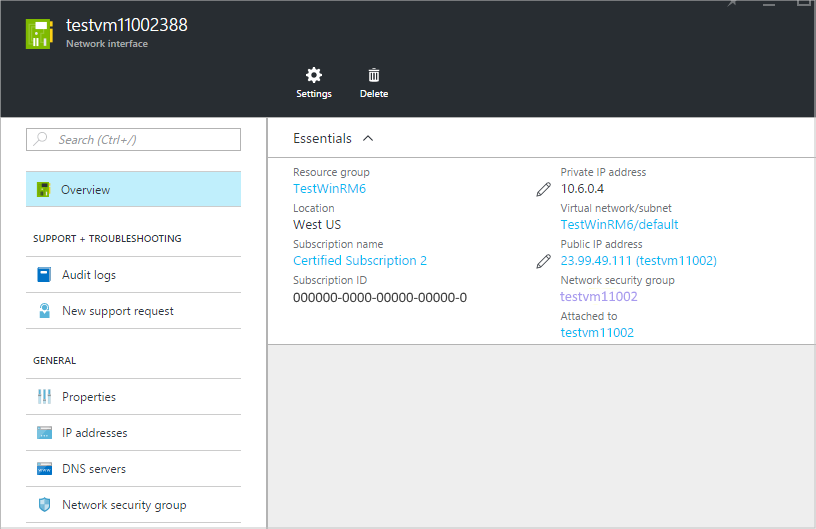
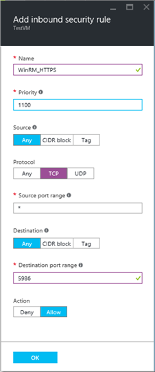
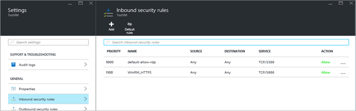
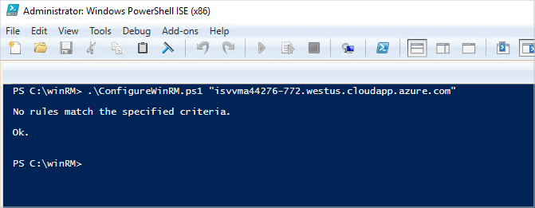

# Configure WinRM after virtual machine creation

This article explains how to configure an existing Azure-hosted virtual machine (VM) to enable WinRM over HTTPS.  This configuration applies only to Windows-based VMs and requires the following two-step process:

1. Enable port traffic for the WinRM over HTTPS protocol.  You will configure this setting for your VM in the Azure portal.
2. Configure the VM to enable WinRM by running the supplied PowerShell scripts.

## Enabling port traffic

The WinRM over HTTPS protocol uses port 5896, which is not enabled by default on pre-configured Windows VMs offered on the Azure Marketplace. To enable this protocol, use the following steps to add a new rule to the network security group (NSG) with the [Azure portal](https://portal.azure.com).  For more information about NSGs, see [Security Groups](https://docs.microsoft.com/azure/virtual-network/security-overview).

1.	Navigate to the blade **Virtual machines >**  <*vm-name*>  **> Settings/Networking**.
2.	Click on the NSG name (in this example, **testvm11002**) to display its properties:

    
 
3. Under **Settings**, select **Inbound security rules** to display this blade.
4. Click **+Add** to create a new rule called `WinRM_HTTPS` for TCP port 5986.

    

5. Click **OK** when you are finished supplying values.  The list of inbound security rules should contain the following new entries.

    

## Configure VM to enable WinRM 

Use the following steps to enable and configure the Windows Remote Management feature on your Windows VM.   

1. Establish a Remote Desktop connection to your Azure-hosted VM.  For more information, see [How to connect and sign in to an Azure virtual machine running Windows](https://docs.microsoft.com/azure/virtual-machines/windows/connect-logon).  The remaining steps will be run on your VM.
2. Download the following files and save them to a folder on your VM:
    - [ConfigureWinRM.ps1](https://raw.githubusercontent.com/Azure/azure-quickstart-templates/master/201-vm-winrm-windows/ConfigureWinRM.ps1)
    - [makecert.exe](https://raw.githubusercontent.com/Azure/azure-quickstart-templates/master/201-vm-winrm-windows/makecert.exe)
    - [winrmconf.cmd](https://raw.githubusercontent.com/Azure/azure-quickstart-templates/master/201-vm-winrm-windows/winrmconf.cmd)
3. Open the **PowerShell Console** with elevated privileges (**Run as Administrator**). 
4. Run the following command, supplying the required parameter: the fully qualified domain name (FQDN) for your VM:  
   `ConfigureWinRM.ps1 <vm-domain-name>`

    

    This script depends upon the other two files being in the same folder.

## Next steps

Once you have configured WinRM, you are ready to [deploy your VM from its constituent VHDs](./cpp-deploy-vm-vhd.md).
