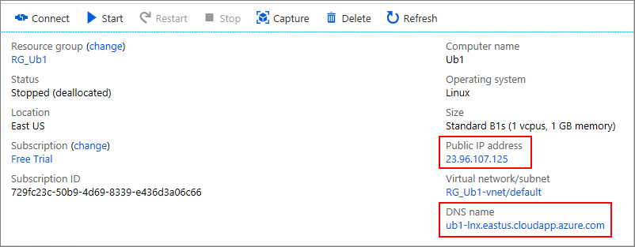
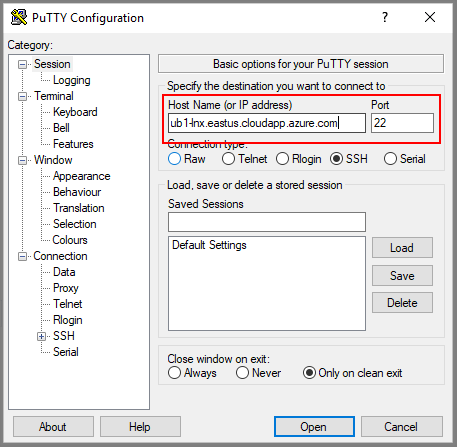
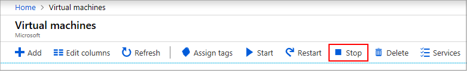

# Connect to your Azure-based virtual machine

This article explains how to connect to and sign into the virtual machines (VMs) you created on Azure.  Once you've successfully connected, you can work with the VM as if you were locally logged on to its host server. 

## Connect to a Windows-based VM

You'll use the remote desktop client to connect to the Windows-based VM hosted on Azure.  Most versions of Windows natively contain support for the remote desktop protocol (RDP).  For other machines, you can find more information about clients in [Remote Desktop clients](https://docs.microsoft.com/windows-server/remote/remote-desktop-services/clients/remote-desktop-clients).  

The following article details how to use the built-in Windows RDP support to connect to your VM: [How to connect and log on to an Azure virtual machine running Windows](../../../virtual-machines/windows/connect-logon.md).  

>[!TIP]
> You may get security warnings during the process, for example that the .rdp file is from an unknown publisher or that your user credentials cannot be verified.  It is safe to ignore these warnings.

## Connect to a Linux-based VM

To connect the Linux-based VM, you need a secure shell protocol (SSH) client.  This discussion will use the free [PuTTY](https://www.ssh.com/ssh/putty/) SHH terminal.

1. Go to the [Azure portal](https://ms.portal.azure.com). Search for and select **Virtual machines**. 
2. Select the VM you want to connect to.  
3. **Start** the VM if it isn't already running.
4. Click on the name of the VM to open its **Overview** page.
5. Note the Public IP address and DNS name of your VM.  (If these values are not set, then you must [Create a network interface](https://docs.microsoft.com/azure/virtual-network/virtual-network-network-interface#create-a-network-interface)

   
 
6. Open the PuTTY application.  
7. In the PuTTY Configuration dialog, enter the IP address or DNS name of your VM. 

   
 
8. Click **Open** to open a PuTTY terminal.  
9. When you're prompted, enter the account name and password of your Linux VM account. 

If you are having connection problems, refer to the documentation for your SSH client, for example [Chapter 10: Common error messages](https://www.ssh.com/ssh/putty/putty-manuals).

For more information, including how to add a desktop to a provisioned Linux VM, see [Install and configure Remote Desktop to connect to a Linux VM in Azure](../../../virtual-machines/linux/use-remote-desktop.md).

## Stop unused VMs
Azure bills for VM hosting when a VM is running *or idle*.  As such, it's best practice to stop VMs that aren't currently being used.  For example, test, backup, or retired VMs are candidates for shutdown. To shut down a VM, complete the following steps:

1. On the **Virtual machines** blade, select the VM you want to stop. 
2. In the toolbar near the top of the page, click on the **Stop** button.

   

Azure quickly stops the VM in a process called *deallocation*, which not only shuts down the operating system on the VM, but also frees the hardware and network resources previously provisioned for it.

If you want to later reactivate a stopped VM, select it and click the **Start** button.

## Next steps

After you're remotely connected, you're ready to [configure your VM](./cpp-configure-vm.md).
