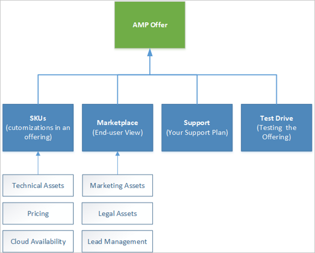
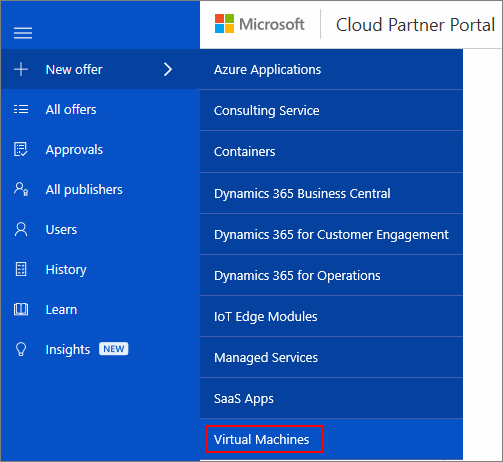

# Create Virtual Machine offer

This section lists the steps required to create a new virtual machine (VM) offer request for the Azure Marketplace.  Every offer appears as its own entity in Azure Marketplace and is associated with one or more SKUs.  A VM offer is composed of the following groupings of assets and supporting services: 

where:

|  **Asset group**   |  **Description**  |
|  ---------------   |  ---------------  |
|    SKUs            |  The smallest purchasable unit of an offer. A single offer (product class) can have multiple SKUs associated with it, to differentiate between supported features, VM image types, and billing models. |
|  Marketplace       | Contains marketing, legal and lead management assets and specifications.  <ul><li> Marketing assets include offer name, description, and logos</li> <li> Legal assets include a privacy policy, terms of use, and other legal documentation</li>  <li> Lead management policy enables you to specify how to handle leads from the Azure Marketplace End-user portal.</li> </ul> |
| Support            | Contains support contact and policy information |
| Test Drive         | Defines assets that enable end users to test your offering before they purchase it |
|  |  |

## New Offer form

Once your sign into the [Cloud Partner Portal](https://cloudpartner.azure.com/), click the **+ New Offer** item on the left menubar. In the resulting menu, click on **Virtual Machines** to display the **New Offer** form and start the process of defining assets for a new VM offer. 
<!-- not all publishers see corevm or azure apps test, you need to be whitelisted to see them. we should hide those in these images. -->

> [!WARNING]
> If the **Virtual Machines** option is not shown or is not enabled, then your account does not have permission to create this offer type.  Please check that you have met all the [prerequisites](./cpp-prerequisites.md) for this offer type, including registering for a developer account.

## Next steps

The subsequent topics in this section mirror the tabs in the **New Offer** page (for a VM offer type).  Each article explains how to use the associated tab to define the asset groups and supporting services for your new VM offer.

- [Offer Settings tab](./cpp-offer-settings-tab.md)
- [SKUs tab](./cpp-skus-tab.md)
- [Test Drive tab](./cpp-test-drive-tab.md)
- [Marketplace tab](./cpp-marketplace-tab.md)
- [Support tab](./cpp-support-tab.md)
