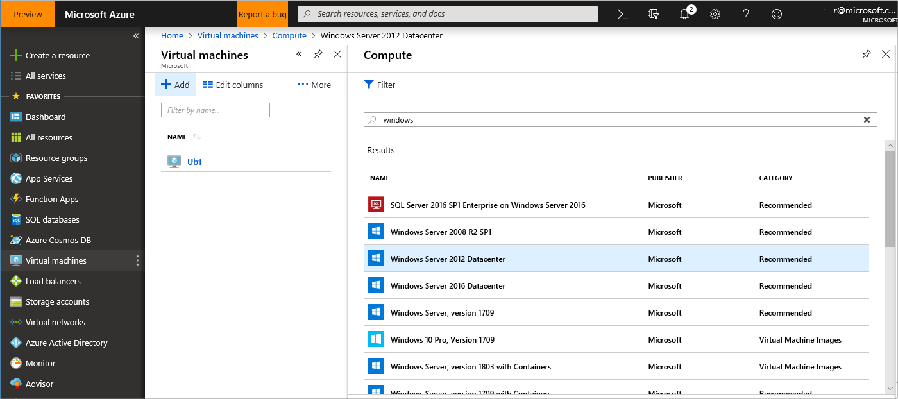
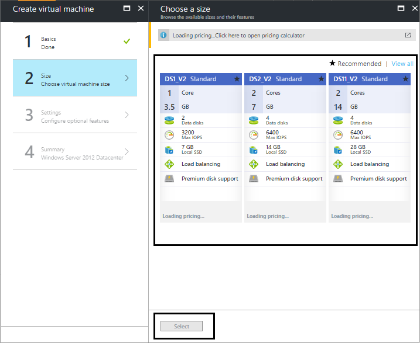
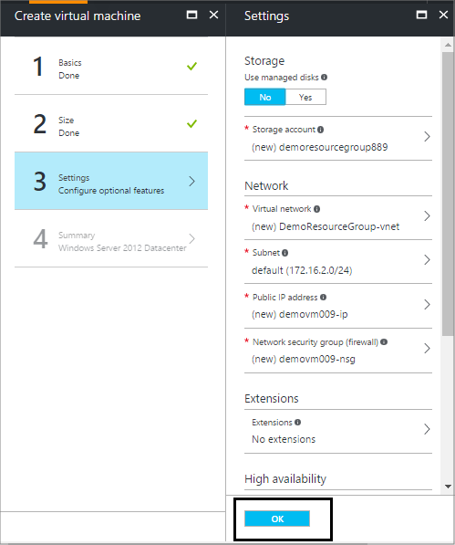
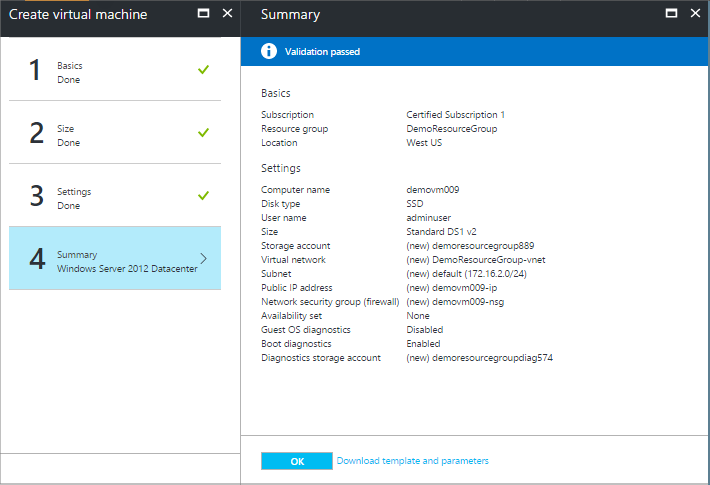

# Create an Azure-compatible VHD

This article details the steps required to create a virtual hard disk (VHD) for a virtual machine (VM) offer in the Azure Marketplace.  It also includes best practices for various aspects, such as using the Remote Desktop Protocol (RDP), selecting a size for the VM, installing the latest Windows updates, and generalizing the VHD image.  The following sections mainly focus on windows-based VHDs; for more information about creating Linux-based VHDs, see 
[Linux on distributions endorsed by Azure](../../../virtual-machines/linux/endorsed-distros.md). 

> [!WARNING]
> It is strongly recommended that you follow the guidance in this topic to use Azure to create a VM containing an pre-configured, endorsed operating system.  If this is not compatible with your solution, then it is possible to create and configure an on-premises VM using an approved operating system.  You can then configure and prepare it for upload as described in [Prepare a Windows VHD or VHDX to upload to Azure](https://docs.microsoft.com/azure/virtual-machines/windows/prepare-for-upload-vhd-image).

## Select an approved base
The operating system VHD for your VM image must be based on an Azure-approved base image that contains Windows Server or SQL Server.
To begin, create a VM from one of the following images, located at the Microsoft Azure portal:

-	Windows Server ([2016](https://www.microsoft.com/evalcenter/evaluate-windows-server-2016), [2012 R2 Datacenter](https://azuremarketplace.microsoft.com/marketplace/apps/microsoftwindowsserver.windowsserver?tab=Overview), [2012 Datacenter](https://azuremarketplace.microsoft.com/marketplace/apps/microsoftwindowsserver.windowsserver?tab=Overview), [2008 R2 SP1](https://azuremarketplace.microsoft.com/marketplace/apps/microsoftwindowsserver.windowsserver?tab=Overview))
-	[SQL Server 2014](https://docs.microsoft.com/azure/virtual-machines/windows/sql/virtual-machines-windows-sql-server-pricing-guidance) (Enterprise, Standard, Web)
-	[SQL Server 2012 SP2](https://docs.microsoft.com/azure/virtual-machines/windows/sql/virtual-machines-windows-sql-server-pricing-guidance) (Enterprise, Standard, Web)

> [!TIP]
> If you are using the current Azure portal or PowerShell, Windows Server images published on September 8, 2014 and later are approved.

Alternately, Azure offers a range of approved Linux distributions.  For a current list, see [Linux on distributions endorsed by Azure](https://docs.microsoft.com/azure/virtual-machines/linux/endorsed-distros).

## Create VM in the Azure portal 

In the Microsoft [Azure portal](https://ms.portal.azure.com/), create the base image using the following steps.

1. Sign in to the portal with the Microsoft account for the Azure subscription you want to publish your VM offer.
2. Create a new resource group and provide your **Resource group name**, **Subscription**, and **Resource group location**.  For more guidance, see [Manage resource groups](https://docs.microsoft.com/azure/azure-resource-manager/resource-group-portal).
3. Click on **Virtual machines** in the left menubar to display the Virtual machines details page. 
4. In this new page, click on **+Add** to display the **Compute** blade.  If you do not see the VM type on the initial screen, you can search for the name of your base VM, for example:

    

5. After you select the proper virtual image, provide the following values:
   * On the **Basics** blade, enter a **Name** for the virtual machine, between 1-15 alphanumeric characters. (This example uses `DemoVm009`.)
   * Enter a **User name** and a strong **Password**, which are used to create a local account on the VM.  (Here `adminUser` is used.)  The password must be 8-123 characters long and meet three out of the four following complexity requirements: one lower case character, one upper case character, one number, and one special character. For more information, see [Username and password requirements](https://docs.microsoft.com/azure/virtual-machines/virtual-machines-windows-faq#what-are-the-username-requirements-when-creating-a-vm).
   * Select the Resource group you created (here `DemoResourceGroup`).
   * Select an Azure Datacenter **Location** (here `West US`).
   * Click **OK** to save these values. 

6. Select the size of the VM to deploy using the following recommendations:
   * If you plan to develop the VHD on-premises, the size does not matter. Consider using one of the smaller VMs.
   * If you plan to develop the image in Azure, consider using one of the recommended VM sizes for the selected image.
   * For pricing information, refer to the **Recommended pricing tiers** selector displayed on the portal. It will display the three recommended sizes provided by the publisher. (Here, the publisher is Microsoft.)

   

7. In the **Settings** blade, set the **Use Managed Disk** option to **No**.  This enables you to manually manage the new VHD. (The **Settings** blade also enables you to change other change the storage and network options, for example, selecting **Premium (SSD)** in **Disk type**.)  Click **OK** to continue.

    

8. Click **Summary** to review your choices. When you see the **Validation passed** message, click **OK**.

    

Azure begins provisioning of the virtual machine you specified.  You can track its progress by clicking on **Virtual Machines** tab on left.  After it is created, the status will change to **Running**.  At that point, you can [connect to the virtual machine](./cpp-connect-vm.md).

## Next steps

If you encountered difficulty creating your new Azure-based VHD, see [Common issues during VHD creation](./cpp-common-vhd-creation-issues.md).  Otherwise, next you must [connect to the VMs](./cpp-connect-vm.md) you created on Azure. 
