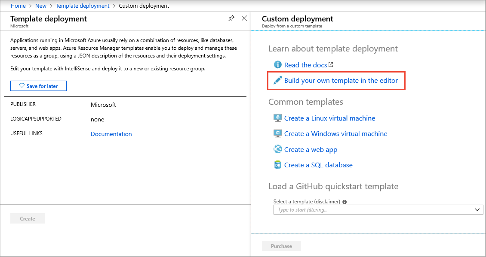
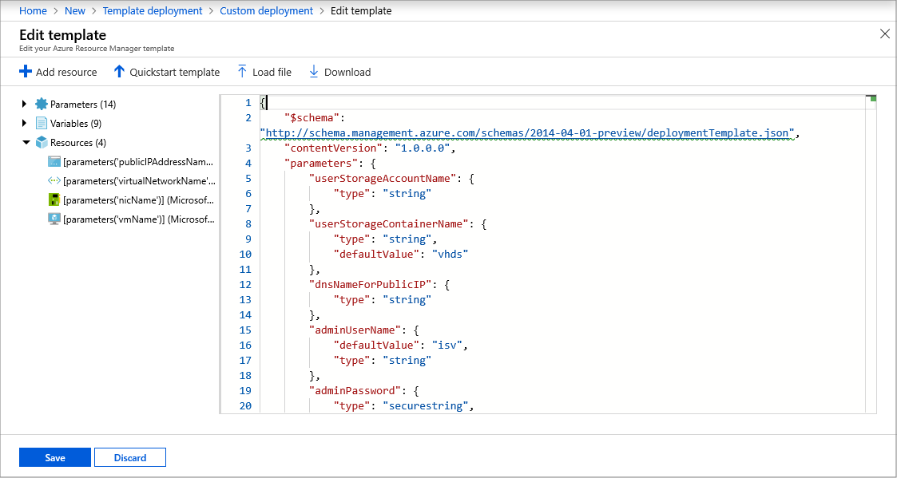
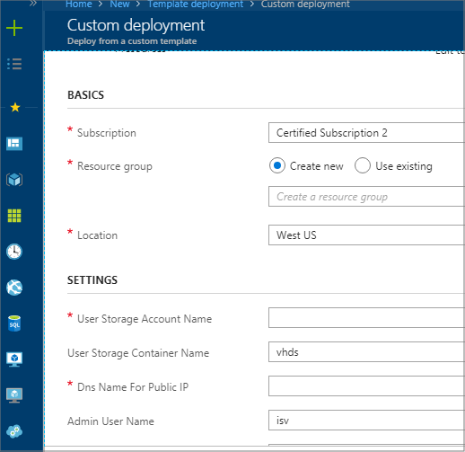
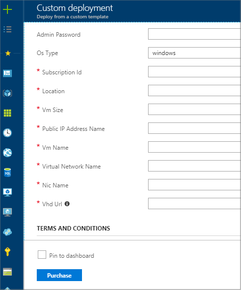

# Deploy a VM from your VHDs

This section explains how to deploy a virtual machine (VM) from an Azure-deployed virtual hard disk (VHD).  It lists the tools required, and how to use them to create a user VM image, then deploy it to Azure using PowerShell scripts.

After you have uploaded your virtual hard disks (VHDs)—the generalized operating system VHD and zero or more data disk VHDs—to your Azure storage account, you can register them as a user VM image. Then you can test that image. Because your operating system VHD is generalized, you cannot directly deploy the VM by providing the VHD URL.

To learn more about VM images, see the following blog posts:

- [VM Image](https://azure.microsoft.com/blog/vm-image-blog-post/)
- [VM Image PowerShell 'How To'](https://azure.microsoft.com/blog/vm-image-powershell-how-to-blog-post/)

[!INCLUDE [updated-for-az](../../../../includes/updated-for-az.md)]

## Prerequisite: install the necessary tools

If you have not already done so, install Azure PowerShell and the Azure CLI, using the following instructions:

- [Install Azure PowerShell](https://docs.microsoft.com/powershell/azure/install-Az-ps)
- [Install Azure CLI](https://docs.microsoft.com/cli/azure/install-azure-cli)


## Deployment steps

You will use the following steps to create and deploy a user VM image:

1. Create the user VM image, which entails capturing and generalizing the image. 
2. Create certificates and store them in a new Azure Key Vault. A certificate is required for establishing a secure WinRM connection to the VM.  An Azure Resource Manager template and an Azure PowerShell script are provided. 
3. Deploy the VM from a user VM image, using the supplied template and script.

After your VM is deployed, you are ready to [certify your VM image](./cpp-certify-vm.md).

1. Click **New** and search for **Template Deployment**, then select **Build your own template in Editor**.  <br/>
   

1. Copy and paste this [JSON template](./cpp-deploy-json-template.md) into the editor and click **Save**. <br/>
   

1. Provide the parameter values for the displayed **Custom deployment** property pages.

   <table> <tr> <td valign="top">  </td> <td valign="top">  </td> </tr> </table> <br/> 

   |  **Parameter**              |   **Description**                                                            |
   |  -------------              |   ---------------                                                            |
   | User Storage Account Name   | Storage account name where the generalized VHD is located                    |
   | User Storage Container Name | Container name where the generalized VHD is located                          |
   | DNS Name for Public IP      | Public IP DNS name                                                           |
   | Admin User Name             | Administrator account's username for new VM                                  |
   | Admin Password              | Administrator account's password for new VM                                  |
   | OS Type                     | VM operating system: `Windows` \| `Linux`                                    |
   | Subscription ID             | Identifier of the selected subscription                                      |
   | Location                    | Geographic location of the deployment                                        |
   | VM Size                     | [Azure VM size](https://docs.microsoft.com/azure/virtual-machines/windows/sizes), for example `Standard_A2` |
   | Public IP Address Name      | Name of your public IP address                                               |
   | VM Name                     | Name of the new VM                                                           |
   | Virtual Network Name        | Name of the virtual network used by the VM                                   |
   | NIC Name                    | Name of the network interface card running the virtual network               |
   | VHD URL                     | Complete OS Disk VHD URL                                                     |
   |  |  |
            
1. After you supply these values, click **Purchase**. 

Azure will begin deployment: it creates a new VM with the specified unmanaged VHD, in the specified storage account path.  You can track the progress in the Azure portal by clicking on **Virtual Machines** on the left-hand side of the portal.  When the VM has been created, the status will change from `Starting` to `Running`. 


### Deploy a VM from PowerShell

To deploy a large VM from the generalized VM image just created, use the following cmdlets.

``` powershell
    $img = Get-AzureVMImage -ImageName "myVMImage"
    $user = "user123"
    $pass = "adminPassword123"
    $myVM = New-AzureVMConfig -Name "VMImageVM" -InstanceSize "Large" -ImageName $img.ImageName | Add-AzureProvisioningConfig -Windows -AdminUsername $user -Password $pass
    New-AzureVM -ServiceName "VMImageCloudService" -VMs $myVM -Location "West US" -WaitForBoot
```


## Next steps

Next, you will [create a user VM image](cpp-create-user-image.md) for your solution.

