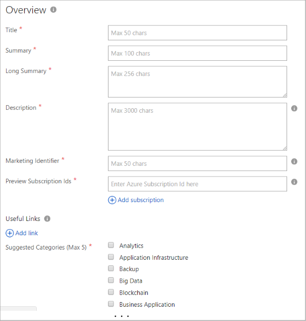
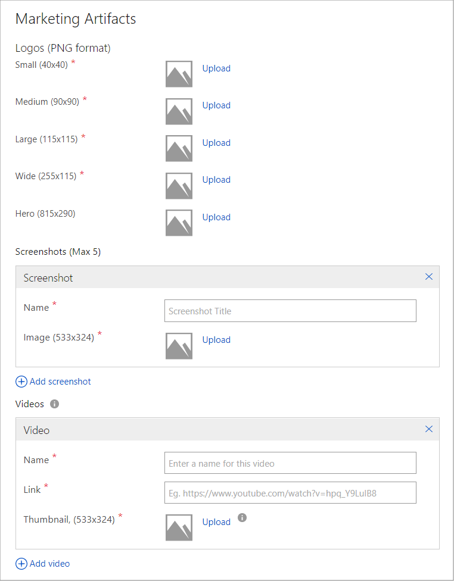
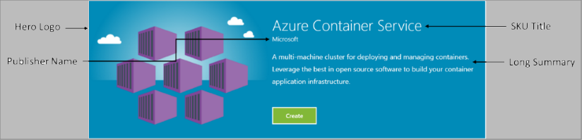
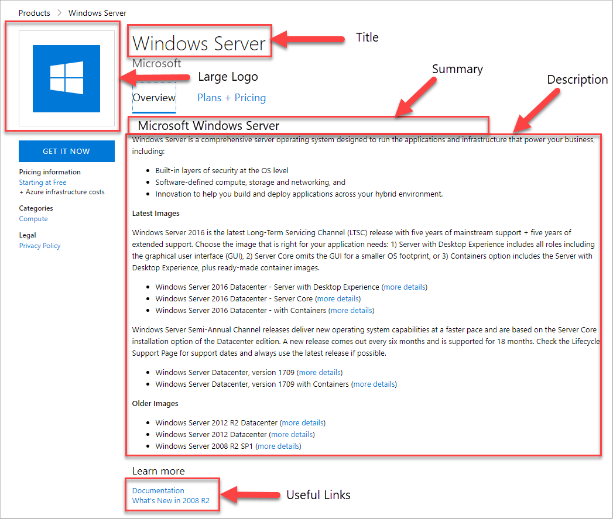

# Virtual machine Marketplace tab

The **Marketplace** tab of the **New Offer** page enables you to provide your prospective customers with marketing, sales, and legal information and agreements and manage leads generated from the marketplace. This long form is divided into four sections: **Overview**, **Marketing Artifacts**, **Lead Management**, and **Legal**.

## Overview section
In this section, you enter the general information about your Azure Marketplace Offer.  An appended asterisk (*) on the field name indicates that it is required.

The following table describes the purpose and content of these fields. Required fields are indicted by an asterisk (*).

|  **Field**                |     **Description**                                                          |
|  ---------                |     ---------------                                                          |
| **Title\***                 | Title of the offer, often the long, formal name. This title will be displayed prominently in the marketplace.  Maximum length of 50 characters. |
| **Summary\***               | Brief purpose or function of solution.  Maximum length of 100 characters. |
| **Long Summary\***          | Purpose or function of solution.  Maximum length of 256 characters. |
| **Description\***           | Description of solution.  Maximum length of 3000 characters, supports simple HTML formatting. |
| **Microsoft CSP Reseller channel\*** | Cloud Solution Providers (CSP) partner channel opt-in is now available.  Please see [Cloud Solution Providers](../../cloud-solution-providers.md) for more information on marketing your offer through the Microsoft CSP partner channels. |
| **Marketing Identifier\***  | A unique URL to associate to this offer, typically includes your organization and solution name, maximum length 50 characters.  For example:   `https://azuremarketplace.microsoft.com/marketplace/apps/contoso.sampleApp`  |
| **Preview Subscription IDs\*** | Add one to 100 subscription identifiers of previewers. These white-listed subscriptions will have access to the offer once it's published, before it goes live. |
| **Useful Links**          | Add URLs to the documentations, release notes, FAQs, and so on. |
| **Suggested Categories (Max 5)\*** | Multi-selection of business and technical categories that offer can be best associated with.  Maximum five allowed.  |
|  |  |

## Marketing Artifacts section

This second section is divided in three subsections: **Logos**, **Screenshot**, and **Videos**. Logos are the only required marketing artifacts, however all are highly recommended for best customer appeal. 

The following table describes the purpose and content of these fields. Required fields are indicted by an asterisk (*).

|  **Field**                |     **Description**                                                          |
|  ---------                |     ---------------                                                          |
| *Logos*  |  |
| **Small\***                 | 40x40 pixel .ico bitmap                                                      |
| **Medium\***                | 90x90 pixel .ico bitmap                                                      |
| **Large\***                 | 115x115 pixel .ico  bitmap                                                   |
| **Wide\***                  | 255x115 pixel .ico bitmap                                                    |
| **Hero**                  | 815x290 bitmap.  Optional, however once uploaded the hero icon cannot be deleted. |
| *Screenshots*  | Optional, but maximum of five screenshots per SKU. |
| **Name**                  | Name or title <!-- TODO - max char length? none specified in UI -->                               |
| **Image**                 | Screen capture image, 533x324 pixel                                         |
| *Videos*  |  |
| **Name**                  | Name or title  <!-- TODO - max char length? -->                              |
| **Link**                  | Video URL, hosted on YouTube or Vimeo                                        |
| **Thumbnail**             | 533x324 bitmap                                                               |
|   |   |

### Logo guidelines

<!-- TD: It seems like this section could be better located in some common area, maybe an AMP Marketing/Design section 
+1 this should all be in a common area and referenced from here to that location.-->

All the logos uploaded to the Cloud Partner Portal should follow the guidelines:

*  The Azure design has a simple color palette. Keep the number of primary and secondary colors on your logo low.
*  The theme colors of the Azure portal are white and black. Therefore avoid using these colors as the background color of your logos. Use some color that would make your logos prominent in the Azure portal. We recommend simple primary colors. If you are using transparent background, then make sure that the logos/text are not white or black or blue.
*  Do not use a gradient background on your logo.
*  Avoid placing text—even your company or brand name—on the logo. The look and feel of your logo should be "flat" and should avoid gradients.
*  Do not stretch the logo.

#### Hero logo

The Hero logo is optional; however once uploaded, the hero icon cannot be deleted.  The Hero logo icon should follow the guidelines:

*  Black, white, and transparent backgrounds are not allowed for hero icons.
*  Avoid using any light color as the background of the hero icon.  The Publisher display name, plan title and the offer long summary are displayed in white font color, and must stand out against the background.
*  Avoid using most text while you are designing the hero logo.  The publisher name, plan title, the offer long summary and a create button are embedded programmatically inside the hero icon when the offer lists. 
* Include an unused rectangle on the right-side of your hero icon, of size 415x100 pixel and offset 370 px from the left.  

As an example, the following hero icon is for the Azure Container Service.  <!-- TD: It would be nice to have the raw bitmap, e.g.before and after embedding. -->

### Marketing information example 

The following image demonstrates how marketing information is displayed on the Microsoft Windows Server main product page.

## Lead Management section

The third section enables you to collect customers leads generated from your Azure Marketplace offers. It offers the following storage options (from a dropdown list) for this lead information.

* **None** - the default, lead information is not collected.
* Azure Table - written to the Azure table specified by a connection string.
* Dynamics CRM Online - written to the [Microsoft Dynamics 365 Online](https://dynamics.microsoft.com/) instance, specified by a URL and authentication credentials.
* HTTPS Endpoint - written to the specified HTTPS endpoint as a JSON payload.
* Marketo - written to the specified [Marketo](https://www.marketo.com/) instance, specified by server ID, munchkin ID, and form ID.
* Salesforce - written to a [Salesforce](https://www.salesforce.com/) database, specified by an object Identifier.

After you successfully publish your offer, the lead connection is validated and a test lead is automatically sent to the configured destination. Lead information should be continuously managed and these settings should be promptly updated whenever changes are made to your customer management architecture.

<!-- TD: For more info, see [Need a topic on lead information and processing that mimics the Appendix of the VM Pub Guide]. -->

## Legal section

This last section enables you to provide the required legal documents required for each offer.  

|  **Field**                    |     **Description**                                        |
|  ---------                    |     ---------------                                        |
| **Privacy Policy URL\***      | URL to your posted privacy policy                          |
| **Use Standard Contract?\***  |   |
| **Terms of use\***            | policy as plain text or simple HTML.                       |
|  |  |

## Next steps

In the next [Support](./cpp-support-tab.md) tab, you will provide technical and user support resources for your offer.
