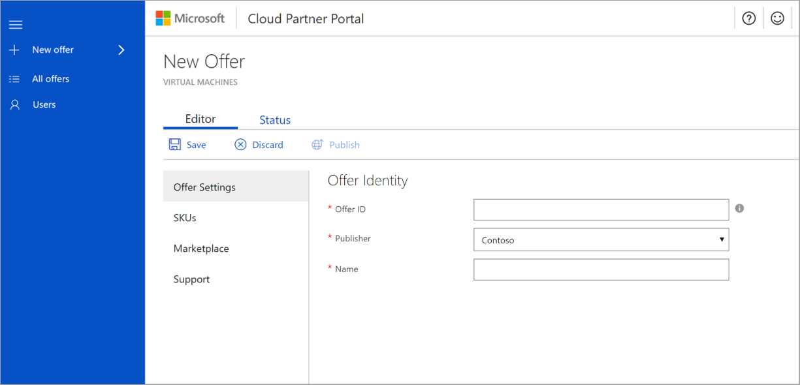

# Virtual machine Offer Settings tab

The **New Offer** page for virtual machines opens in the first tab named **Offer Settings**.  An appended asterisk (*) on the field name indicates that it is required. 

In the **Offer Settings** tab, you must provide the following required fields.

|  **Field**       |     **Description**                                                          |
|  ---------       |     ---------------                                                          |
| **Offer ID**       | A unique identifier (within a publisher profile) for the offer. This identifier will be visible in product URLs, Azure Resource Manager templates, and billing reports. It has a maximum length of 50 characters, can only be composed of lowercase alphanumeric characters and dashes (-), but cannot end in a dash. This field cannot be changed after an offer goes live.   For example, if Contoso publishes an offer with offer ID **sample-vm**, it is assigned the Azure Marketplace URL `https://azuremarketplace.microsoft.com/marketplace/apps/contoso.sample-vm?tab=Overview` . |
| **Publisher**     | Your organization's unique identifier in the Azure Marketplace. All your offerings should be associated with your publisher ID. This value cannot be modified once the offer is saved. |
| **Name**          | Display name for your offer. This name will display in the Azure Marketplace and in the Cloud Partner Portal. It can have a maximum of 50 characters. Guidance here is to include a recognizable brand name for your product. Don’t include your organization's name here unless that is how it is marketed. If you are marketing this offer in other websites and publications, ensure that the name is exactly the same across all publications. |
|  |  |
 
Click **Save** to save your progress. In the next tab, you will add [SKUs](./cpp-skus-tab.md) to your offer.
