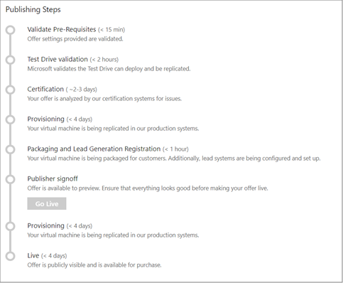

# Publish a virtual machine offer

 The last step, after you have defined the offer in the portal and created the associated technical assets, is to submit the offer for publishing. The following diagram depicts the main steps in the publishing process to "go live":

The following table describes these steps and provides a maximum time estimate for their completion:
<!-- we need to tell them that if an offer seems stuck in a step, to know that they should file a support ticket (link to support ticket doc) -->

|  **Publishing Step**           | **Time**    | **Description**                                                            |
|  -------------------           | --------    | ---------------                                                            |
| Validate prerequisites         | 15 min   | Offer information and offer settings are validated.                        |
| Test Drive Validation (optional) | 2 hours | If you have selected to enable Test Drive, Microsoft validates the Test Drive configuration, its deployment, and replication through the selected regions. |
| Certification                  | 3 days | Offer is analyzed by the Azure Certification Team. This step will perform scans for viruses, malware, safety compliance, and security issues. Feedback is provided if an issue is found. |
| Provisioning                   | 4 days   | VM offer is replicated in marketplace production systems.               |
| Packaging and lead generation registration | \< 1 hour  | Offer’s technical assets are packaged for customer use and the lead systems are configured and setup. |
|  Publisher signoff             |  -        | Final publisher review and confirmation before the offer goes live. You can deploy your offer in the selected subscriptions (in the offer information steps) to verify that it meets all your requirements.  |
| Provisioning                   | 4 days | Finalized VM offer is replicated in marketplace production systems and regions. | 
| Live                           | 4 days | VM offer is released, replicated to the required regions, and made available to the public. |
|  |  |

Allow for up to 16 days for this process to complete.  After you go through these publishing steps, your VM offer will be listed in the [Microsoft Azure Marketplace](https://azuremarketplace.microsoft.com/marketplace/). 

