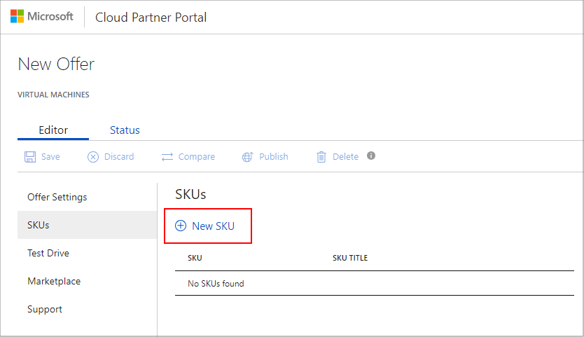
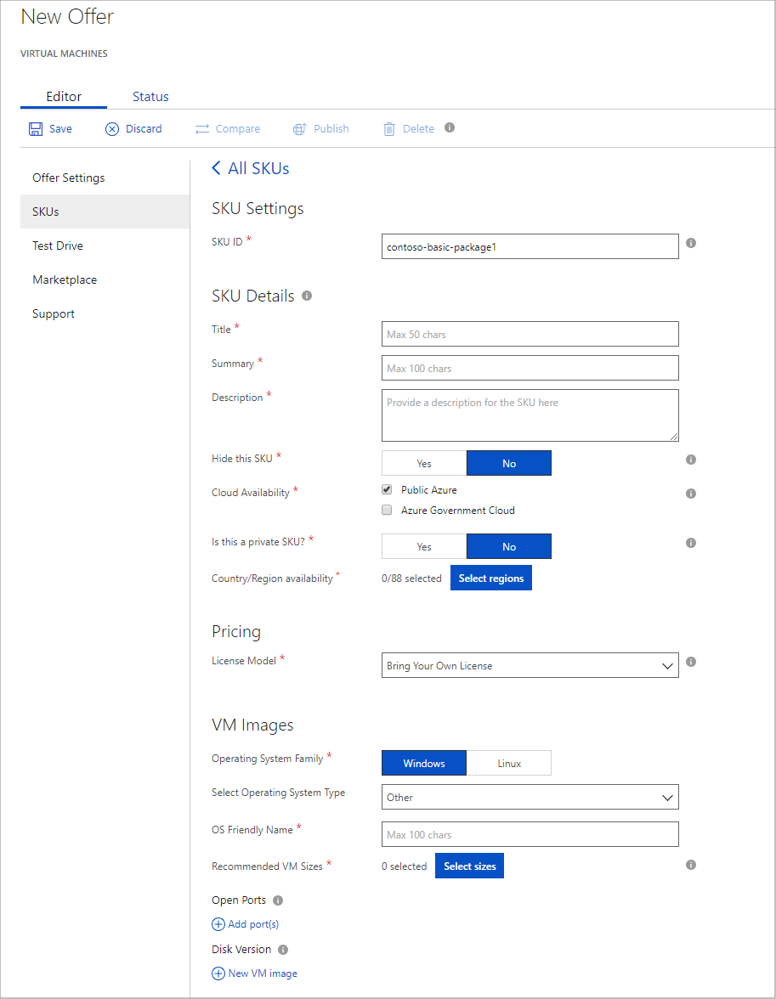

# Virtual machine SKUs tab

The **SKUs** tab of the **New Offer** page enables you to create one or more SKUs and associate them to your new offer.  Different SKUs can differentiate a solution by feature sets, VM image types, throughput or scalability, billing models, or some other characteristic.

## Create a SKU

Initially, a new offer will not have any associated SKUs, so you will create one by clicking **New SKU**.

 

The **New SKU** dialog box is displayed.  Enter the identifier for the new SKU then click **OK**. (See below for identifier naming conventions.)  The **SKUs** tab will now display the fields available for editing.    An appended asterisk (*) on the field name indicates that it is required.

<!-- TD: This tab has been updated, now has "Old Pricing" and "Simplified Currency Pricing" sections"! -->

The following table describes the purpose, contents, and formatting of these fields.

<!-- TD: I took a new screenshot, and the fields differ somewhat from description in the VM Pub Guide.  Needs review. -->

|  **Field**       |     **Description**                                                          |
|  ---------       |     ---------------                                                          |
|  *SKU Settings*   |  |
| **SKU ID**       | Identifier for this SKU.  This name has a maximum of 50 characters, consisting of lowercase alphanumeric characters or dashes (-), but cannot end with a dash.  It cannot be modified after the offer is published.  |
|  *SKU Details*   |  |
| **Title**        | Friendly name for the offer for display in the marketplace. Maximum length of 50 characters. |
| **Summary**      | Succinct description of the offer for display in the marketplace. Maximum length of 100 characters. |
| **Description**  | Description text that provides a more detailed explanation of the offer.  <!-- TD: max len/guidance? 3k characters -->  |
| **Hide this SKU** | Indicates whether the SKU should be visible in the marketplace to customers.  You may want to hide the SKU if you only want it available only via solution templates and not for purchase individually.  It could also be useful for initial testing or for temporary or seasonal offers. |
| **Cloud Availability** | Determines on which clouds the SKU should be available.  The default is the public version of Azure.  Microsoft Azure Government is a government-community cloud with controlled access for the US Federal, State, local or tribal governments, and their certified partners.  For more information about government cloud, see [Welcome to Azure Government](https://docs.microsoft.com/azure/azure-government/documentation-government-welcome). |
| **Is this a Private SKU?** | Indicates whether the SKU is private or public. The default is **No** (public).  For more information, see [Public and Private SKUs](../../cloud-partner-portal-orig/cloud-partner-portal-azure-private-skus.md). |
| **Country/Region Availability** | Determines which countries or world regions your SKU will be available for purchase. Select at least one region/country. <!-- TD: Is this parameter an AMP visibility control or a contractual one, or both? --> |  
|  *Pricing*   |  |
| **License Model**| Standardized billing model to use.  If you select **Usage-based monthly billed SKU**, an accordion section will open to enable you to specify details of per-core pricing and whether you want to offer a free trial period.  This section also enables you to export and import this pricing schedule to Excel. For more information, see [Billing options in the Azure Marketplace](../../billing-options-azure-marketplace.md). | 
|  *VM Images*   |  |
| **Operating System Family** | Indicates whether the solution VM is Windows- or Linux-based. |
| **Select Operating System Type** | Specific vendor or release of the specified OS. |
| **OS Friendly Name** | Operating system name to be displayed to customers.  |
| **Recommended VM Sizes** | Enables selection of up to six recommended VM sizes from a standardized list.  Although these recommendations are prominently displayed to potential customers, they are able to specify any VM size that is compatible with the solution image. | 
| **Open Ports**| Ports to open and protocol to support for the SKU.  These configurations must match the virtual network you've configured for the network of the solution VM. These settings go into effect during VM deployment. However, Port settings can be modified after you publish an SKU. For more information, see [How to open ports to a virtual machine with the Azure portal](https://docs.microsoft.com/azure/virtual-machines/windows/nsg-quickstart-portal).  The following default network mappings are added to all VMs. &emsp; Windows: 3389 -> 3389 TCP, 5986 -> 5986 TCP; &emsp; Linux: 22 -> 22, TCP (SSH). |
| **Disk Version**  | Associated solution VM, specified by disk version number and disk URL. The disk version must be in [semantic version](http://semver.org/) format: `<major>.<minor>.<patch>`.  The URL is the shared access signature URI created for the operating system VHD.  Although, you can add up to eight disk versions per SKU, only the highest disk version number for an SKU will show up in Azure Marketplace. The other versions will only be visible via APIs.  <!--TD: Add more specific link to API -->   The **New data disk** accordion section enables you to attach up to 15 data disks to your VM.  Once you publish a SKU with a given VM version and associated data disks, this configuration cannot be modified.  If additional VM versions get added to the SKU, they must also support the same number of data disks.   If you have not created your Azure-based VM image(s), you can add update this field later.  For information about creating the associated VM resource, see the section [Create VM technical assets](./cpp-create-technical-assets.md).  
|  |  |

<!-- TD: The CPP UX warning msg indicates that underscores are also supported in these SKU IDs. I suspect this might be true for other identifiers. --> 

  Click **Save** to save your progress. In the next tab, you will specify if your offer supports [Test Drive](./cpp-test-drive-tab.md).

## Additional pricing considerations

The pricing model described above is a basic description.  It is undergoing changes and may be affected by local or regional tax regulations and Microsoft pricing policies. 

### Simplified Currency Pricing

Starting September 1 2018, a new section called **Simplified Currency Pricing** will be added to the portal. Microsoft is streamlining the Azure Marketplace business by enabling more predictable pricing and collections from your customers across the world. This streamlining will include reducing the number of currencies in which we invoice your customers.  For more information, see [Update an existing VM offer on Azure Marketplace](./cpp-update-existing-offer.md).

### Additional information on taxes and prices

* Microsoft classifies some countries as *tax remitted countries*.  In such countries, Microsoft collects taxes from customers then pays (remits) taxes to the government.  In other countries, partners are typically responsible for collecting taxes from their customers and paying taxes to the government. If you choose to sell in the latter countries, you must have the capability to calculate and pay local taxes.  <!-- TD: Find a good reference on taxing policies. The best I found was in the UWP section: https://docs.microsoft.com/windows/uwp/publish/tax-details-for-paid-apps -->
* Prices are not changeable once an offer goes live. However, you may still add or remove supported regions. 
* Microsoft charges the customer standard Azure VM usage fees in addition to your scheduled SKU fees.
* Prices are set for all regions in local currency on available currency rates at the time of setting prices.  <!-- TD: Meaning? - Offer created, published, other? -->
* To set each region’s price individually, please export the pricing spreadsheet, apply custom pricing, then import. 

<!-- TD: The detailed information in the table and supplemental notes should be centralized in another topic, maybe "Billing Options" in AMP tree. Need to include a common section on export/import pricing-->

