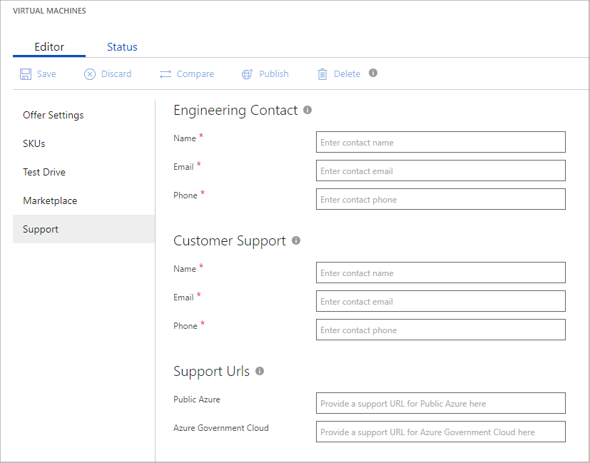

# Virtual machine Support tab

The **Support** tab of the **New Offer** page enables you to provide technical and user support resources for your offer.  It is divided into three areas: **Engineering**, **Customer Support**, and **Support URLs**.

## Field values

The following table describes the purpose and content of these fields. Required fields are indicted by an asterisk (*).

|         Field                 |       Description                                                        |
|        -------                |       ------------                                                       |
| *Engineering Contact*     | Serves as a technical contact between Microsoft and your organization | 
| **Name\***                | Name of the person or group that serves as technical/engineering support     |
| **Email\***               | Email address of this technical contact                                      |
| **Phone\***               | Phone number for technical support                                           |
| *Customer Support*        | Receives support tickets opened by customers within Azure |
| **Name\***                | Name of the person or group that serves as customer support                  |
| **Email\***               | Email address of customer support                                            |
| **Phone\***               | Phone number for customer support                                            |
| *Support Urls*            | Support sites that Microsoft will use when your customers open support tickets |
| **Public Azure**          | URL for public internet support site                                         |
| **Azure Government Cloud**| URL for government cloud support site                                        |
|  |  |

## Next steps

Next if you have not already doen so, finalize your [virtual machine technical assets](./cpp-create-technical-assets.md).
