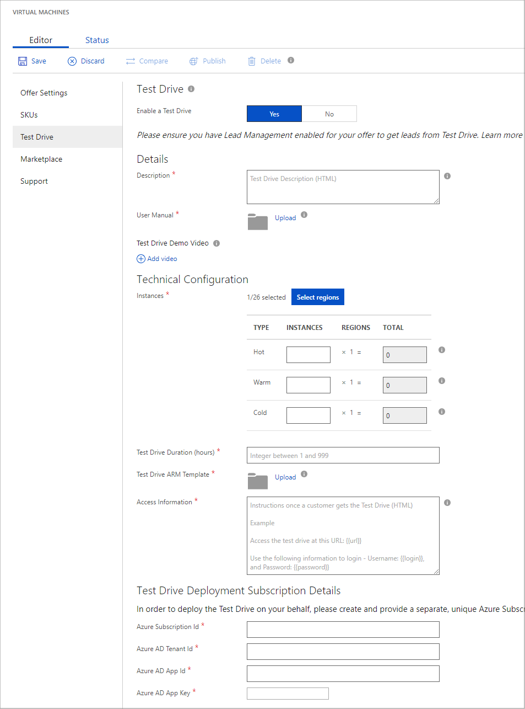

# Virtual machine Test Drive tab

The **Test Drive** tab of the **New Offer** page enables you to provide your prospective customers with a hands-on, self-guided demonstration of your product's key features and benefits, demonstrated in a standardized scenario.  Test Drive is an optional feature for the offer types that support Test Drive.  Test Drive requires supporting assets to be properly implemented.  For more information, see the article [Azure Marketplace Test Drive](https://azure.microsoft.com/blog/azure-marketplace-test-drive/).  <!--TD: Replace with migrated version of Test Drive article! -->

To enable this feature, on the **Test Drive** tab, click the **Yes** option on **Enable a Test Drive**.  The **Test Drive** tab displays the fields available for editing.  An appended asterisk (*) on the field name indicates that it is required.

## Field values

The following table describes the purpose and content of these fields.  Required fields are indicted by an asterisk (*).

|    Field                  |       Description                                                            |
|  ---------                |     ---------------                                                          |
|  *Details*   |  |
| **Description\***           | Provide an overview of your Test Drive scenario. This text will be shown to the user while the Test Drive is being provisioned. This field supports basic HTML if you want to provide formatted content.  |
| **User Manual\***           | Upload a detailed user manual (.pdf) which helps Test Drive users understand how to use your solution.  |
| **Test Drive Demo Video** | Upload a video that showcases your solution.  If you chose this option, you must provide a name, URL to the video (hosted on YouTube or Vimeo), and a (533x324 pixel) thumbnail for the video. |
| *Technical Configuration* |  |
| **Instances\***             | Specify region availability and relatively availability of the vm instance (click the info icon for more details).   Potential concurrent Test Drive sessions should not exceed the quota limit for your subscription.  The former is calculated as:  [Number of Regions Selected] x [Hot instances] + [Number of Regions Selected] x [Warm instances] + [Number of Regions Selected] x [Cold instances] |
| **Test Drive Duration\***   | Maximum session duration in hours. The Test Drive session terminates automatically after this time period is exceeded.  |
|**Test Drive ARM Template\***| Upload the Azure Resource Manager template associated with this Test Drive. For more information, see [Transforming Virtual Machine Deployment Template for Test Drive](https://github.com/Azure/AzureTestDrive/wiki/Transforming-Virtual-Machine-Deployment-Template-for-Test-Drive). |
| **Access Information\***    | Azure Resource Manager access and trial login information, written as plain text or simple HTML. |
| *Test Drive Deployment Subscription Details* |  |
| **Azure Subscription Id\*** | Can be obtained by signing into the [Microsoft Azure portal](https://ms.portal.azure.com) and clicking **Subscriptions** on the left menubar. (Example: “a83645ac-1234-5ab6-6789-1h234g764ghty”)    This identifier should be a GUID of the form  `a83645ac-1234-5ab6-6789-1h234g764ghty`.|
| **Azure AD Tenant Id\***    | Azure Active Directory tenant ID.  Can be obtained by signing into the [Microsoft Azure portal](https://ms.portal.azure.com) and clicking **Azure Active Directory** on the left menubar, then clicking **Properties** in the middle menubar, then copying the **Directory ID** from the form.  This identifier should also be a GUID.  If blank, then you must create a tenant ID for your organization. |
| **Azure AD App Id\***       | Identifier for your registered Azure VM solution  |
| **Azure AD App Key\***      | Authentication key for your registered solution |
|   |   |

## Next steps

In the next [Marketplace](./cpp-marketplace-tab.md) tab, you will provide marketing and legal information about your solution.
