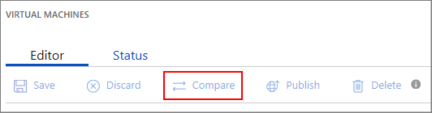

# Update an existing VM offer on Azure Marketplace

This article walks you through the different aspects of updating your virtual machine (VM) offer in the [Cloud Partner Portal](https://cloudpartner.azure.com/) and then republishing the offer. 

There are a number of commonplace reasons for you to update your offer, including:

-  Add a new VM image version to existing SKUs
-  Change regions a SKU is available
-  Add new SKUs
-  Update the marketplace metadata for the offer or individual SKUs
-  Update pricing on pay-as-you-go offers

To assist you in these modifications, the portal offers the **Compare** and **History** features.  

>[!Note]
>Cloud Solution Providers (CSP) partner channel opt-in is now available.  Please see [Cloud Solution Providers](../../cloud-solution-providers.md) for more information on marketing your offer through the Microsoft CSP partner channels.

## Unpermitted changes to VM offer or SKU

There are some attributes of a VM offer or SKU that cannot be modified once the offer is live in the Azure Marketplace, mainly:

-  **Offer ID** and **Publisher ID** of the offer
-  **SKU ID** of existing SKUs
-  Data disk count of existing SKUs
-  Billing/license model changes to existing SKUs
-  Price increases to a published SKU

## Common update operations

Although there are a wide range of characteristics you can change on a VM offer, the following operations are common.

### Update the VM image version for a SKU

It is common for a VM image to be periodically updated with security patches, additional
features, and so on.  Under such scenarios, you want to update
the VM image that your SKU references by using the following steps:

1.  Sign into the [Cloud Partner Portal](https://cloudpartner.azure.com/).

2.  Under **All offers**, find the offer to update.

3.  In the **SKUs** tab, click on the SKU associated with the VM image to update.

4.  Under **Disk version**, click on **+New Disk Version** to add a new VM image.

5.  Provide the new VM Images **Disk version**. The disk version needs to follow the [semantic version](https://semver.org/) format. Versions should be of the
    form X.Y.Z, where X, Y, and Z are integers. Verify that the new version you provide is greater than all previous versions; otherwise after republishing the new version will not display in either the portal or the Azure Marketplace.

6.  For **OS VHD URL**, enter the [shared access signature (SAS) URI](./cpp-get-sas-uri.md) created for the operating system VHD. 

    > [!WARNING] 
    > The data disk count cannot change between different versions of the SKU. If previous versions had data disks configured, this new version must also have the same number of data disks.

7.  Click on **Publish** to start the workflow to publish your new VM version to the Azure Marketplace.

### Change region availability of a SKU

Over time, you may want to make your offer/SKU available in more regions.  Alternatively, you may want to stop supporting the offer/SKU in a given region.
To modify availability, use the following steps:

1.  Sign into the [Cloud Partner Portal](https://cloudpartner.azure.com/).

2.  Under **All offers** find the offer you would like to update.

3.  In the **SKUs** tab, click on the SKU that you want to modify its availability.

4.  Click on the **Select Countries** button under the **Country/Region availability** field.

5.  In the region availability pop-up, add or remove the regions for this SKU.

6.  Click on **Publish** to start the publish workflow to update your SKUs
    region availability.

If a SKU is being made available in a new region, you will have the ability to specify pricing for that particular region via the **Export Pricing Data**
functionality. If you are adding a region back that was once available before, you will not be able to update its pricing because pricing changes are not permitted.

### Add a new SKU

Use the following steps to make a new SKU available for your existing offer: 

1.  Sign into the [Cloud Partner Portal](https://cloudpartner.azure.com/).

2.  Under **All offers** find the offer you would like to update.

3.  Under the **SKUs** tab, click on **Add new SKU** and provide a **SKU ID** in the pop-up.

4.  Republish the VM as detailed in the article [Publish a virtual machine to Azure Marketplace](./cpp-publish-offer.md).

5.  Click on **Publish** to start the workflow to publish your new SKU.

### Update offer marketplace metadata

Use the following steps to update the marketplace metadata—company name, logos, etc.—associated with your offer: 

1.  Sign into the [Cloud Partner Portal](https://cloudpartner.azure.com/).

2.  Under **All offers** find the offer you would like to update.

3.  Goto the **Marketplace** tab then follow the instructions in the article [Publish a virtual machine to Azure Marketplace](./cpp-publish-offer.md) to make metadata changes.

4.  Click on **Publish** to start the workflow to publish your changes.

### Update Pricing on Published Offers

Once your pay-as-you-go offer is published, you cannot directly increase the SKU pricing.  (However, you can create a new SKU under the same offer, delete the old
SKU, and then republish your offer for new customers.)  In contrast, you can decrease the price of a published offer using the following steps:

1.  Sign into the [Cloud Partner Portal](https://cloudpartner.azure.com/).

2.  Under **All offers**, find the offer to update.

3.  Click on the SKU for which you want to decrease pricing.

4.  If you have set the pricing in the 1x1 GUI, you can change the price
    directly in the UI. If you set pricing via import/export spreadsheet, you
    can only decrease prices via the import/export feature.

3.  Click **Save**.

4.  Click on **Publish** to start the workflow to publish your changes.

The new decreased pricing will be visible to new customers once it is live on the website.  This new price will affect your customers in the following ways:

- New customers will be charged this new rate. 
- For existing customers, the price decrease will be reflected retroactively to
the start of the billing cycle during which the price decrease became effective.
If they have already been billed for the cycle during which a price decrease
occurred, they will receive a refund during their next billing cycle to cover
the decreased price.

<!-- TD: This has been implemented, need to change the SKU Tab topic to reflect and move this section there. -->
### Simplified Currency Pricing

Starting September 1 2018, a new section called **Simplified Currency Pricing** will be added to the portal. Microsoft is streamlining the Azure Marketplace business by enabling more predictable pricing and collections from your customers across the world. This streamlining will include reducing the number of
currencies in which we invoice your customers.

The new section will take pricing in these new currencies. Once all customers
have been migrated to these new settlement currencies, the original pricing
section will be retired and only the Simplified Currency Pricing section will
remain.

You will have until November 1, 2018 to set a new price for the regions wherein the
settlement currency is changing. You will not be able to increase the price for
regions wherein the settlement currency is not changing.

> [!NOTE] 
> If you use APIs to publish your offer, you may see a new section within the Offer JSON. This would be annotated as `virtualMachinePricingV2` or
`monthlyPricingV2`, depending upon the type of offer. 

If you have any questions about this change, contact [Azure Marketplace Support](../../support-azure-marketplace.md).

## Compare Feature

When you make changes on an already published offer, you can leverage the **Compare** feature to audit the changes that have been made. To use this feature:

1.  At any point in the editing process, click the **Compare** button for your offer.

    

2.  View side-by-side versions of marketing assets and metadata.

## History of Publishing Actions

To view any historical publishing activity, click on the **History** item in the left navigation menubar of Cloud Partner Portal. Here you will be able to view timestamped actions that have been taken during the lifetime of your Azure Marketplace offers.  
<!-- TD: Add after section authored: For more information, see [History page](../portal-tour/cpp-history-page.md). -->

