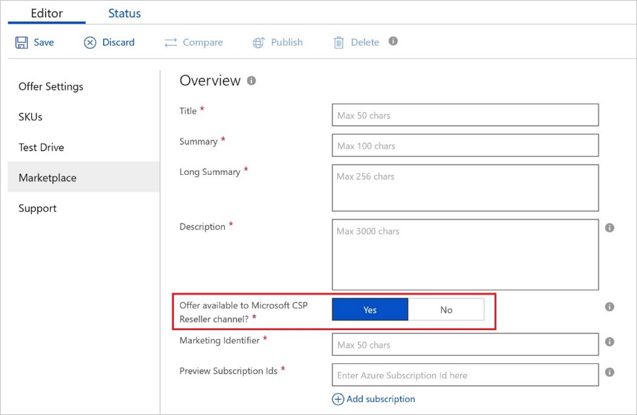
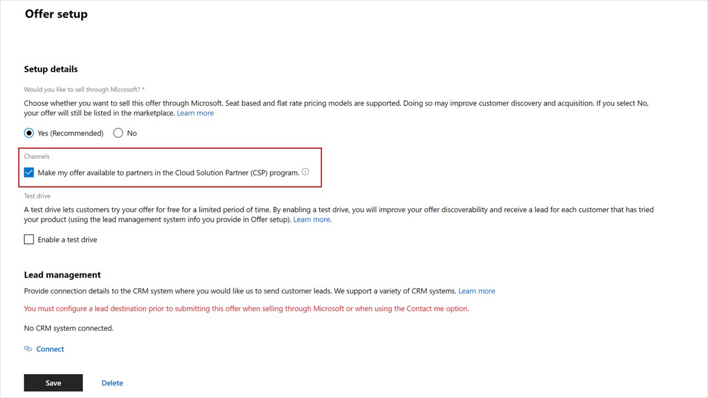
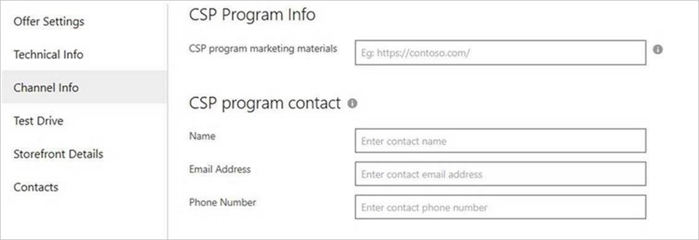

# Cloud Solution Providers

Software offers can reach millions of qualified Microsoft customers served by partners in the Cloud Solution Provider (CSP) program, in addition to public availability of offers through [Microsoft’s web storefronts](https://docs.microsoft.com/azure/marketplace/comparing-appsource-azure-marketplace).

Publishers configure offers for availability in the CSP program on an opt-in basis (default is excluded), for a new offer or an existing one, enabling partners to sell your products and create bundled solutions for customers.

Publishers are responsible for providing break-fix support to end customers and for providing a mechanism for CSP partners and/or customers to contact you for support. It is best practices to provide CSP partners with user documentation, training, and service health/outage notifications (as applicable) so that CSP partners are equipped to handle tier 1 support requests from customers.

The following table shows offer types and pricing models that can opt in to the CSP program:

| **Offer Type**    | **BYOL**  |  **Free** | **PAYG**   |
| :---------------- | :---------|:----------|:-----------|
| VMs  | Yes | Yes | Yes |
| Containers | N/A | Yes | N/A |
| Solution Templates | N/A | Yes | N/A |
| Managed Applications | N/A | Yes | Yes |
| Software-as-a-Service (SaaS) | N/A | Yes | Yes |
|   |   |   |

## How to configure an offering

The CSP program opt-in setting is configured in the Partner Center or Cloud Partner Portal offer creation experience. ([Learn more about the changing publisher experience.](https://www.microsoftpartnercommunity.com/t5/Azure-Marketplace-and-AppSource/Cloud-Marketplace-In-Partner-Center/m-p/9738#M293))

In Cloud Partner Portal, it is set on the Marketplace or Storefront tab. In Partner Center, it is set in the Offer setup tab under Setup details.

As seen below, in Partner Center, publishers can opt in to make their offers available in the CSP program by checking the box, **Make my offer available in the CSP program**.

## Sharing sales and support materials with CSP partners

To enable partners in the Cloud Solution Provider program to most effectively represent your offering and engage with your organization, submit sales and support materials that will be available to the resellers. These resources will not be exposed to customers in the marketplace storefronts.

As seen below, in Cloud Partner Portal, publishers can enter a URL that hosts relevant marketing materials and channel contact information to the CSP channel:

## Next steps

Visit the [Azure Marketplace and AppSource Publisher Guide](https://docs.microsoft.com/azure/marketplace/marketplace-publishers-guide) page.

To learn more about marketplace GTM services, go to [Go-to-market services](https://partner.microsoft.com/reach-customers/gtm).

Sign in to the [Cloud Partner Portal](https://cloudpartner.azure.com/), or the [Partner Center](https://partner.microsoft.com/dashboard/account/v3/enrollment/introduction/azureisv) for SaaS offers, to create and configure your offer.

---
