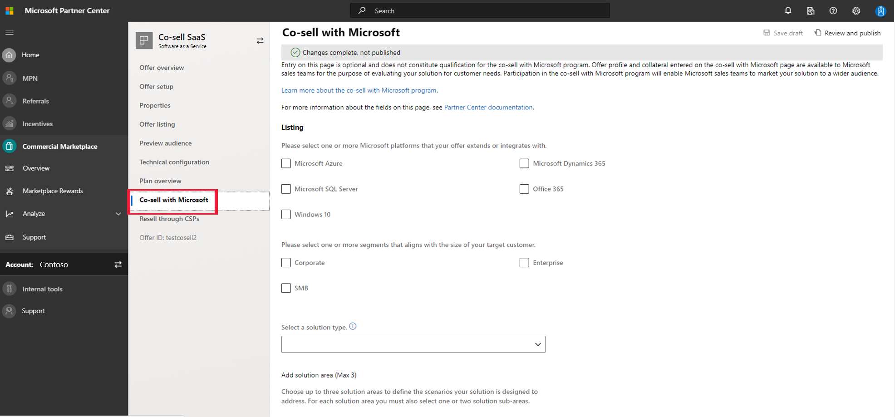
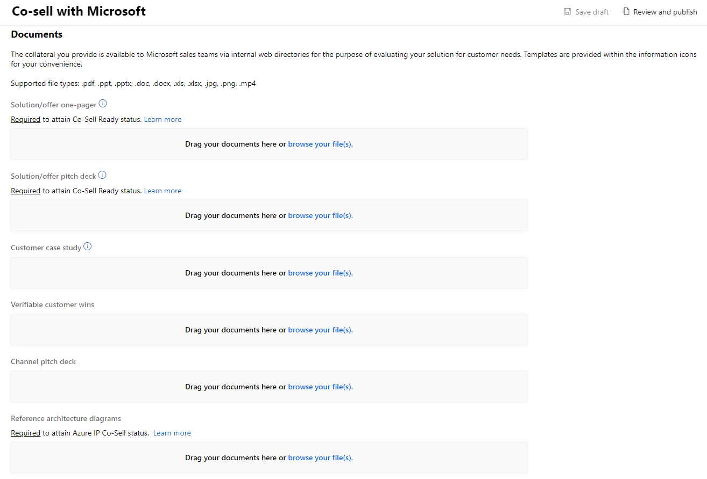
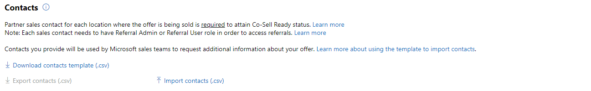

# Configure co-sell for a commercial marketplace offer

This article describes how to configure the **Co-sell with Microsoft** tab for a commercial marketplace offer. Providing information on this tab is entirely optional but it is required to achieve [Co-sell Ready and IP Co-sell Incentivized status](/legal/marketplace/certification-policies#3000-requirements-for-co-sell-status). The information you provide will be used by Microsoft sales teams to learn more about your offer when evaluating its fit for customer needs. This information is not available directly to customers. For more information about co-sell, see [Co-sell with Microsoft sellers and partners overview](marketplace-co-sell.md) and [Co-sell with Microsoft](https://partner.microsoft.com/membership/co-sell-with-microsoft).

The Co-sell option is available for the following offer types.

- Azure Application
- Azure Container
- Azure Virtual Machine
- Consulting service
- Dynamics 365 for Customer Engagement & PowerApps
- Dynamics 365 for operations
- Dynamics 365 business central
- IoT Edge Module
- Managed Service
- Power BI App
- Software as a service (SaaS)

## Go to the Co-sell with Microsoft tab

1. Sign in to [Partner Center](https://partner.microsoft.com/dashboard/home).
1. In the left-navigation menu, select **Commercial Marketplace** > **Overview**.
    > [!TIP]
    > If you don’t see **Commercial Marketplace** in the left-navigation, [create a commercial marketplace account in Partner Center](./partner-center-portal/create-account.md) and make sure your account is enrolled in the commercial marketplace program.
1. On the **Overview** tab, select the offer you want to co-sell.
    > [!NOTE]
    > You can configure co-sell for a new offer that’s not yet published or with an offer that’s already published.

1. In the menu on the left, select **Co-sell with Microsoft**.

    

## Co-sell listings

Co-sell listings help Microsoft sales teams market your offer to a wider audience. You must provide the following information to achieve co-sell ready status:

- Microsoft platforms (select one or more)
- Segments (select one or more)
- Solution type (select one)
- Solution sub-area (select one or two)

### Select Microsoft platforms and segments

1. Under **Listing**, select one or more Microsoft platforms that your offer is built with, extends, or integrates with.
1. Select one or more market segments that your offer is targeting.

### Select solution types

Solution types help define the scenarios that your offer is designed to address.

- From the **Select a solution type** list, select a solution type that best matches your offer. This table describes the available solution types.

***Table 1: Available solution types***

| **Solution type**    | **Description**  |
| :------------------- | :-------------------|
| Device (hardware) | An offer that involves building or selling hardware from a device manufacturer. |
| IP (application) | Apps or other copyrightable material licensed for the customer's use. For example, a CRM program that can be licensed and installed on-premises. |
| Managed Service | Hands-on expertise for a cloud-based project, usually on an ongoing basis. For example, providing a platform and tools for running an online database, with ongoing management provided by the managed service provider. |
| Service | Hands-on expertise for a specific one-time project, often delivered via consultants. For example, setting up a customer database for a customer (with the customer assuming responsibility for operating the database after delivery). |
|||

### Select solution areas

Solution areas help to further define your solution. This helps Microsoft sales teams find and understand your solution’s value proposition. You must select at least one and up to a maximum of three solution areas for your offer. For each solution area, you can further choose up to two solution sub-areas.

1. Select the **+ Add solution area (3 Max)** link.
1. Select a solution area from the drop-down list that appears.
1. Select at least one and up to two solution sub-areas. To select multiple sub-areas, use the `Ctrl` key (on Windows) or `Command` key (on macOS).
1. To add another solution area, repeat steps 1 through 3.

## Upload documents

You must provide collateral documents that provide details about your offer. Microsoft sales teams use this information to evaluate whether your offer is a fit for customer needs in order to recommend and sell your offer. The more information you provide, the more information Microsoft sales teams will have to understand and promote your product.

The supported file types are .pdf, .ppt, .pptx, .doc, .docx, .xls, .xlsx, .jpg, .png, and .mp4. Templates for some documents are provided in Table 2 below.

> [!NOTE]
> The **Solution/offer one-pager** and **Solution/offer pitch deck** are required to attain Co-sell Ready status. They are also prerequisites for some offers to be Azure IP Co-sell incentivized. The Reference architecture diagram is also required for Azure IP co-sell incentivized status. The other documents described in this table are optional but recommended.

***Table 2: Documents that support co-sell***

| **Documents**    | **Description**  |
| :------------------- | :-------------------|
| *Solution/offer one-pager (Required)* | Drive awareness among potential customers with a professionally designed one-pager that showcases the value proposition of your solution.  You can use one of the relevant templates to provide a customer-ready description of your offering: <ul><li> [Microsoft Azure one-pager template](https://aka.ms/Customer-One-Pager_MicrosoftAzure)</li><li>[Microsoft Dynamics 365 one-pager template](https://aka.ms/Customer-One-Pager_MicrosoftDynamics365)</li> <li>[Microsoft 365 one-pager template](https://aka.ms/Customer-One-Pager_MicrosoftOffice365) </li><li>[Windows 10 one-pager template](https://aka.ms/Customer-One-Pager_Windows)</li></ul>   Microsoft sales teams may share this information with customers to help determine if your offering may be a good fit, and to ensure that it is customer ready. |
| *Solution/offer pitch deck (Required)* | You can use the [Customer presentation template](https://aka.ms/GTMServices_CustomerPresentation) to create your pitch deck. This deck should reference the [Reference architecture diagram](reference-architecture-diagram.md). The purpose of this slide deck is to pitch your offer and its value proposition. After ensuring that your offer is customer ready, Microsoft sales teams may share this presentation with customers to articulate the value that your company and Microsoft bring when deploying a joint solution. The presentation should cover what your offer does, how it can help customers, what industries the offer is relevant for, and how it compares with competing solutions. |
| *Customer case study* (Optional)| Use the [Case study template](https://aka.ms/GTM_Case_Study_Template) to create your customer case study. This information shows a potential customer how you and Microsoft have successfully deployed your offer in prior cases. |
| *Verifiable customer wins* (Optional) | Provide specific examples of customer successes after your offer has been deployed. |
| *Channel pitch deck* (Optional) | A slide deck with information that helps channel resellers learn more about your offer and get their sales teams ready to sell it. This deck typically includes an elevator pitch, information about target customers, questions to ask customers, talking points, and links to videos, documentation, and support information. |
| *Reference architecture diagram* (Required for Azure IP co-sell incentivized status) | A diagram that represents your offer and its relationship with Microsoft cloud services. It may also demonstrate how your offer meets the technical requirements for Azure IP Co-sell incentivized status. [Learn more about the reference architecture diagram.](reference-architecture-diagram.md) |
| *Other documents* (Optional) | You may upload up to five additional documents or videos to help Microsoft sales teams and channel resellers learn more about your offer, organization, and how it's different from other offers. |
|||

- After you create your documents, drag them to the appropriate box under **Documents** or select **browse your file(s)** to upload a document from your computer.

    

## Product landing page

- Under **Documents**, in the **Product landing page** box, enter the link to your product's site, where Microsoft sales teams and channel resellers can learn more about your offer and view the latest updates.

## Enter your contacts

A contact for each geography in which your offer is available is required to achieve co-sell ready status. If you choose to make your offer available in the CSP program, this contact information is also available to channel resellers.

Your contact information lets Microsoft sales teams and channel resellers request additional information from the appropriate resource in your organization. Contact information is available to all Microsoft sales teams.

> [!NOTE]
> It is critical that you keep your contact information up to date.

1. To download the template to provide your contact information, under **Contacts**, select **Download contacts template (.csv)** as seen in this screenshot. If you previously uploaded contacts, you can export your existing list of contacts for an offer, and then make changes in that .CSV file.

    

1. Open the .CSV file in an application such as Microsoft Excel, and then fill in each row with information about the contact.

    - Name (Required): The contact's name.
    - Email (Required): The contact's email address.
    - Job title (Required): Job title.
    - Role (Required): Use any of the following roles.

    ***Table 3: Description of roles***

    | **Role**    | **Description**  |
    | :------------------- | :-------------------|
    | Partner marketing | This role focuses on marketing your offer and collaborating on marketing efforts with Microsoft sales teams and channel resellers. The main point of contact for marketing engagements and offer listing content, such as product descriptions, images, and videos. |
    | Partner sales | This role focuses on selling your offer and collaborating on sales with Microsoft sales teams and channel resellers. Indicate at least one partner sales contact for each region in which you want your offer to be Co-sell ready. The same partner sales contact can cover multiple regions. |
    | Partner technical sales | Supports technical architecture and deployment considerations during the sales cycle, the post-sales integration, and deployment periods. |
    | Partner customer success manager | Typically supports customers post-deployment to help them get the most out of your offer and increase its usage within the customer's organization. |
    |||

    - Countries/Regions (Required): When filling out the template, use the two letter [Co-sell country and region codes](commercial-marketplace-co-sell-countries.md). If the contact covers all countries and regions, use the three-letter code "OOO". If a contact covers more than one country or region, enter each of the two letter codes separated by a comma. For example, enter "US, CA, FR" without quotation marks into the template.

        The countries and regions should reflect each contact's territory. Microsoft sales teams and channel resellers will use this information when requesting information or collaborating on sales within the specific country or region.

    - States/Provinces (Optional): When filling out the template, use the XX-XX format as listed in the [states, provinces, and territories tables](commercial-marketplace-co-sell-states.md).

1. Save and close the .CSV file.

1. To import the .CSV file, select the **Import contacts (.csv)** link.
    > [!NOTE]
    > Importing the .CSV file will overwrite any existing contacts.

1. Select the .CSV file and then select **Open**. A message appears stating that the contacts have been successfully imported.

## Save and republish the offer

1. Select **Save draft** to save your changes before you continue.
1. After you've completed all the required sections of the offer, you can submit it for review and publication. Select **Review and publish**.
1. Do one of the following:

    - If you completed or updated the **Co-sell with Microsoft** tab for an offer that has been previously published live and you haven’t updated any other tabs, we recommend that you only select the **Co-sell** check box.

    - If this is a new or draft offer that has never been published, we recommend that you select all boxes. You can optionally select **Compare** to compare the current version against the unpublished changes.

1. To begin the validation phase, select **Publish**. Note that your offer won’t be published live until after the offer has been reviewed and then you select **Go live** after the validation phase is complete. If your offer was already published and you configured co-sell, then the offer remains live while we validate the co-sell status. For details about reviewing and publishing an offer, see [How to review and publish an offer to the commercial marketplace](review-publish-offer.md).

> [!NOTE]
> You no longer need to contact us to nominate your offer for co-sell. After you complete all required fields on the Co-sell with Microsoft page and republish your offer, we will review your offer to determine if it meets the requirements for co-sell status.

## Next steps

- For details about republishing an offer, see [How to review and publish an offer to the commercial marketplace](review-publish-offer.md).
- For information about commercial marketplace rewards and technical benefits, see [Your commercial marketplace benefits](gtm-your-marketplace-benefits.md).