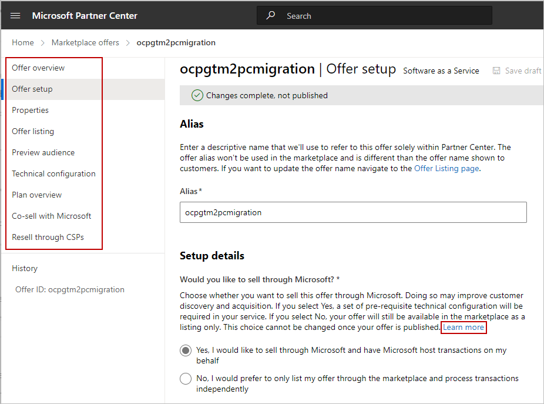
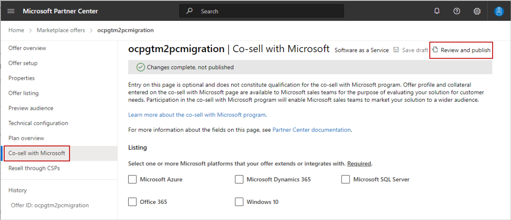
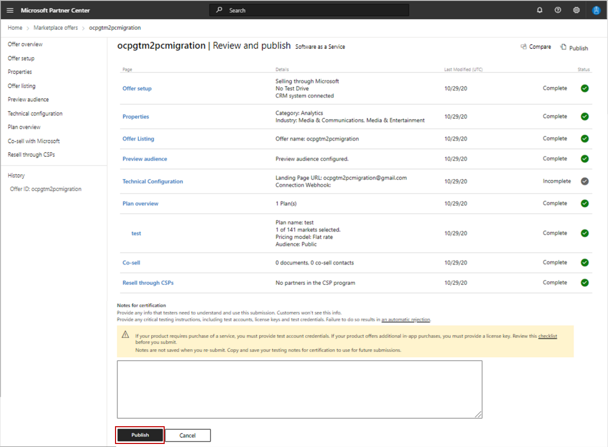
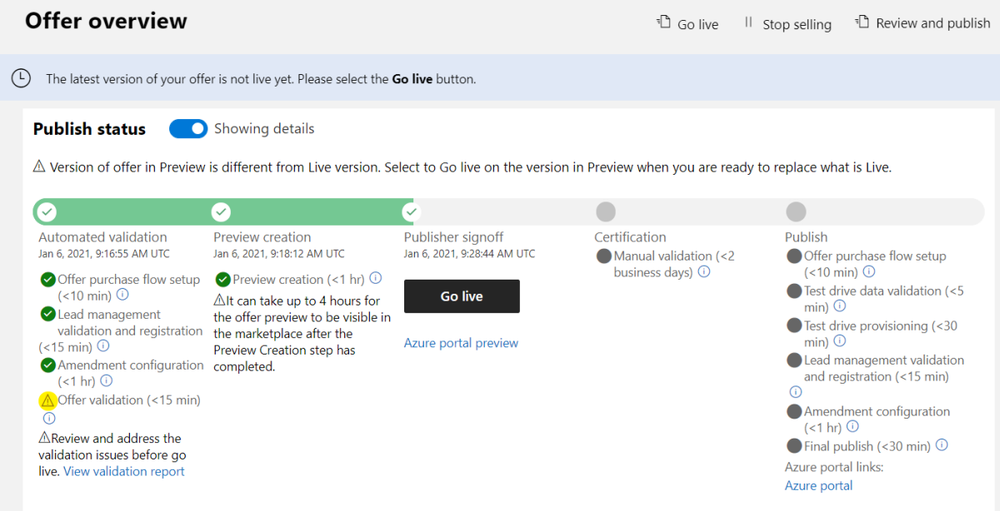
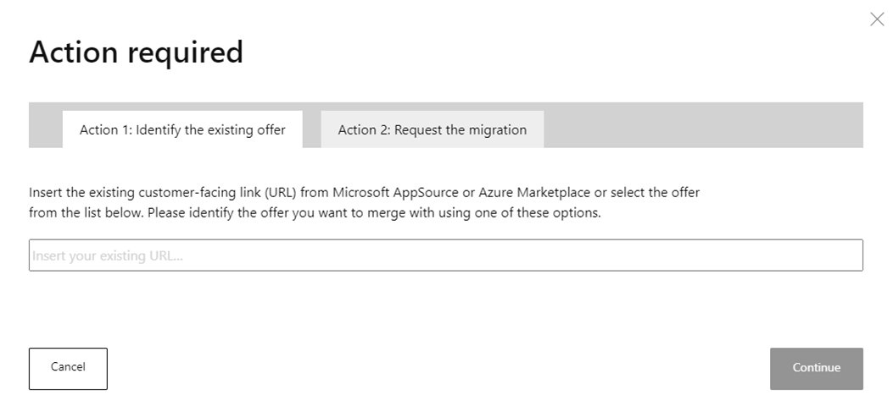
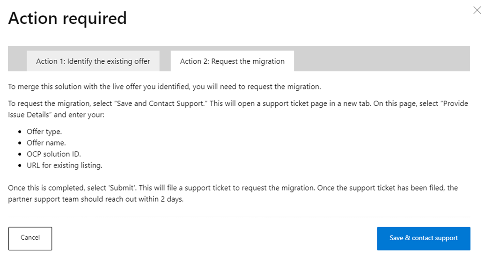

# Migration of co-sell solutions from OCP GTM to the commercial marketplace

Microsoft is moving the publishing experience. The [commercial marketplace](overview.md) provides simplified offer publishing to co-sell through Microsoft's three channels by centralizing offer creation and management in Partner Center, where you are already managing your relationship with Microsoft.

As a Microsoft partner enrolled in the commercial marketplace, you can:

- Publish your offers centrally and co-sell across Microsoft direct customer, partner, and seller channels.
- Ensure your offers are in the correct online store—[Microsoft AppSource](https://appsource.microsoft.com) or [Azure Marketplace](https://azure.microsoft.com)—to reach the millions of cloud customers who align with your offer's capabilities.
- Drive your own publishing experience to co-sell with the offers that align with your business goals.
- Align your offer publishing within Partner Center, where you are already managing your Microsoft relationship and co-sell opportunities.
- Unlock [Marketplace Rewards](marketplace-rewards.md).

## Prerequisites to continue co-selling with Microsoft

Ensure you have an active Microsoft Cloud Partner Program membership and are enrolled in the commercial marketplace in Partner Center.

- Join the Microsoft Cloud Partner Program [at no cost](https://partner.microsoft.com/dashboard/account/v3/enrollment/introduction/partnership). As a partner, you’ll have access to exclusive resources, programs, tools, and connections to grow your business.
- If you do not have an account in commercial marketplace, [enroll now](create-account.md) to continue co-selling with Microsoft and access the full publishing experience.

## Publishing updates for attaining co-sell-ready status

For your solution to be discoverable to Microsoft sellers and partners, it must meet the [co-sell ready requirements](/partner-center/co-sell-overview?context=/azure/marketplace/context/context). For a Microsoft seller to be a Co-sell incentive, your solution must meet the [incentive-eligible requirements](/partner-center/co-sell-overview?context=/azure/marketplace/context/context). Complete these requirements on the co-sell tab in Partner Center (see [this image](#action-2-merge) later in this article).

> [!NOTE]
> In commercial marketplace, your solutions are referred to as “offers” throughout the publishing experience.

After you’ve enrolled in the commercial marketplace, prepare to migrate your solutions from OCP GTM. We have created a digital migration interface that provides a single view of the OCP GTM solutions for your organization. From this interface, you will be able to take the action to merge the solution with a similar offer already published and live in commercial marketplace, or discard it.

Follow these steps before importing your solutions from OCP GTM:

1. Visit your company's [publisher list](https://go.microsoft.com/fwlink/?linkid=2165704). It includes the account owner, managers, and developers who have publishing access. Learn more about [Partner Center user roles](user-roles.md).
2. Ask one of the listed contacts to [add users](https://go.microsoft.com/fwlink/?linkid=2166003) to the commercial marketplace as *managers* or *developers*, since only these roles can edit and publish solutions.
3. Work with your developers to move your solutions from your OCP GTM account to the commercial marketplace.
4. Decide which of the following you want to do:
    1. If you have a solution in OCP GTM that you want to migrate to Partner Center - *to retain referral pipeline, collateral, co-sell status and incentives* - there are two scenarios for you to choose from:
        - If there is no similar offer in commercial marketplace
            - Step 1. [Create an offer](#step-1-similar-offer-does-not-exist-in-commercial-marketplace-please-follow-these-steps)
            - Step 2. [Publish it in the commercial marketplace](#scenario-2-similar-offer-exists-in-commercial-marketplace-please-follow-these-steps)
            - Step 3. [Request merge the solution in OCP GTM GTM to newly published marketplace offer](#begin-the-migration-of-your-solutions-from-ocp-gtm).
        - If there is already a similar offer in Commercial marketplace
            - Step 1. [Request merge of solution in OCP GTM to published marketplace offer](#begin-the-migration-of-your-solutions-from-ocp-gtm)
    1. If you have a solution in OCP GTM that is no longer relevant, then discard this solution.

> [!IMPORTANT]
> On May 17, 2021, the migrate option below was removed.  If you previously used the Migration option and have an offer that was migrated to the commercial marketplace as a draft offer, it is important that you complete the publishing process in the commercial marketplace.  
> - Learn more about [How to review and publish an offer to Microsoft commercial marketplace | Microsoft Docs](./review-publish-offer.md)
> - [Publishing in the commercial marketplace training deck](https://assetsprod.microsoft.com/mpn/en-us/guidance-and-permissions-needed-to-publish-an-offer-and-co-sell-with-ms.pptm)
:::image type="content" source="media/co-sell-migrate/ready-to-migrate.png" alt-text="I want to migrate this solution to commercial marketplace":::

## Begin the migration of your solutions from OCP GTM

1. Begin the migration [here](https://go.microsoft.com/fwlink/?linkid=2165807).
1. Select the **Overview** page, then **Click here to get started**.

    :::image type="content" source="media/co-sell-migrate/welcome-overveiw.png" alt-text="Displays overview page":::

1. To begin migrating, select the **Solutions** tab, which displays all the solutions associated to your PartnerIDs.

    :::image type="content" source="media/co-sell-migrate/solutions-tab.png" alt-text="Partner Center Overview page, Solutions tab.":::

    > [!NOTE]
    > This tab will note if there aren't any solutions pending to migrate to the commercial marketplace. To continue co-selling with Microsoft, ensure the migrated solutions are published to the commercial marketplace.

    Learn more about the solution status by reviewing the tool tips. All solutions pending action are listed under **Action**.

1. Select **Begin migration** (see image above) for the solution you want to migrate, then select one of the following options:

    :::image type="content" source="media/co-sell-migrate/migration-options.png" alt-text="The three options for migration.":::

### Merge solution

What is the value of merging your OCP GTM solution into an existing published and live offer in the commercial marketplace?

- Partners currently co-selling with offers in OCP GTM are encouraged to migrate their solutions to the commercial marketplace to take advantage of its capabilities and simplify the publishing experience.

If you have a solution in OCP GTM that you want to migrate to Partner Center there are two scenarios for you to choose from. At the end of this merge process your offer will retain referral pipeline, collateral, co-sell status and incentives.

#### Step 1: Similar offer does not exist in commercial marketplace please follow these steps

If you do not have an offer already in the commercial marketplace to merge a solution in OCP GTM with you will first need to create AND PUBLISH an offer in the commercial marketplace (this will retain its co-sell status, incentives, and referral pipeline.)

1. Create a draft offer in commercial marketplace

   1. On the commercial marketplace Overview page, select **+ New Offer**, and then select the offer type you want.

        

   2. Complete the required information in each tab.
      - The **Learn more** links and tooltips will guide you through the requirements and details.
      - Optionally, complete the **Resell through CSPs** page (in the left-nav menu below) to resell through the Cloud Solution Provider (CSP) program.

        

   3. Select **Save Draft**.
        - For detailed instructions on the information you need to provide before your offer can be published, read the appropriate [publishing guide](./publisher-guide-by-offer-type.md).
        - Review the eligibility requirements in the corresponding article for your offer type to finalize the selection and configuration of your offer.
        - Review the publishing patterns for each online store for examples on how your solution maps to an offer type and configuration.
        - [Offer listing best practices - Microsoft commercial marketplace | Microsoft Docs](./gtm-offer-listing-best-practices.md)

    > [!TIP]
    > We recommend that you *do not fill out* the data in the **Co-sell with Microsoft** tab. To save you time we will take care of populating this data for you with your existing collateral in OCP GTM during the merge process.

    After the merge is complete you can return to the Co-sell with Microsoft tab and make updates if needed. For more information, see [Configure co-sell for a commercial marketplace offer](/partner-center/co-sell-configure?context=/azure/marketplace/context/context).
1. When complete, select **Review and publish**.

    

1. After reviewing all submitted information, select **Publish** to submit your draft offer for certification review. [Learn more about the certification phase](./review-publish-offer.md).

    

1. Track the status of your submission on the Overview tab.

    

1. We will notify you when our certification review is complete. If we provide actionable feedback, address it, then select **Publish** to initiate a recertification.

1. Once your offer passes certification, preview the offer with the link provided and make any final adjustments you may want. When you're ready, select **Go live** (see button above) to publish your offer to relevant commercial marketplace storefront(s).

1. **Continue to Scenario 2 below to complete the merge process.**

#### Scenario 2: Similar offer exists in commercial marketplace please follow these steps

Select this option if the solution is already published and live in the commercial marketplace and the solution in OCP GTM and the offer in the commercial marketplace should be merged into a single offer. This will avoid creating duplicate offers.

1. Identify the existing offer.
   1. Select **This is similar to an existing offer in commercial marketplace** (see **Begin your migration** image [above](#beginmigration)).
   1. The **Action 1** tab shows live commercial marketplace offers that your OCP GTM solution can be associated with. Select the live offer from the list if you have one. If there is no list of offers to choose from, enter the customer-facing address (URL) from Microsoft AppSource or Azure Marketplace.
   1. Select **Continue**.
        
1. Request the merge.
    1. The **Action 2** tab shows directions to request the merge of your OCP GTM solution with the one you identified. To request the merge, select **Save & Contact support**, which opens a partner support page in a browser. 
    
        
    1. Select **Provide Issue Details** and enter the following:
        1. Offer Type
        1. Offer name
        1. OCP solution ID
        1. URL for existing listing
    1. Select **Submit**. The partner support team will contact you within two business days.
    1. Partner support will work with you to ensure a successful merge of this offer so it published as a live offer.

### Discard this solution

We recommend that you take the time to assess the viability and relevance of your solutions to optimize your presence and discoverability in the commercial marketplace with high quality offers that meet customer demand.

Select this option when a solution in OCP GTM solutions is no longer relevant. You will be asked to confirm the discard, and you can also undo it later.

1. Select **I want to discard this solution** (see **Action required** image [above](#beginmigration)), then **Continue**.
2. Select **Discard**.

    :::image type="content" source="media/co-sell-migrate/migration-discard.png" alt-text="Confirm the discard.":::

3. To undo your discard, select **Undo Discard**.

    :::image type="content" source="media/co-sell-migrate/migration-discard-undo.png" alt-text="The Undo Discard link.":::

### Additional Help

 If you need additional help, select the **Get Help** tab to contact the partner support team.

:::image type="content" source="media/co-sell-migrate/get-support-link.png" alt-text="The support link on the Get Help tab.":::

## Next steps

- [Resell through CSP Partners](cloud-solution-providers.md)
- [Configure co-sell for a commercial marketplace offer](/partner-center/co-sell-configure?context=/azure/marketplace/context/context)
- View these [FAQs](https://partner.microsoft.com/resources/detail/co-sell-requirements-publish-commercial-marketplace-faq-pdf) (PDF)
