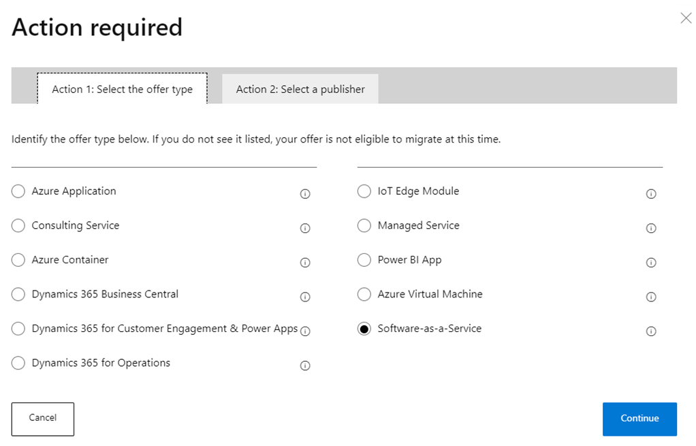
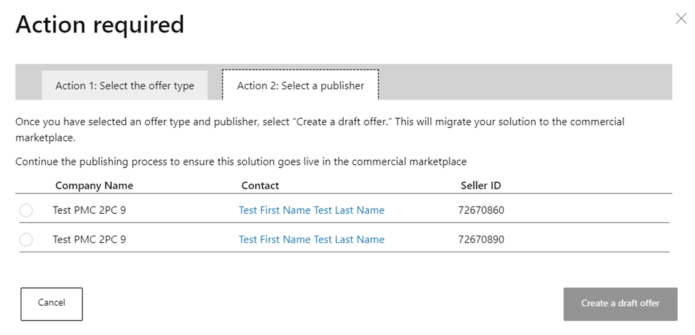

# Migration of co-sell solutions from OCP GTM to the commercial marketplace

Microsoft is moving the publishing experience. The [commercial marketplace](overview.md) provides simplified offer publishing to co-sell through Microsoft's three channels by centralizing offer creation and management in Partner Center, where you are already managing your relationship with Microsoft.

As a Microsoft partner enrolled in the commercial marketplace, you can:

- Publish your offers centrally and co-sell across Microsoft direct customer, partner, and seller channels.
- Ensure your offers are in the correct online store—[Microsoft AppSource](https://appsource.microsoft.com) or [Azure Marketplace](https://azure.microsoft.com)—to reach the millions of cloud customers who align with your offer's capabilities.
- Drive your own publishing experience to co-sell with the offers that align with your business goals.
- Align your offer publishing within Partner Center, where you are already managing your Microsoft relationship and co-sell opportunities.
- Unlock [Marketplace Rewards](partner-center-portal/marketplace-rewards.md).

## Prerequisites to continue co-selling with Microsoft

Ensure you have an active Microsoft Partner Network membership and are enrolled in the commercial marketplace in Partner Center.

- Join the Microsoft Partner Network [at no cost](https://partner.microsoft.com/dashboard/account/v3/enrollment/introduction/partnership). As a partner, you’ll have access to exclusive resources, programs, tools, and connections to grow your business.
- If you do not have an account in commercial marketplace, [enroll now](partner-center-portal/create-account.md) to continue co-selling with Microsoft and access the full publishing experience.

## Publishing updates for attaining co-sell-ready status

For your solution to be discoverable to Microsoft sellers and partners, it must meet the [co-sell ready requirements](marketplace-co-sell.md). For a Microsoft seller to be incentivized, your solution must meet the [incentive-eligible requirements](marketplace-co-sell.md). Complete these requirements on the co-sell tab in Partner Center (see [this image](#cosell-tab) later in this article).

> [!NOTE]
> In commercial marketplace, your solutions are referred to as “offers” throughout the publishing experience.

After you’ve enrolled in the commercial marketplace, prepare to migrate your solutions from OCP GTM.

Follow these steps before importing your solutions from OCP GTM:

1. Visit your company's [publisher list](https://partner.microsoft.com/dashboard/account/v3/publishers/list). It includes the account owner, managers, and developers who have publishing access. Learn more about [Partner Center user roles](./partner-center-portal/manage-account.md#define-user-roles-and-permissions).
2. Ask one of the listed contacts to [add users](https://partner.microsoft.com/dashboard/account/usermanagement) to the commercial marketplace as *managers* or *developers*, since only these roles can edit and publish solutions.
3. Work with your developers to move your solutions from your OCP GTM account to the commercial marketplace.
4. Decide which of the following you want to do:
    1. Merge this solution with a similar offer in the commercial marketplace.
    1. Migrate this solution from OCP GTM to the commercial marketplace.
    1. Discard this solution.

## Migrate your solutions from OCP GTM

1. Begin the migration [here](https://partner.microsoft.com/solutions/migration#).
2. Select the **Overview** page, then **Click here to get started**.

    :::image type="content" source="media/co-sell-migrate/migration-overview.png" alt-text="Partner Center Overview page, Overview tab.":::

3. To begin migrating, select the **Solutions** tab, which displays all the solutions associated to your MPN IDs.

    :::image type="content" source="media/co-sell-migrate/solutions-tab.png" alt-text="Partner Center Overview page, Solutions tab.":::

    > [!NOTE]
    > This tab will note if there aren't any solutions pending to migrate to the commercial marketplace. To continue co-selling with Microsoft, ensure the migrated solutions are published to the commercial marketplace.

    Learn more about the solution status by reviewing the tool tips. All solutions pending action are listed under **Action**.

4. Select **Begin migration** (see image above) for the solution you want to migrate, then select one of the following options:

    :::image type="content" source="media/co-sell-migrate/migration-options.png" alt-text="The three options for migration.":::

### Merge solution with a similar offer

Select this option if the solution is already published in the commercial marketplace and the two should be merged into a single offer. This will avoid creating duplicate offers.

1. Identify the existing offer.
    1. Select **I want to merge this solution with a similar offer in the commercial marketplace** (see **Action required** image [above](#beginmigration)).
    1. The **Action 1** tab shows live commercial marketplace offers that your OCP GTM solution can be associated with. Select the live offer from the list if you have one. If there is no list of offers to choose from, enter the customer-facing address (URL) from Microsoft AppSource or Azure Marketplace.
        
    1. Select **Continue**.
1. Request the merge.
    1. The **Action 2** tab shows directions to request the merge of your OCP GTM solution with the one you identified. To request the merge, select **Save & Contact support**, which opens a partner support page in a browser.
    1. Select **Provide Issue Details** and enter the following:
            
    1. Select **Submit**. The partner support team will contact you within two business days.
    1. Partner support will work with you to ensure a successful merge of this offer so it published as a live offer.

### Migrate this solution from OCP GTM

Select this option when you may have an OCP GTM solution that does not yet have a corresponding offer published in the commercial marketplace. You will need to publish this solution to the commercial marketplace to continue co-selling with Microsoft and migrating this solution will save you time by retaining the information and bill of materials from OCP GTM. This option requires you to select an offer type.

1. Select **I want to migrate this solution from OCP GTM to the commercial marketplace** (see **Action required** image [above](#beginmigration)), then **Continue**.
1. On the **Action 1** tab, select the [offer type](publisher-guide-by-offer-type.md), then **Continue**.

    

1. On the **Action 2** tab, select the [publisher profile](partner-center-portal/create-account.md) from the list provided. If you do not have a publisher account, create one at [Partner Center](https://partner.microsoft.com/solutions/migration), select it here.

    

1. Select **Create a draft offer** to migrate your solution to the commercial marketplace as a draft. It will not be live yet.
1. Continue the publishing process in Partner Center. For assistance with publishing in Partner Center, see [Make your offer live in the commercial marketplace](#make-your-offer-live-in-the-marketplace) below.

### Discard this solution

Select this option when a solution in OCP GTM solutions is no longer relevant. You will be asked to confirm the discard, and you can also undo it later.

1. Select **I want to discard this solution** (see **Action required** image [above](#beginmigration)), then **Continue**.
2. Select **Discard**.

    :::image type="content" source="media/co-sell-migrate/migration-discard.png" alt-text="Confirm the discard.":::

3. To undo your discard, select **Undo Discard**.

    :::image type="content" source="media/co-sell-migrate/migration-discard-undo.png" alt-text="The Undo Discard link.":::

4. If you need additional help, select the **Get Help** tab to contact the partner support team.

    :::image type="content" source="media/co-sell-migrate/get-support-link.png" alt-text="The support link on the Get Help tab.":::

## Make your offer live in the marketplace

If you selected to migrate your offer to the commercial marketplace, it will arrive as a draft. You still need to publish your offer to make it live in the commercial marketplace; this will retain its co-sell status, incentives, and referral pipeline.

For detailed instructions on the information you need to provide before your offer can be published, read the appropriate [publishing guide](publisher-guide-by-offer-type.md). For a summary, read below.

1. On the **Overview** page in Partner Center, select your draft offer name.

    :::image type="content" source="media/co-sell-migrate/offer-overview.png" alt-text="The offer overview page in Partner Center.":::

2. Complete the required information in each tab. Optionally, complete the **Resell through CSPs** page (in the left-nav menu below) to resell through the Cloud Solution Provider (CSP) program. The **Learn more** links and tooltips will guide you through the requirements and details.

    :::image type="content" source="media/co-sell-migrate/offer-setup.png" alt-text="The offer overview setup tabs in Partner Center.":::

3. Some of the Microsoft seller-facing details were copied over from the OCP GTM solution. Complete the remaining required information in the **Co-sell with Microsoft** tab to make your offer co-sell ready. When complete, select **Review and publish**. For more information, see [Configure co-sell for a commercial marketplace offer](commercial-marketplace-co-sell.md).

    :::image type="content" source="media/co-sell-migrate/co-sell-page.png" alt-text="The offer co-sell tab in Partner Center.":::

4. After reviewing all submitted information, select **Publish** to submit your draft offer for certification review.

    :::image type="content" source="media/co-sell-migrate/co-sell-review-publish.png" alt-text="The offer review tab and Publish button in Partner Center.":::

5. Track the status of your submission on the **Overview** tab.

    :::image type="content" source="media/publish-status-publisher-signoff.png" alt-text="The offer publish status bar on the Overview tab in Partner Center.":::

6. We will notify you when our certification review is complete. If we provide actionable feedback, address it, then select **Publish** to initiate a recertification.
7. Once your offer passes certification, preview the offer with the link provided and make any final adjustments you may want. When you're ready, select **Go live** (see button above) to publish your offer to relevant commercial marketplace storefront(s). Once live, your offer will retain its co-sell status from the original OCP GTM solution.

## Next steps

- [Resell through CSP Partners](cloud-solution-providers.md)
- [Configure co-sell for a commercial marketplace offer](commercial-marketplace-co-sell.md)
- View these [FAQs](https://partner.microsoft.com/resources/detail/co-sell-requirements-publish-commercial-marketplace-faq-pdf) (PDF)
