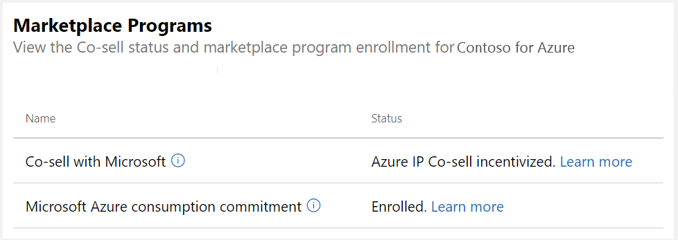

# Verify Co-sell status of a commercial marketplace offer

You can verify the Co-sell status for an offer on the **Offer overview** page of an offer in the Commercial Marketplace program of Partner Center.

## Verify Co-sell status

1. Sign in to [Partner Center](https://partner.microsoft.com/dashboard/home).
1. In the left-navigation menu, select **Commercial Marketplace** > **Overview**.
1. In the **Offer alias** column, select the offer you want. The co-sell status is shown in the Marketplace Programs section of the page.

    

The following table shows all possible co-sell statuses. To learn about the requirements for each co-sell status, see [Co-sell requirements](co-sell-requirements.md).

| Status | Comment |
| ------------ | ------------- |
| Not co-sell ready | The minimum [requirements for Co-sell ready status](co-sell-requirements.md#requirements-for-co-sell-ready-status) have not been met. |
| Co-sell ready | All [requirements for Co-sell ready status](co-sell-requirements.md#requirements-for-co-sell-ready-status) have been met. |
| Azure IP Co-sell incentive | Co-sell ready requirements have been met in addition to [these additional requirements](co-sell-requirements.md#requirements-for-azure-ip-co-sell-incentive-status). |
| Business Applications Co-sell incentive | This status applies to Dynamics 365 and Power Apps offers in the [ISV Connect Program](business-applications-isv-program.md) and indicates that all [requirements for this status](co-sell-requirements.md#requirements-for-business-applications-co-sell-incentive-status) have been met. |
|||

## Next steps

- For information about Co-sell requirements, see [Co-sell ready requirements](co-sell-requirements.md).
- For help configuring an offer for Co-sell, see [Configure Co-sell for a commercial marketplace offer](co-sell-configure.md).