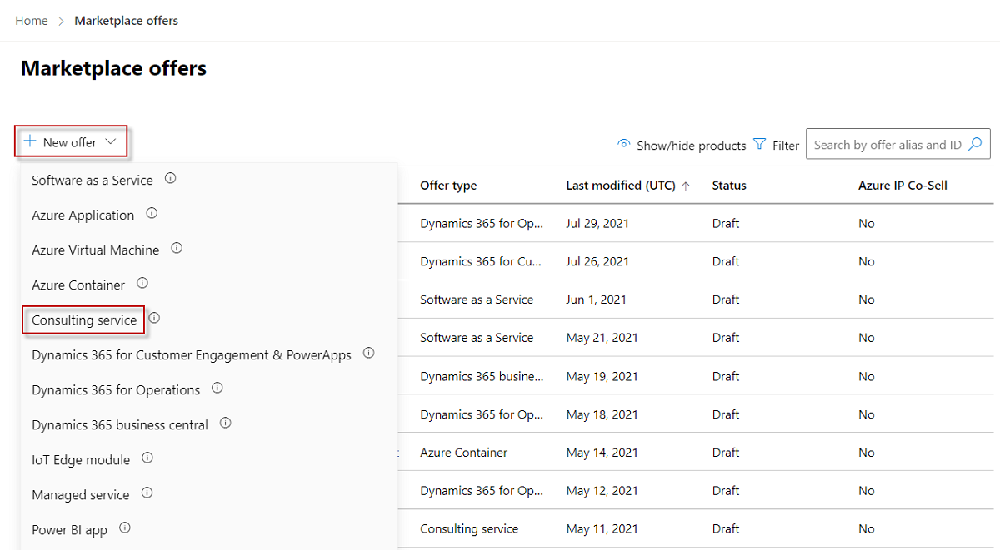

# How to create a consulting service offer in the commercial marketplace

This article explains how to create a consulting service offer for the Microsoft commercial marketplace using Partner Center. 

## Before you begin

To publish a consulting service offer, you must meet certain eligibility requirements to demonstrate expertise in your field. If you haven’t already done so, read [Plan a consulting service offer for the commercial marketplace](./plan-consulting-service-offer.md). It describes the prerequisites for a consulting service, and the assets you’ll need when you create the offer with Partner Center.

## Create a new consulting service offer

#### [Workspaces view](#tab/Workspaces-view)

1. Sign in to [Partner Center](https://partner.microsoft.com/dashboard/home).
1. On the Home page, select the **Marketplace offers** tile.

    :::image type="content" source="./media/workspaces/partner-center-home.png" alt-text="Illustrates the Partner Center Home page.":::

1. On the Marketplace offers page, select **+ New offer** > **Consulting service**.

    

4. In the **New Consulting service** dialog box, enter an **Offer ID**. This ID is visible in the URL of the commercial marketplace listing. For example, if you enter test-offer-1 in this box, the offer web address will be `https://azuremarketplace.microsoft.com/marketplace/../test-offer-1`.

    * Each offer in your account must have a unique offer ID.
    * Use only lowercase letters and numbers. The offer ID can include hyphens and underscores, but no spaces, and is limited to 50 characters.
    * The offer ID can't be changed after you select **Create**.

5. Enter an **Offer alias**. This is the name used for the offer in Partner Center. It isn't visible in the online stores and is different from the offer name shown to customers.
6. To generate the offer and continue, select **Create**.

#### [Classic view](#tab/classic-view)

1. Sign in to [Partner Center](https://partner.microsoft.com/dashboard/home).
2. In the left-navigation menu, select **Commercial Marketplace** > **Overview**.
3. On the Overview tab, select **+ New offer** > **Consulting service**.

    

4. In the **New offer** dialog box, enter an **Offer ID**. This ID is visible in the URL of the commercial marketplace listing. For example, if you enter test-offer-1 in this box, the offer web address will be `https://azuremarketplace.microsoft.com/marketplace/../test-offer-1`.

    * Each offer in your account must have a unique offer ID.
    * Use only lowercase letters and numbers. The offer ID can include hyphens and underscores, but no spaces, and is limited to 50 characters.
    * The offer ID can't be changed after you select **Create**.

5. Enter an **Offer alias**. This is the name used for the offer in Partner Center. It isn't visible in the online stores and is different from the offer name shown to customers.
6. To generate the offer and continue, select **Create**.

---

## Configure lead management

Connect your customer relationship management (CRM) system with your commercial marketplace offer so you can receive customer contact information when a customer expresses interest in your consulting service. You can modify this connection at any time during or after you create the offer. For detailed guidance, see [Customer leads from your commercial marketplace offer](./partner-center-portal/commercial-marketplace-get-customer-leads.md).

To configure the lead management in Partner Center:

1.	In Partner Center, go to the **Offer setup** tab.
2.	Under **Customer leads**, select the **Connect** link.
3.	In the **Connection details** dialog box, select a lead destination from the list.
4.	Complete the fields that appear. For detailed steps, see the following articles:

    * [Configure your offer to send leads to the Azure table](./partner-center-portal/commercial-marketplace-lead-management-instructions-azure-table.md#configure-your-offer-to-send-leads-to-the-azure-table)
    * [Configure your offer to send leads to Dynamics 365 Customer Engagement](./partner-center-portal/commercial-marketplace-lead-management-instructions-dynamics.md#configure-your-offer-to-send-leads-to-dynamics-365-customer-engagement) (formerly Dynamics CRM Online)
    * [Configure your offer to send leads to HTTPS endpoint](./partner-center-portal/commercial-marketplace-lead-management-instructions-https.md#configure-your-offer-to-send-leads-to-the-https-endpoint)
    * [Configure your offer to send leads to Marketo](./partner-center-portal/commercial-marketplace-lead-management-instructions-marketo.md#configure-your-offer-to-send-leads-to-marketo)
    * [Configure your offer to send leads to Salesforce](./partner-center-portal/commercial-marketplace-lead-management-instructions-salesforce.md#configure-your-offer-to-send-leads-to-salesforce)

5.	To validate the configuration you provided, select the **Validate link**.
6.	When you’ve configured the connection details, select **Connect**.
7.	Select **Save draft**.

After you submit your offer for publication in Partner Center, we'll validate the connection and send you a test lead. While you preview the offer before it goes live, test your lead connection by trying to purchase the offer yourself in the preview environment.

> [!TIP]
> Make sure the connection to the lead destination stays updated so you don't lose any leads.

## Next steps

* [How to configure your consulting service offer properties](./create-consulting-service-offer-properties.md)