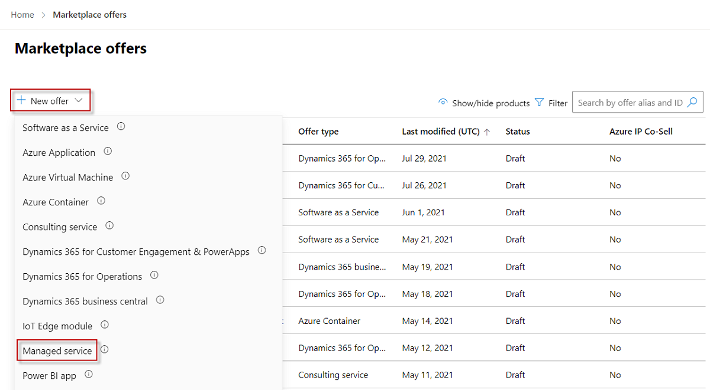

# Create a Managed Service offer for the commercial marketplace

This article explains how to create a Managed Service offer for the Microsoft commercial marketplace using Partner Center.

## Before you begin

To publish a Managed Service offer, you must meet the following prerequisites:

- Have earned a Gold or Silver Microsoft Competency in Cloud Platform. If you haven’t already done so, read [Plan a Managed Service offer for the commercial marketplace](./plan-managed-service-offer.md). It will help you prepare the assets you need when you create the offer in Partner Center.
- Have a commercial marketplace account in Partner Center and ensure your account is enrolled in the commercial marketplace program. See [Create a commercial marketplace account in Partner Center](create-account.md) and [Verify your account information when you enroll in a new Partner Center program](/partner-center/verification-responses#checking-your-verification-status).

## Create a new offer

1. Sign in to [Partner Center](https://go.microsoft.com/fwlink/?linkid=2166002).

1. On the Home page, select the **Marketplace offers** tile.

    

1. On the Marketplace offers page, select **+ New offer** > **Managed service**.

    

1. In the **New Managed service** dialog box, enter an **Offer ID**. This is a unique identifier for each offer in your account. This ID is visible in the URL of the commercial marketplace listing and Azure Resource Manager templates, if applicable. For example, if you enter test-offer-1 in this box, the offer web address will be `https://azuremarketplace.microsoft.com/marketplace/../test-offer-1`.

    - Each offer in your account must have a unique offer ID.
    - Use only lowercase letters and numbers. It can include hyphens and underscores, but no spaces, and is limited to 50 characters.
    - The Offer ID can't be changed after you select **Create**.

1. Enter an **Offer alias**. This is the name used for the offer in Partner Center. It isn't visible in the online stores and is different from the offer name shown to customers.

1. Associate the new offer with a _publisher_. A publisher represents an account for your organization. You may have a need to create the offer under a particular publisher. If you don’t, you can simply accept the publisher account you’re signed in to.

    > [!NOTE]
    > The selected publisher must be enrolled in the [**Commercial Marketplace program**](marketplace-faq-publisher-guide.yml#how-do-i-sign-up-to-be-a-publisher-in-the-microsoft-commercial-marketplace-) and cannot be modified after the offer is created.

1. To generate the offer and continue, select **Create**.

## Setup details

This section does not apply for this offer type.

## Customer leads

When a customer expresses interest or deploys your product, you’ll receive a lead in the [Referrals workspace](https://partner.microsoft.com/dashboard/referrals/v2/leads) in Partner Center.

You can also connect the product to your customer relationship management (CRM) system to handle leads there.

> [!NOTE]
> Connecting to a CRM system is optional.

To configure the lead management in Partner Center:

1. In Partner Center, go to the **Offer setup** tab.
1. Under **Customer leads**, select the **Connect** link.
1. In the **Connection details** dialog box, select a lead destination from the list.
4. Complete the fields that appear. For detailed steps, see the following articles:

    - [Configure your offer to send leads to the Azure table](./partner-center-portal/commercial-marketplace-lead-management-instructions-azure-table.md#configure-your-offer-to-send-leads-to-the-azure-table)
    - [Configure your offer to send leads to Dynamics 365 Customer Engagement](./partner-center-portal/commercial-marketplace-lead-management-instructions-dynamics.md#configure-your-offer-to-send-leads-to-dynamics-365-customer-engagement) (formerly Dynamics CRM Online)
    - [Configure your offer to send leads to HTTPS endpoint](./partner-center-portal/commercial-marketplace-lead-management-instructions-https.md#configure-your-offer-to-send-leads-to-the-https-endpoint)
    - [Configure your offer to send leads to Marketo](./partner-center-portal/commercial-marketplace-lead-management-instructions-marketo.md#configure-your-offer-to-send-leads-to-marketo)
    - [Configure your offer to send leads to Salesforce](./partner-center-portal/commercial-marketplace-lead-management-instructions-salesforce.md#configure-your-offer-to-send-leads-to-salesforce)

1. To validate the configuration you provided, select the **Validate link**.
1. When you’ve configured the connection details, select **Connect**.
1. Select **Save draft**.

    After you submit your offer for publication in Partner Center, we'll validate the connection and send you a test lead. While you preview the offer before it goes live, test your lead connection by trying to purchase the offer yourself in the preview environment.

    > [!TIP]
    > Make sure the connection to the lead destination stays updated so you don't lose any leads.

1. Select **Save draft** before continuing to the next tab, **Properties**.

## Next step

- Configure offer [Properties](create-managed-service-offer-properties.md)
