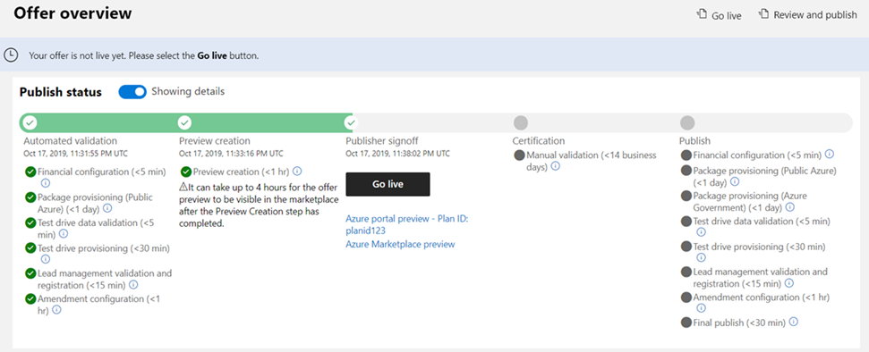

# How to test and publish an Azure Application offer

This article explains how to use Partner Center to submit your Azure Application offer for publishing, preview your offer, test it, and then publish it live to the commercial marketplace. You must have already created an offer that you want to publish.

## Submit your offer for publishing

1. Sign in to the commercial marketplace dashboard in [Partner Center](https://partner.microsoft.com/dashboard/commercial-marketplace/overview).
1. On the **Overview** page, select the offer you want to publish.
1. In the upper-right corner of the portal, select **Review and publish**.
1. Make sure that the **Status** column for each page says **Complete**. The three possible statuses are as follows:
    - **Not started** – The page is incomplete.
    - **Incomplete** – The page is missing required information or has errors that need to be fixed. You'll need to go back to the page and update it.
    - **Complete** – The page is complete. All required data has been provided and there are no errors.
1. If any of the pages have a status other than **Complete**, select the page name, correct the issue, save the page, and then select **Review and publish** again to return to this page.
1. After all the pages are complete, in the **Notes for certification** box, provide testing instructions to the certification team to ensure that your app is tested correctly. Provide any supplementary notes helpful for understanding your app.
1. To start the publishing process for your offer, select **Publish**. The **Offer overview** page appears and shows the offer's **Publish status**.

Your offer's publish status will change as it moves through the publication process. For detailed information on this process, see [Validation and publishing steps](review-publish-offer.md#validation-and-publishing-steps).

## Preview and test your offer

When the offer is ready for your sign off, we’ll send you an email to request that you review and approve your offer preview. You can also refresh the **Offer overview** page in your browser to see if your offer has reached the Publisher sign-off phase. If it has, the **Go live** button and preview link will be available. If you chose to sell your offer through Microsoft, anyone who has been added to the preview audience can test the acquisition and deployment of your offer to ensure it meets your requirements during this stage.

The following screenshot shows the **Offer overview** page for an offer, with two preview links under the **Go live** button. The validation steps you’ll see on this page vary depending on the selections you made when you created the offer.

Use the following steps to preview your offer.

1. On the **Offer overview** page, select a preview link under the **Go live** button. 

1. To validate the end-to-end purchase and setup flow, purchase your offer while it's in preview. First, notify Microsoft with a [support ticket](https://aka.ms/marketplacesupport) to ensure we don't process a charge.

1. If your Azure application supports [metered billing using the commercial marketplace metering service](./partner-center-portal/azure-app-metered-billing.md), review and follow the testing best practices detailed in [Marketplace metered billing APIs](./partner-center-portal/marketplace-metering-service-apis.md#development-and-testing-best-practices).

1. If you need to make changes after previewing and testing the offer, you can edit and resubmit to publish a new preview. For more information, see [Update an existing offer in the commercial marketplace](./partner-center-portal/update-existing-offer.md).

## Publish your offer live

After completing all tests on your preview, select **Go live** to publish your offer live to the commercial marketplace.

   > [!TIP]
   > If your offer is already live in the commercial marketplace, any updates you make won't go live until you select **Go live**.

Now that you’ve chosen to make your offer available in the commercial marketplace, we perform a series of final validation checks to ensure the live offer is configured just like the preview version of the offer. For details about these validation checks, see [Publish phase](review-publish-offer.md#publish-phase).

After these validation checks are complete, your offer will be live in the marketplace.

### Errors and review feedback

The **Manual validation** step in the publishing process represents an extensive review of your offer and its associated technical assets (especially the Azure Resource Manager template) issues are typically presented as pull request (PR) links. An explanation of how to view and respond to these PRs, see [Handling review feedback](partner-center-portal/azure-apps-review-feedback.md).

If you have errors in one or more of the publishing steps, correct them before republishing your offer.

## Next step

- [Access analytic reports for the commercial marketplace in Partner Center](partner-center-portal/analytics.md)
- Learn [How to sell your Azure Application offer](create-new-azure-apps-offer-marketing.md) through the Co-sell with Microsoft and Resell through CSPs programs.
