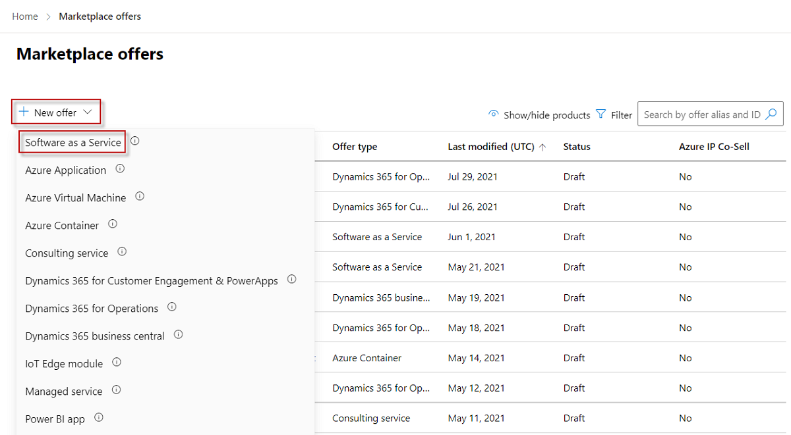

# Create a SaaS offer

As a commercial marketplace publisher, you can create a software as a service (SaaS) offer so potential customers can buy your SaaS-based technical solution. This article explains the process to create a SaaS offer for the Microsoft commercial marketplace.

## Before you begin

Before you can publish a SaaS offer, you must have a commercial marketplace account in Partner Center and ensure your account is enrolled in the commercial marketplace program. See [Create a commercial marketplace account in Partner Center](create-account.md) and [Verify your account information when you enroll in a new Partner Center program](/partner-center/verification-responses#checking-your-verification-status).

If you haven't already, read [Plan a SaaS offer](plan-saas-offer.md). It will explain the technical requirements for your SaaS app, and the information and assets you'll need when you create your offer. Unless you plan to publish a simple listing (**Contact me** listing option) in the commercial marketplace, your SaaS application must meet technical requirements around authentication.

> [!IMPORTANT]
> We recommend that you create a separate development/test (DEV) offer and a separate production (PROD) offer. This article describes how to create a PROD offer. For details about creating a DEV offer, see [Plan a test and development SaaS offer](plan-saas-dev-test-offer.md).

## Create a SaaS offer

Follow these steps to create a SaaS offer:

1. Sign in to [Partner Center](https://partner.microsoft.com/dashboard/home).

1. On the **Home** page, select the **Marketplace offers** tile.

    

1. On the **Marketplace offers** page, select **+ New offer** > **Software as a Service**.

    

1. In the **New Software as a Service** dialog, enter an **Offer ID** value. This ID is visible in the URL of the commercial marketplace listing and in Azure Resource Manager templates, if applicable. For example, if you enter **test-offer-1** in this box, the offer web address will be `https://azuremarketplace.microsoft.com/marketplace/../test-offer-1`.
   + Each offer in your account must have a unique offer ID.
   + Limit the offer ID to 50 characters. Use only numbers and lowercase letters. You can include hyphens and underscores, but no spaces.
   + The offer ID can't be changed after you select **Create**.

1. Enter an **Offer alias** value. The offer alias is the name used for the offer in Partner Center.

   + This name isn't visible in the commercial marketplace and is different from the offer name and other values shown to customers.
   + The offer alias can't be changed after you select **Create**.

1. Associate the new offer with a _publisher_. A publisher represents an account for your organization. You may have a need to create the offer under a particular publisher. If you don't, you can simply accept the publisher account you're signed in to.

    > [!NOTE]
    > The selected publisher must be enrolled in the [**Commercial marketplace program**](marketplace-faq-publisher-guide.yml#how-do-i-sign-up-to-be-a-publisher-in-the-microsoft-commercial-marketplace-) and can't be modified after the offer is created.

1. To generate the offer and continue, select **Create**.

## Configure your SaaS offer setup details

On the **Offer setup** tab, under **Setup details**, choose whether to sell your offer through Microsoft or manage your transactions independently. Offers sold through Microsoft are called _transactable offers_, which means that Microsoft facilitates the exchange of money for a software license on the publisher's behalf. For more information on these options, see [Listing options](plan-saas-offer.md#listing-options) and [Determine your publishing option](determine-your-listing-type.md).

1. To sell through Microsoft and have Microsoft facilitate transactions for you, select **Yes**. Continue to [Enable a test drive](#enable-a-test-drive-optional).
1. To list your offer through the commercial marketplace and process transactions independently, select **No** and then do one of the following:
   + To provide a free subscription for your offer, select **Get it now (Free)**. In the **Offer URL** box that appears, enter the URL (beginning with *http* or *https*) where customers can get a trial through [one-click authentication by using Azure Active Directory (Azure AD)](azure-ad-saas.md). For example: https://contoso.com/saas-app`.
   + To provide a 30-day free trial, select **Free trial**. In the **Trial URL** box that appears, enter the URL (beginning with *http* or *https*) where customers can access your free trial through [one-click authentication by using Azure AD](azure-ad-saas.md). For example: `https://contoso.com/trial/saas-app`.
   + To have potential customers contact you to purchase your offer, select **Contact me**.

    > [!NOTE]
    > You can convert a published listing-only offer to sell through the commercial marketplace offer if your circumstances change, but you can't convert a published transactable offer to a listing-only offer. Instead, you must create a new listing-only offer and stop distribution of the published transactable offer.

## Enable a test drive (optional)

A test drive is a great way to showcase your offer to potential customers by giving them access to a preconfigured environment for a fixed number of hours. Offering a test drive results in an increased conversion rate and generates highly qualified leads. To learn more about test drives, see [What is a test drive?](./what-is-test-drive.md).

> [!TIP]
> A test drive is different from a free trial. You can offer either a test drive, a free trial, or both. Both provide customers with your solution for a fixed period, but a test drive also includes a hands-on, self-guided tour of your product's key features and benefits demonstrated in a real-world implementation scenario.

To enable a test drive:

1. Under **Test drive**, select the **Enable a test drive** checkbox.
1. Select the test drive type from the list.

## Configure lead management

Connect your customer relationship management (CRM) system with your commercial marketplace offer so you can receive customer contact information when a customer expresses interest or deploys your product. You can modify this connection at any time during or after offer creation.

### Configure the connection details in Partner Center

When a customer expresses interest or deploys your product, you'll receive a lead in the [Referrals workspace](https://partner.microsoft.com/dashboard/referrals/v2/leads) in Partner Center.

You can also connect the product to your CRM system to handle leads there.

> [!NOTE]
> Connecting to a CRM system is optional.

To configure the lead management in Partner Center:

1. Go to the **Offer setup** tab.
1. Under **Customer leads**, select the **Connect** link.
1. In the **Connection details** dialog, select a lead destination from the list.
4. Complete the fields that appear. For detailed steps, see the following articles:

    - [Configure your offer to send leads to the Azure table](./partner-center-portal/commercial-marketplace-lead-management-instructions-azure-table.md#configure-your-offer-to-send-leads-to-the-azure-table)
    - [Configure your offer to send leads to Dynamics 365 Customer Engagement](./partner-center-portal/commercial-marketplace-lead-management-instructions-dynamics.md#configure-your-offer-to-send-leads-to-dynamics-365-customer-engagement) (formerly Dynamics CRM Online)
    - [Configure your offer to send leads to the HTTPS endpoint](./partner-center-portal/commercial-marketplace-lead-management-instructions-https.md#configure-your-offer-to-send-leads-to-the-https-endpoint)
    - [Configure your offer to send leads to Marketo](./partner-center-portal/commercial-marketplace-lead-management-instructions-marketo.md#configure-your-offer-to-send-leads-to-marketo)
    - [Configure your offer to send leads to Salesforce](./partner-center-portal/commercial-marketplace-lead-management-instructions-salesforce.md#configure-your-offer-to-send-leads-to-salesforce)

1. To validate the configuration you provided, select the **Validate** link.
1. When you've configured the connection details, select **Connect**.
1. Select **Save draft** before continuing to the next tab, **Properties**.

## Configure Microsoft 365 app integration

You can enable [unified discovery and delivery](plan-SaaS-offer.md) of your SaaS offer and any related Microsoft 365 app consumption by linking them.

### Integrate with the Microsoft Graph API

- If your SaaS offer doesn't integrate with the Microsoft Graph API, select **No**. Continue to link published Microsoft 365 app consumption clients.  
- If your SaaS offer integrates with the Microsoft Graph API, select **Yes**. Next, provide the Azure AD app ID you created and registered to integrate with the Microsoft Graph API.

### Link published Microsoft 365 app consumption clients

1. If you don't have a published Office add-in, Teams app, or SharePoint Framework solutions that work with your SaaS offer, select **No**.

    If you have a published Office add-in, Teams app, or SharePoint Framework solutions that work with your SaaS offer, select **Yes**. You can then select **+Add another AppSource link** to add new links.  

1. Provide a valid AppSource link.
1. Continue adding all the links by selecting **+Add another AppSource link**.
1. The **Rank** value on the SaaS offer listing page indicates the order of the linked products. To change the order, select, hold, and move the **=** icon up and down the list.
1. To delete a linked product, select **Delete** in the product row.  

> [!IMPORTANT]
> If you stop selling a linked product, it won't be automatically unlinked on the SaaS offer. You must delete it from the list of linked products and resubmit the SaaS offer.  

## Next steps

- [Configure SaaS offer properties](create-new-saas-offer-properties.md)
