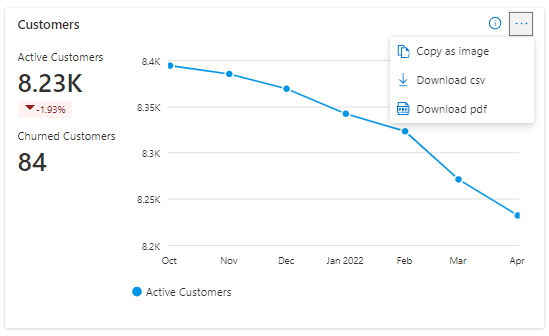
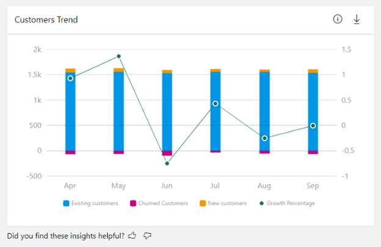
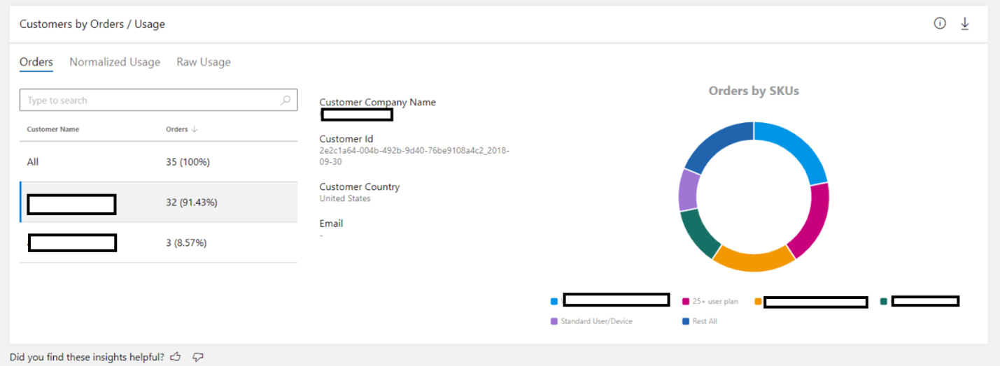
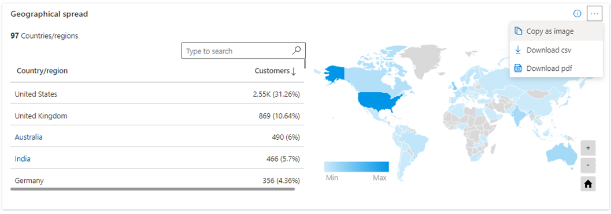
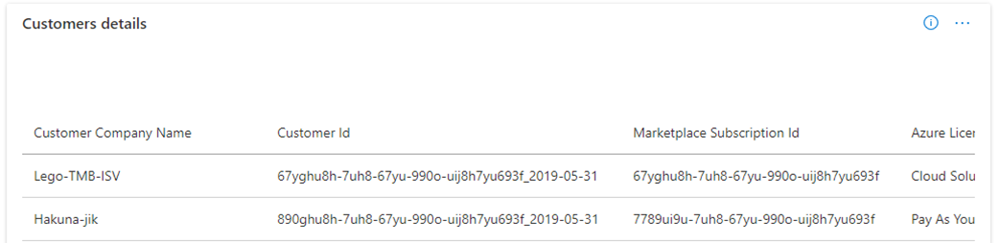

# Customers dashboard in commercial marketplace analytics

This article provides information on the Customers dashboard in Partner Center. This dashboard displays information about your customers, including growth trends, presented in a graphical and downloadable format.

>[!NOTE]
> For detailed definitions of analytics terminology, see [Commercial marketplace analytics terminology and common questions](./analytics-faq.yml).

## Customers dashboard

The [Customers dashboard](https://go.microsoft.com/fwlink/?linkid=2166011) displays data for customers who have acquired your offers. You can view graphical representations of the following items:

- Active and churned customers’ trend
- Customer growth trend including existing, new, and churned customers
- Customers by orders and usage
- Customers percentile
- Customer type by orders and usage
- Customers by geography
- Customers details table
- Customers page filters

> [!NOTE]
> The maximum latency between customer acquisition and reporting in Partner Center is 48 hours.

### Customer page dashboard filters

:::image type="content" source="media/customer-dashboard/button-filters.png" alt-text="Screenshot showing the Filters button on the Insights screen of the Customers dashboard.":::

These filters are applied at the Customers page level. Select multiple filters to render the chart for what you want to see in the **Detailed orders data** export. Filters are applied on the data extracted for the month range you selected on the upper-right corner of the page.

The page has dashboard-level filters for the following:

- Sales Channel
- Marketplace Subscription ID
- Customer ID
- Customer Name
- Customer Company Name
- Country/region

Each filter is expandable with multiple options that you can select. Filter options are dynamic and based on the selected date range.

### Active and churned customers’ trend

This widget shows your customer's growth trend for the selected computation period. Metrics and growth trends are represented by a line chart and displays the value for each month by hovering over the line on the chart. The percentage value below **Active customers** in the widget represents the amount of growth during the selected computation period. For example, the following Screenshot showing a decline of 1.93% in active customers for the selected computation period.

There are three customer types: new, existing, and churned.

- A **new** customer has acquired one or more of your offers for the first time within the selected month.
- An **existing** customer has acquired one or more of your offers prior to the month selected.
- A **churned** customer has canceled all offers previously purchased. Churned customers for VM offers are calculated as customers who didn’t show any VM usage for two days or more. Churned customers are represented in the negative axis in the Trend widget.

Select the ellipsis (...) to copy the widget image, download aggregated widget data as a .csv file, or download the image as a PDF.

### Customer growth trend including existing, new, and churned customers

This widget shows trend and count of all customers, including new, existing, and churned, with a month-by-month growth trend.

- The line chart represents the overall customer growth percentages.
- The month column represents the count of customers stacked by new, existing, and churned customers.
- The churned customer count is displayed on the negative direction of the X-Axis.
- You can select specific legend items to display more detailed views. For example, select new customers from the legend to display only new customers.
- Hovering over a column in the chart displays details for that month only.

Select the ellipsis (...) to copy the widget image, download aggregated widget data as .csv file, or download the image as a PDF.

### Orders by customers type

This chart has tabs for Orders, Normalized usage, and Raw usage. Select **Orders** to show order details.

- The Leader board presents details of the customers ranked by order count. After selecting a customer, the customer details are presented in the adjoining “Details”, “Orders by SKUs” and “SKUs by Seats” sections.
- The Customer profile details are displayed in this space when publishers are signed in with an owner role. If publishers are signed in with a contributor role, the details in this section won't be available.
- The **Orders by SKUs** donut chart displays the breakdown of orders purchased for plans. The top five plans with the highest order count are displayed, while the rest of the orders are grouped under **Rest all**.
- The **SKUs by Seats** donut chart displays the breakdown of seats ordered for plans. The top five plans with the highest seats are displayed, while the rest of the orders are grouped under **Rest All**.

Select **Normalized usage** or **Raw usage** for those views.

- The Leader board presents details of the customers ranked by usage hours count. After selecting a customer, the details of the customer are presented in the adjoining “Details”, “Normalized Usage by offers” and “Normalized Usage by virtual machine (VM) Size(s)” section.
- The Customer profile details are displayed in this space when publishers are logged in with an owner role. If publishers are logged in with a contributor role, the details in this section won't be available.
- The **Normalized usage by Offers** donut chart displays the breakdown of usage consumed by the offers. The top five plans with the highest usage count are displayed, while the rest of the offers are grouped under **Rest All**.
- The **Normalized usage by VM Size(s)** donut chart displays the breakdown of usage consumed by different VM Size(s). The top five VM Sizes with the highest normalized usage are displayed, while the rest of the usage is grouped under **Rest All**.

Select the ellipsis (...) to copy the widget image, download aggregated widget data as .csv file, or download the image as a PDF.

### Top customers percentile

The **Top customers percentile** chart has three tabs, "Orders," "Normalized usage," and "Raw usage." The _top customer percentile_ is displayed along the x-axis, as determined by the number of orders. The y-axis displays the customer's order count. The secondary y-axis (line graph) displays the cumulative percentage of the total number of orders. You can display details by hovering over points along the line chart.

Select the ellipsis (...) to copy the widget image, download aggregated widget data as .csv file, or download the image as a PDF.

### Customer type by orders and usage

The **Orders/usage by customer type** chart displays the number of orders, normalized usage, and raw usage hours split between new customers and existing customers; based on the selection of orders, normalized, and raw usage respectively in the chart.

This chart shows the following:

- A new customer has acquired one or more of your offers or reported usage for the first time within the same calendar month (y-axis).
- An existing customer has previously acquired an offer from you or reported usage prior to the calendar month reported (on the y-axis).

:::image type="content" source="media/customer-dashboard/orders-by-customer-type.png" alt-text="Screenshot showing the Orders tab of the Orders by Customer Type widget on the Customers page.":::

Select the ellipsis (...) to copy the widget image, download aggregated widget data as .csv file, or download the image as a PDF.

### Customers by geography

For the selected computation period, the heatmap displays the total number of customers, and the percentage of newly added customers against geography dimension. The light to dark color on the map represents the low to high value of the customer count. Select a record in the table to zoom in on a country or region.

- You can move the map to view the exact location.
- You can zoom into a specific location.
- The heatmap has a supplementary grid to view the details of customer count, order count, normalized usage hours in the specific location.
- You can search and select a country/region in the grid to zoom to the location in the map. Revert to the original view by selecting the **Home** button in the map.

Select the ellipsis (...) to copy the widget image, download aggregated widget data as .csv file, or download the image as a PDF.

### Customer details table

> [!IMPORTANT]
> To download the data in CSV, please use the Download data option available on top of page.

The **Customer details** table displays a numbered list of the top 1,000 customers sorted by the date they first acquired one of your offers. You can expand a section by selecting the expansion icon in the details ribbon.

- Customer personal information will only be available if the customer has provided consent. You can only view this information if you've signed in with an owner role level of permissions.
- Each column in the grid is sortable.
- Apply filters to the table to display only the data you're interested in. Filter data by Company name, Customer ID, Marketplace Subscription ID, Azure License Type, Date Acquired, Date Lost, Customer Email, Customer Country/Region/State/City/Zip, Customer Language, and so on.
- When an offer is purchased by a protected customer, information in **Customer Detailed Data** will be masked (************).
- Customer dimension details such as Company Name, Customer Name, and Customer Email are at an organization ID level, not at Azure Marketplace or the Microsoft commercial marketplace transaction level.

Select the ellipsis (...) to copy the widget image, or download the image as a PDF.

_**Table 1: Dictionary of data terms**_

| Column name in user interface | Attribute name | Definition | Column name in programmatic access reports |
| ------------ | ------------- | ------------- | ------------- |
| Marketplace Subscription ID | Marketplace Subscription ID | The unique identifier associated with the Azure subscription the customer used to purchase your commercial marketplace offer. For infrastructure offers, this is the customer's Azure subscription GUID. For SaaS offers, this is shown as zeros since SaaS purchases don't require an Azure subscription. | MarketplaceSubscriptionId |
| DateAcquired | Date Acquired | The first date the customer purchased any offer you published. | DateAcquired |
| DateLost | Date Lost | The last date the customer canceled the last of all previously purchased offers. | DateLost |
| Provider Name | Provider Name | The name of the provider involved in the relationship between Microsoft and the customer. If the customer is an Enterprise through Reseller, this is the reseller. If a Cloud Solution Provider (CSP) is involved, this is the CSP. | ProviderName |
| Provider Email | Provider Email | The email address of the provider involved in the relationship between Microsoft and the customer. If the customer is an Enterprise through Reseller, this is the reseller. If a Cloud Solution Provider (CSP) is involved, this is the CSP. | ProviderEmail |
| FirstName | Customer First Name | The first name provided by the customer. Name could be different than the name provided in a customer's Azure subscription. | FirstName |
| LastName | Customer Last Name | The last name provided by the customer. Name could be different than the name provided in a customer's Azure subscription. | LastName |
| Email | Customer Email | The e-mail address provided by the end customer. Email could be different than the e-mail address in a customer's Azure subscription. | Email |
| Customer Company Name | Customer Company Name | The company name provided by the customer. Name could be different than the city in a customer's Azure subscription. | CustomerCompany Name |
| CustomerCity | Customer City | The city name provided by the customer. City could be different than the city in a customer's Azure subscription. | CustomerCity |
| Customer Postal Code | Customer Postal Code | The postal code provided by the customer. Code could be different than the postal code provided in a customer's Azure subscription. | CustomerPostal Code |
| CustomerCommunicationCulture | Customer Communication Language | The language preferred by the customer for communication. | CustomerCommunicationCulture |
| CustomerCountryRegion | Customer Country/Region | The country/region name provided by the customer. Country/region could be different than the country/region in a customer's Azure subscription. | CustomerCountryRegion |
| AzureLicenseType | Azure License Type | The type of licensing agreement used by customers to purchase Azure. Also known as the _channel_. The possible values are: - Cloud Solution Provider - Enterprise - Enterprise through Reseller - Pay as You Go | AzureLicenseType |
| PromotionalCustomers | Is Promotional Contact Opt In | The value lets you know if the customer proactively opted in for promotional contact from publishers. At this time, we aren't presenting the option to customers, so we've indicated "No" across the board. After this feature is deployed, we'll start updating accordingly. | PromotionalCustomers |
| CustomerState | Customer State | The state of residence provided by the customer. State could be different than the state provided in a customer's Azure subscription. | CustomerState |
| CommerceRootCustomer | Commerce Root Customer | One Billing Account ID can be associated with multiple Customer IDs. One combination of a Billing Account ID and a Customer ID can be associated with multiple commercial marketplace subscriptions. The Commerce Root Customer signifies the name of the subscription’s customer. | CommerceRootCustomer |
| Customer ID | Customer ID | The unique identifier assigned to a customer. A customer may have zero or more Azure Marketplace subscriptions. | CustomerId |
| Billing Account ID | Billing Account ID | The identifier of the account on which billing is generated. Map **Billing Account ID** to **customerID** to connect your Payout Transaction Report with the Customer, Order, and Usage Reports. | BillingAccountId |
| Customer Type | Customer Type | The value of this field signifies the type of the customer. The possible values are: - individual - organization | CustomerType |
| OfferName | OfferName | The name of the commercial marketplace offer | OfferName|
| PlanID | PlanID | The display name of the plan entered when the offer was created in Partner Center | PlanID |
| SKU | SKU | The plan associated with the offer | SKU |
| N/A | lastModifiedAt | The latest timestamp for customer purchases. Use this field, via programmatic API access, to pull the latest snapshot of all customer purchase transactions since a specific date | lastModifiedAt |
|	N/A	|	AddressLine1	|	The Address Line 1 section of customer’s street address	|	AddressLine1	|
|	N/A	|	Billing ID  	|	The Billing ID of the enterprise customer	|	Billing ID  	|
|	N/A	|	Private Offer ID  	|	The ID to identify a private marketplace offer	|	Private Offer ID  	|
|	N/A	|	Private Offer Name  	|	The name provided during private offer creation	|	Private Offer Name  	|
|	N/A	|	Purchaser Email  	|	Email of the entity purchasing or provisioning an offer. This could be same or different than the email of “bill-to” entity	|	Purchaser Email  	|
|	N/A	|	ReferenceId	|	A unique identifier to indicate provisioned instances or purchased offers by the customer. This key can be used to link with Orders and Usage report  	|	ReferenceId	|
|	Offer ID  	|	Offer ID  	|	The ID to identify a marketplace offer	|	OfferId  	|
|	Is Private Plan  	|	Is Private Plan  	|	Indicates whether a marketplace offer is private plan. <li> 0 value indicates false </li> <li> 1 value indicates true </li>	|	IsPrivatePlan  	|

## Next steps

- For an overview of analytics reports available in the commercial marketplace, see [Access analytic reports for the commercial marketplace in Partner Center](analytics.md).
- For graphs, trends, and values of aggregate data that summarize marketplace activity for your offer, see [Summary dashboard in commercial marketplace analytics](./summary-dashboard.md).
- For information about your orders in a graphical and downloadable format, see [Orders dashboard in commercial marketplace analytics](./orders-dashboard.md).
- For virtual machine (VM) offers usage and metered billing metrics, see [Usage Dashboard in commercial marketplace analytics](./usage-dashboard.md).
- For a list of your download requests over the last 30 days, see [Downloads dashboard in commercial marketplace analytics](downloads-dashboard.md).
- To see a consolidated view of customer feedback for offers on Azure Marketplace and the Microsoft commercial marketplace, see [Ratings & Reviews analytics dashboard in Partner Center](ratings-reviews.md).
- For frequently asked questions about commercial marketplace analytics and for a comprehensive dictionary of data terms, see [Commercial marketplace analytics terminology and common questions](./analytics-faq.yml).
