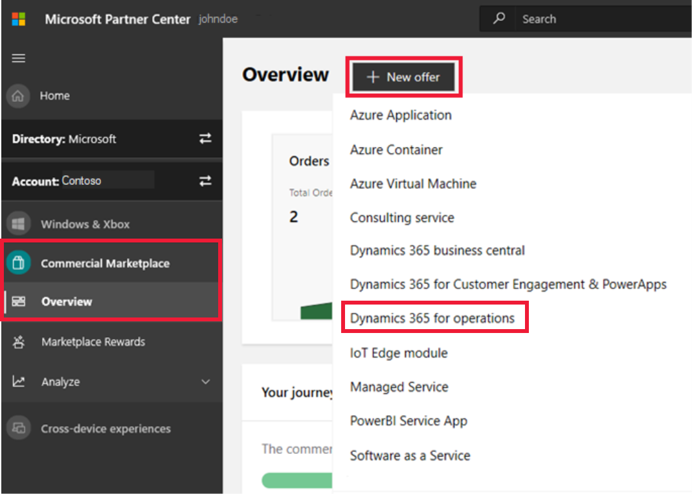

# How to create a Dynamics 365 for Finance and Operations

This article describes how to create a [Dynamics 365 for Finance and Operations](https://dynamics.microsoft.com/finance-and-operations) offer. This offer type is an enterprise resource planning (ERP) service that supports advanced finance, operations, manufacturing, and supply chain management. All offers for Dynamics 365 go through our certification process.

Before you start, [create a commercial marketplace account in Partner Center](partner-center-portal/create-account.md). Ensure that your account is enrolled in the commercial marketplace program.

## Before you begin

If you haven't done so yet, review [Plan a virtual machine offer](marketplace-virtual-machines.md). It will explain the technical requirements for your virtual machine and list the information and assets you’ll need when you create your offer.

## Create a new offer

1. Sign in to [Partner Center](https://partner.microsoft.com/dashboard/home).
2. In the left-nav menu, select **Commercial Marketplace** > **Overview**.
3. On the Overview page, select **+ New offer** > **Dynamics 365 for operations**.

    

> [!NOTE]
> After an offer is published, any edits you make to it in Partner Center appear on Microsoft AppSource only after you republish the offer. Be sure to always republish an offer after making changes to it.

## New offer

Enter an **Offer ID**. This is a unique identifier for each offer in your account.

- This ID is visible to customers in the web address for the offer and in Resource Manager templates, if applicable.
- Use only lowercase letters and numbers. The ID can include hyphens and underscores, but no spaces, and is limited to 50 characters. For example, if you enter **test-offer-1**, the offer web address will be `https://azuremarketplace.microsoft.com/marketplace/../test-offer-1`.
- The Offer ID combined with the Publisher ID must be under 40 characters in length.[ still trure? ]
- The Offer ID can't be changed after you select **Create**.

Enter an **Offer alias**. The offer alias is the name that's used for the offer in Partner Center.

- This name isn't used on AppSource. It is different from the offer name and other values that are shown to customers.
- This name can't be changed after you select **Create**.

Select **Create** to generate the offer. Partner Center opens the **Offer setup** page.

## Alias

Enter a descriptive name that we'll use to refer to this offer solely within Partner Center. The offer alias won't be used in the marketplace and is different than the offer name shown to customers. If you want to update the offer name navigate, see the [Offer listing](d365-operations-create-listing.md) page.

## Setup details

<!-- Select the **Package type** that applies to your offer: (Biz Central)

- An **Add-on** app extends the experience and the existing functionality of Dynamics 365 Business Central. For details, see [Add-on apps](/dynamics365/business-central/dev-itpro/developer/readiness/readiness-add-on-apps).
- A **Connect** app can be used in the scenario where there must be established a point-to-point connection between Dynamics 365 Business Central and a third-party solution or service. For details, see [Connect Apps](/dynamics365/business-central/dev-itpro/developer/readiness/readiness-connect-apps).
-->
For **How do you want potential customers to interact with this listing offer?**, select the option you'd like to use for this offer.

- **Get it now (free)** – List your offer to customers for free.
- **Free trial (listing)** – List your offer to customers with a link to a free trial. Offer listing free trials are created, managed, and configured by your service and do not have subscriptions managed by Microsoft.

    > [!NOTE]
    > The tokens your application will receive through your trial link can only be used to obtain user information through Azure Active Directory (Azure AD) to automate account creation in your app. Microsoft accounts are not supported for authentication using this token.

- **Contact me** – Collect customer contact information by connecting your Customer Relationship Management (CRM) system. The customer will be asked for permission to share their information. These customer details, along with the offer name, ID, and marketplace source where they found your offer, will be sent to the CRM system that you've configured. For more information about configuring your CRM, see [Customer leads](#customer-leads).

## Test drive

A test drive is a great way to showcase your offer to potential customers by giving them access to a preconfigured environment for a fixed number of hours. Offering a test drive results in an increased conversion rate and generates highly qualified leads. To learn more about test drives, see [What is a test drive?](what-is-test-drive.md).

> [!TIP]
> A test drive is different from a free trial. You can offer either a test drive, free trial, or both. They both provide customers with your solution for a fixed period-of-time. But, a test drive also includes a hands-on, self-guided tour of your product’s key features and benefits being demonstrated in a real-world implementation scenario.

To enable a test drive, select the **Enable a test drive** check box and select the **Type of test drive**. You will configure the test drive later. With test drive, configuring a CRM is required (see next section). To remove test drive from your offer, clear this check box.

## Customer leads

[!INCLUDE [Connect lead management](includes/connect-lead-management.md)]

For more information, see [Lead management overview](partner-center-portal/commercial-marketplace-get-customer-leads.md).

## Business Applications ISV Program

Your offer is initially enrolled in the Standard tier. If your solution meets program eligibility criteria, you may request an upgrade to the Premium tier, which offers expanded program benefits. If you do so, be sure to complete the [Co-sell module](https://aka.ms/BizAppsISVProgram) before you publish your offer.

Select the check box to request an upgrade to the premium tier.

Select **Save draft** before continuing to the next tab in the left-nav menu, **Properties**.

## Next steps

- [How to configure Dynamics 365 for Operations offer properties](d365-operations-create-properties.md)
- [Offer listing best practices](gtm-offer-listing-best-practices.md)