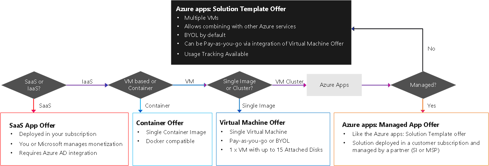

---  
title: Determine your listing type in Azure Marketplace | Azure
description: This article describes the eligibility criteria and publishing requirements partners trying to understand how to publish apps to the Azure Marketplace.
services:  Azure, Marketplace, Compute, Storage, Networking, Blockchain, Security
documentationcenter:
author: jm-aditi-ms
manager: pabutler
editor:

ms.assetid: 
ms.service: marketplace
ms.workload: 
ms.tgt_pltfrm: 
ms.devlang: 
ms.topic: article
ms.date: 06/13/2018
ms.author: ellacroi

---  

# Determine the Listing Type for Your Solution  
The storefronts support many publishing options: listing types and offer types. Select an offer type that best represents your solution and service details. All publishing options provide you access to lead sharing.   

| Storefront | Listing type | App type | Technical guidelines |  
|:--- |:--- |:--- |:--- |  
| AppSource | [List](#list) | [Consulting Service](#requirements-appSource-list-consulting-service) | [smp-cdn-prod.azureedge.net/documents/Microsoft%20AppSource%20Partner%20Listing%20Guidelines.pdf](https://smp-cdn-prod.azureedge.net/documents/Microsoft%20AppSource%20Partner%20Listing%20Guidelines.pdf) |  
| Azure Marketplace | [List](#list) | [Consulting service](#requirements-azure-marketplace-list-consulting-service) |  |  
| Azure Marketplace | [List](#list) | [Contact Me](#requirements-azure-marketplace-list-contact-me) |  |  
| Azure Marketplace | [Trial](#trial) | [Free trial / SaaS trial](#requirements-azure-marketplace-trial-free-trial-/-saas-trial) |  |  
| AppSource |  | Cortana Intelligence | [docs.microsoft.com/azure/machine-learning/team-data-science-process/cortana-intelligence-appsource-publishing-guide](https://docs.microsoft.com/azure/machine-learning/team-data-science-process/cortana-intelligence-appsource-publishing-guide) |  
| AppSource |  |Dynamics 365 for Customer Engagement | [docs.microsoft.com/dynamics365/customer-engagement/developer/publish-app-appsource](https://docs.microsoft.com/dynamics365/customer-engagement/developer/publish-app-appsource) |  
| AppSource |  | Dynamics 365 for Finance and Operations | [docs.microsoft.com/dynamics365/unified-operations/dev-itpro/lcs-solutions/lcs-solutions-app-source](https://docs.microsoft.com/dynamics365/unified-operations/dev-itpro/lcs-solutions/lcs-solutions-app-source) |  
| Azure Marketplace | [Trial](#trial) | [Interactive demo](#requirements-azure-marketplace-trial-interactive-demo) |  |  
| Azure Marketplace | [Trial](#trial) | [Test drive](#requirements-azure-marketplace-trial-test-drive) |  |  
| AppSource |  | Office 365 | [docs.microsoft.com/office/dev/store/submit-to-the-office-store](https://docs.microsoft.com/office/dev/store/submit-to-the-office-store) |  
| AppSource |  | Power BI | [docs.microsoft.com/power-bi/developer/office-store](https://docs.microsoft.com/power-bi/developer/office-store) | | Azure Marketplace | [Transact](#transact) | [Azure apps: Managed app](#requirements-azure-marketplace-transact-azure-apps-managed-app) |  [docs.microsoft.com/azure/managed-applications/overview](https://docs.microsoft.com/azure/managed-applications/overview) |  
| Azure Marketplace | [Transact](#transact) | [Azure apps: Solution template](#requirements-azure-marketplace-transact-azure-apps-solution-template) |   |  
| Azure Marketplace | [Transact](#transact) | [Container](#requirements-azure-marketplace-transact-container) |   |  
| Azure Marketplace | [Transact](#transact) | [SaaS app](#requirements-azure-marketplace-transact-saas-app) |   |  
| Azure Marketplace | [Transact](#transact) | [Virtual machine](#requirements-azure-marketplace-transact-virtual-machine) |   |   

## Azure Certified program  
All virtual machines (VMs) published in the Azure Marketplace are tested for the Azure Certified program.  
*   For more information, visit the Microsoft Azure Certified page located at [azure.microsoft.com/marketplace/programs/certified](https://azure.microsoft.com/marketplace/programs/certified). 

The certification program provides the following.  
*   Your virtual machine is compatible with the Azure platform and the Marketplace selling model.  
*   Your virtual machine is tested for online image safety compliance, including viruses and malware.  
*   Your virtual machine includes badging at the offer level. Badging as a validated solution enhances promotion for Microsoft enterprise customers.   

---   

## AppSource Publishing by Product  
The following table provides more information about the specific requirements for AppSource apps that extend Office, Dynamics, and Power BI.  

| Listing type | App type | Technical guidelines |  
|:--- |:--- |:--- |  
| [List](#list) | [Consulting service](#requirements-appSource-list-consulting-service) | [smp-cdn-prod.azureedge.net/documents/Microsoft%20AppSource%20Partner%20Listing%20Guidelines.pdf](https://smp-cdn-prod.azureedge.net/documents/Microsoft%20AppSource%20Partner%20Listing%20Guidelines.pdf) |  
|  | Cortana Intelligence | [docs.microsoft.com/azure/machine-learning/team-data-science-process/cortana-intelligence-appsource-publishing-guide](https://docs.microsoft.com/azure/machine-learning/team-data-science-process/cortana-intelligence-appsource-publishing-guide) |  
|  |Dynamics 365 for Customer Engagement | [docs.microsoft.com/dynamics365/customer-engagement/developer/publish-app-appsource](https://docs.microsoft.com/dynamics365/customer-engagement/developer/publish-app-appsource) |  
|  | Dynamics 365 for Finance and Operations | [docs.microsoft.com/dynamics365/unified-operations/dev-itpro/lcs-solutions/lcs-solutions-app-source](https://docs.microsoft.com/dynamics365/unified-operations/dev-itpro/lcs-solutions/lcs-solutions-app-source) |  
|  | Office 365 | [docs.microsoft.com/office/dev/store/submit-to-the-office-store](https://docs.microsoft.com/office/dev/store/submit-to-the-office-store) |  
|  | Power BI | [docs.microsoft.com/power-bi/developer/office-store](https://docs.microsoft.com/power-bi/developer/office-store) |  

---   

## Azure Marketplace Publishing by Product  

  

The following table provides more information about the specific requirements for Azure Marketplace offers.  

| Listing type | Offer type |  Technical guidelines |  
|:--- |:--- |:--- |  
| [List](#list) | [Consulting service](#requirements-azure-marketplace-list-consulting-service) |  |  
| [List](#list) | [Contact Me](#requirements-azure-marketplace-list-contact-me) |  |  
| [Trial](#trial) | [Free trial / SaaS trial](#requirements-azure-marketplace-trial-free-trial-/-saas-trial) |  |  
| [Trial](#trial) | [Interactive demo](#requirements-azure-marketplace-trial-interactive-demo) |  |  
| [Trial](#trial) | [Test drive](#requirements-azure-marketplace-trial-test-drive) |  |  
| [Transact](#transact) | [Azure apps: Managed app](#requirements-azure-marketplace-transact-azure-apps-managed-app) |  [docs.microsoft.com/azure/managed-applications/overview](https://docs.microsoft.com/azure/managed-applications/overview) |  
| [Transact](#transact) | [Azure apps: Solution template](#requirements-azure-marketplace-transact-azure-apps-solution-template) |   |  
| [Transact](#transact) | [Container](#requirements-azure-marketplace-transact-container) |   |  
| [Transact](#transact) | [SaaS app](#requirements-azure-marketplace-transact-saas-app) |   |  
| [Transact](#transact) | [Virtual machine](#requirements-azure-marketplace-transact-virtual-machine) |   |  

---   

## Non-transact Listings  
This section describes all offers that do not use the Transact listing type. 

### List  
The List listing type includes the following Offer types on the storefronts in the marketplace.  

| Offer type | Storefront | Details |  
|:---        |:---        |:---     |  
| Consulting Services | AppSource | [Requirements: AppSource: List: Consulting Services](#requirements-appsource-list-consulting-service) |  
| Consulting Services | Azure Marketplace | [Requirements: Azure Marketplace: List: Consulting Services](#requirements-azure-marketplace-list-consulting-service) |  
| Contact Me | AppSource |  |  
| Contact Me | Azure Marketplace | [Requirements: AppSource: List: Contact Me](#requirements-azure-marketplace-list-contact-me) |  

#### Requirements: AppSource: List: Consulting service  
When the offer consists primarily of professional services, for example, assessments, implementations, workshops, use the Consulting Services offer type.  

| Requirements | Details |  
|:--- |:--- |  
| Service offer characteristics | Your consulting service must meet the following criteria.<ul> <li>Deliver a fixed-scope, fixed-duration, fixed-price (or free) engagement.</li> <li>Orient primarily for pre-sales.</li> <li>Limit to a single customer.</li> <li>Conduct on site.</li> </ul> |  
| Partner requirements for Consulting Services | You meet the criteria in the relevant area for your service.<table><tr><th>Solution Area</th><th>Criteria</th></tr><tr><td>Dynamics 365 for Customer Engagement</td><td>Have Silver or Gold Cloud Customer Relationship Management competency.</td></tr><tr><td>Dynamics 365 for Finance and Operations, Enterprise edition</td><td>Have Silver or Gold Enterprise Resource Planning competency and revenue from your cloud operations in the trailing 12 months of $25,000 or more.</td></tr><tr><td>Dynamics 365 for Finance and Operations, Business edition</td><td>Serve as Cloud Services Provider (CSP) or Digital Partner of Record (DPOR) for one or more customers.</td></tr><tr><td>Power BI</td><td>Meet the Solution Partner criteria.</td></tr><tr><td>PowerApps</td><td>Have a Partner Showcase solution.</td></tr></table><ul> <li>For more information about customer relationship management, visit the Cloud Customer Relationship Management page located at [partner.microsoft.com/membership/cloud-customer-relationship-management-competency](https://partner.microsoft.com/membership/cloud-customer-relationship-management-competency).</li> <li>For more information about resource planning, visit the Enterprise Resource Planning page located at [partner.microsoft.com/membership/enterprise-resource-planning-competency](https://partner.microsoft.com/membership/enterprise-resource-planning-competency).</li> <li>For more information about CSP, visit the Cloud Services Provider page located at [partner.microsoft.com/cloud-solution-provider](https://partner.microsoft.com/cloud-solution-provider).</li> <li>For more information about DPOR, visit the Digital Partner of Record and Partner Association page located at [partner.microsoft.com/membership/digital-partner-of-record](https://partner.microsoft.com/membership/digital-partner-of-record).</li> <li>For more information about solution partner criteria, visit the Solution Partner Overview and Incentives document located at [www.microsoftpartnerserverandcloud.com/_layouts/download.aspx?SourceUrl=Hosted%20Documents/Power%20BI%20Program%20Overview%20%26%20Incentives.pdf](https://www.microsoftpartnerserverandcloud.com/_layouts/download.aspx?SourceUrl=Hosted%20Documents/Power%20BI%20Program%20Overview%20%26%20Incentives.pdf).</li> <li>For more information about partner showcase, visit the Partner Showcase page located at [powerapps.microsoft.com/partner-showcase](https://powerapps.microsoft.com/partner-showcase).</li> </ul> |  

#### Requirements: Azure Marketplace: List: Consulting service  

| Requirements | Details |  
|:--- |:--- |  
| Service offer characteristics | Your consulting service must meet the following criteria.<ul> <li>Deliver a fixed-scope, fixed-duration, fixed-price (or free) engagement.</li> <li>Orient primarily for pre-sales.</li> <li>Limit to a single customer.</li> <li>Conduct on site.</li> </ul> |  
| Partner requirements for Consulting Services | You must have silver or gold in one of the following competencies in the relevant area for your service. <table><tr><th>Solution Area</th><th>Competency</th></tr><td>Cloud Platform and Infrastructure</td><td>Cloud Platform Data Center</td><tr><td>Application Development and ISV</td><td>Application Development Application Integration DevOps</td></tr><tr><td>Data Management and Analytics</td><td>Data Analytics Data Platform</td></tr></table><ul> <li>For more information about competencies, visit the Competencies Through Microsoft Partner Network page located at [partner.microsoft.com/membership/competencies](https://partner.microsoft.com/membership/competencies).</li> <li>For more information about listing, visit the Azure Marketplace Consulting Services page located at [docs.microsoft.com/azure/marketplace/consulting-services](https://docs.microsoft.com/azure/marketplace/consulting-services).</li></ul> |  

#### Requirements: Azure Marketplace: List: Contact Me  
Use Contact Me offer type when using trial or transact listing type is not feasible. The benefit of Contact Me offer type is that you to able to immediately receive leads with an in-market solution. Your leads should be nurtured into the foundational deals to start your business flywheel. The drawback is that customer engagement is limited, when compared with other offer types.  

>[!IMPORTANT]
>Customer engagement is best with Trial and Transact offer types. The value of Contact Me listing type is the lead that you receive. If you choose the Contact Me listing type, then you must verify that your lead destination is configured and you are ready to maximize your lead.  

---   

### Trial  
Providing a trial experience increases the engagement level provided to your customers. An increased engagement level causes richer exposure to your solution. A trial offer type enables customers to explore your solution before buying. With the trial listing type, you have a higher chance of promotion in the storefronts. You should also expect more and richer leads from customer engagements.  

Your app or offer using the Trial listing type is deployed to your trial environment, Azure subscription, or both. Other listing types would be deployed to the environment or Azure subscription of your customer. Your app or offer should be customer led without additional requirements to buy. Your app or offer should be minimal, if any, additional configuration to complete a use-case. Your app or offer must include free support at least for the duration of the trial period. Your customers should be nurtured and monitored along a deliberate evaluation path for best results. You are encouraged to use leads provided on the marketplace and from your own in-app intelligence. Your leads should be used to monitor and manage your customers.  

The Trial listing type includes the following Offer types on the storefronts in the marketplace.  

| Offer type | Storefront | Details |  
|:---        |:---        |:---     |  
| Free / SaaS trial | AppSource | [Listing Type Requirements: Trial](#listing-type-requirements-trial) |  
| Free / SaaS trial | Azure Marketplace | [Requirements: Azure Marketplace: Trial: Free trial / SaaS trial](#requirements-azure-marketplace-trial-free-trial-/-saas-trial) |  
| Interactive demo | AppSource | [Listing Type Requirements: Trial](#listing-type-requirements-trial) |  
| Interactive demo | Azure Marketplace | [Requirements: Azure Marketplace: Trial: Interactive demo](#requirements-azure-marketplace-trial-interactive-demo) |  
| Test drive | AppSource | [Listing Type Requirements: Trial](#listing-type-requirements-trial) |  
| Test drive | Azure Marketplace | [Requirements: Azure Marketplace: Trial: Test drive](#requirements-azure-marketplace-trial-test-drive) |  

#### Requirements: Azure Marketplace: Trial  

| Requirement | Details |  
|:--- |:--- |  
| Free trial period and trial experience | Your customer may try your app for free for a limited time.  Your customer is not required to pay any license or subscription fees for your offer. Your customers are not required to pay for the underlying Microsoft first-party product or service. All trial options are deployed to your Azure subscription. You have sole control of the cost optimization and management.  You may choose a free trial, interactive demo, or test drive. No matter what you choose, your free trial must provide the customer a pre-set amount of time to try your offer at no additional cost.<ul> <li>To begin the process of creating a test drive, send an email to [amp-testdrive@microsoft.com](mailto:amp-testdrive@microsoft.com).</li> </ul>Note: All SaaS trial offers on Azure Marketplace must allow your customer to use work credentials to sign in.<ul> <li>For more information, visit the AppSource trial experiences section located at [docs.microsoft.com/azure/active-directory/develop/active-directory-devhowto-appsource-certified#appsource-trial-experiences](https://docs.microsoft.com/azure/active-directory/develop/active-directory-devhowto-appsource-certified#appsource-trial-experiences).</li> </ul> |  
| Easily configurable, ready-to-use solution | Your app must be easy and quick to configure and set up. |  
| Availability / uptime | Your SaaS app or platform must have an uptime of at least 99.9%. |  
| Azure Active Directory | Your offer must allow Azure Active Directory (Azure AD) federated single sign-on (SSO) (Azure AD federated SSO) with consent enabled. |  

#### Requirements: Azure Marketplace: Trial: Free trial / SaaS trial  
You provide a solution or app using a free-to-try, software-as-a-service (SaaS)-based trial. SaaS trial offer type drives high-quality leads from interested customers, to help you start your business flywheel. Free trial offer type may be presented as a limited-use or limited-duration trial account. Free Trial should include a call to action for accelerating conversion to paid use of your solution.  

| Benefit | Requirement |  
|:--- |:--- |  
| Enables your customer to try your product before buying with an automated method for converting to paid use. Also enables proofs of concept for the customer and joint engagement with Microsoft sales teams. | Your solution is Virtual machine or Azure apps: Solution template offer type.  Your solution is SaaS offer type and you provide a multitenant SaaS product.  You have a first-run experience to get your customer started quickly.  You have a single tenant, but are adding customers as guests. |  

#### Requirements: Azure Marketplace: Trial: Interactive demo  
You provide a guided experience of your solution to your customers by using an interactive demonstration. The benefit of Interactive demo offer type is that you provide a trial experience without complicated provisioning of your complex solution. Interactive demo offer type provides your customer a look around your solution. Interactive demo offer type provides your leads that should nurture foundational deals to start your business flywheel.  

| Benefit | Requirement |  
|:--- |:--- |  
| Enables your customers to see your solution in action without the complexity of setting up. | Your solution requires complex settings that would be hard to achieve within the trial period. |  

#### Requirements: Azure Marketplace: Trial: Test drive  
You deploy one or more virtual machines through infrastructure-as-a-service(IaaS) or SaaS apps. A benefit of the Test drive offer type is the automated provisioning of a virtual machine or entire solution led by a partner-hosted guided tour. A test drive provides an evaluation at no additional cost to your customer. Your customer does not need to be an existing Azure customer to help generate higher-quality leads.  

| Benefit | Requirement |  
|:--- |:--- |  
| Enables your customer to try your product before buying.  Provides a guided experience of your solution using pre-configured settings.  The following are additional benefits when using a test drive.<ul> <li>27% of user searches on the marketplace are refined by customers to only show offers with test drives.</li> <li>Offers with test drives generate 38% more leads than offers without.</li> <li>36% of new customer acquisitions on the marketplace come from customers who took a test drive.</li> <li>Test drives enable Microsoft field sellers to better understand your product for co-sell efforts.</li> </ul> | Your solution is a Virtual machine, Azure Apps: Solution template, SaaS app with a single tenant, or is complicated to provision.   You do not have a method to convert your trial to a paid offer. |  

---

## Transact-specific Listings
This section describes all offers that use the Transact listing type.

### Transact  
The Transact listing type includes the following Offer types on the storefronts in the marketplace.  

| Offer type | Storefront | Details |   
|:---        |:---        | :--- |  
| Azure apps: Managed app | Azure Marketplace | [Requirements: Azure Marketplace: Transact: Azure apps: Managed app](#requirements-azure-marketplace-transact-azure-apps-managed-app) |  
| Azure apps: Solution template | Azure Marketplace | [Requirements: Azure Marketplace: Transact: Azure apps: Solution template](#requirements-azure-marketplace-transact-azure-apps-solution-template) |  
| Containers | Azure Marketplace | [Requirements: Azure Marketplace: Transact: Container](#requirements-azure-marketplace-transact-container) |  
| SaaS app  | Azure Marketplace | [Requirements: Azure Marketplace: Transact: SaaS app](#requirements-azure-marketplace-transact-saas-app) |  
| Virtual machine | Azure Marketplace | [Requirements: Azure Marketplace: Transact: Virtual Machine](#requirements-azure-marketplace-transact-virtual-machine) |  

#### Requirements: Azure Marketplace: Transact: Azure apps: Managed app  
Use the Azure app: Managed app offer type when the following conditions are required.  
*   You deploy either a subscription-based solution for your customer using either a VM or an entire IaaS-based solution.  
*   You or your customer require that the solution is managed by a partner.  

    >[!NOTE]
    >For example, a partner may be an SI or managed service provider (MSP).  
  
*   For a list of commonly asked questions, visit the Marketplace FAQs page located at [azure.microsoft.com/marketplace/faq](https://azure.microsoft.com/marketplace/faq).  

>[!NOTE]
> Managed apps must be deployable through the Marketplace. If customer communication is a concern, then you should reach out to interested customers after you have enabled lead sharing.  

#### Requirements: Azure Marketplace: Transact: Azure apps: Solution template  
Use the Azure App: Solution template offer type when your solution requires additional deployment and configuration automation beyond a simple VM. You may automate the provisioning of one or more VMs using Azure apps: Solution templates. You may also provision networking and storage resources. Azure apps: Solution templates offer type provides automation benefits for single VMs and entire IaaS-based solutions.  

#### Requirements: Azure Marketplace: Transact: Container  
Use the Container offer type when your solution is a Docker container image provisioned as a Kubernetes-based Azure container service.

>[!NOTE]
>For example, a Kubernetes-based Azure container service like Azure Kubernetes Service or Azure Container Instances, the choice of Azure customers for a Kubernetes-based container runtime.  

Microsoft currently supports free and bring-your-own-license (BYOL) licensing models. More commerce options are scheduled over the next several months, including subscription and consumption-based billing options.  

| Requirement | Details |  
|:--- |:--- |  
| Billing and metering | Support either the free or BYOL billing model. |  
| Image built from Dockerfile | Container images must be based on the Docker image specification and must be built from a Dockerfile.<ul> <li>For more information about building docker images, visit the Usage section located at [docs.docker.com/engine/reference/builder/#usage](https://docs.docker.com/engine/reference/builder/#usage).</li> </ul> |  
| Hosting in ACR | Container images must be hosted in an Azure Container Registry (ACR) repository.<ul> <li>For more information about working with ACR, visit the Quickstart: Create a container registry using the Azure portal page located at [docs.microsoft.com/azure/container-registry/container-registry-get-started-portal](https://docs.microsoft.com/azure/container-registry/container-registry-get-started-portal).</li> </ul> |  
| Image tagging | Container images must contain at least 1 tag (maximum tags: 16).<ul> <li>For more information about tagging an image, visit the docker tag page located at [docs.docker.com/engine/reference/commandline/tag](https://docs.docker.com/engine/reference/commandline/tag).</li> </ul> |  

#### Requirements: Azure Marketplace: Transact: SaaS app  
Use SaaS app offer type to enable your customer to buy your SaaS-based, technical solution as a subscription. The following requirements must be met for your SaaS app.  
*   Price and bill the service at a flat, monthly rate.  
*   Provide a method to upgrade or cancel the service at any time.  

Microsoft hosts the commerce transaction. Microsoft bills your customer on your behalf. To use bill a SaaS App as a subscription, you must enable you own subscription management service API. Your subscription management service API must communicate directly with the Azure Resource Manager APIs. Your subscription management service API must support service provisioning, upgrading, and canceling.  

| Requirement | Details |  
|:--- |:--- |  
|Billing and metering | Your offer is priced at a monthly flat rate. Usage-based pricing and usage-based "true-up" capabilities are not supported at this time. |  
|Cancelation | Your offer is cancelable by the customer at any time. |  
|Transaction landing page | You host an Azure co-branded transaction landing page where users can create and manage their SaaS service account. |   
| Subscription API | You expose a service that can interact with the SaaS Subscription to create, update, and delete a user account and service plan. Critical API changes must be supported within 24 hours. Non-critical API changes will be released periodically. |  

#### Requirements: Azure Marketplace: Transact: Virtual machine  
Use the Virtual machine offer type when you deploy a virtual appliance to the subscription associated with your customer. VMs are fully commerce enabled using Pay-As-You-Go or Bring-your-Own-License (BYOL) licensing models. Microsoft hosts the commerce transaction and bills your customer on your behalf. You get the benefit of using the preferred payment relationship between your customer and Microsoft, including any Enterprise Agreements.  

>[!NOTE]
>At this time, the monetary commitments associated with an Enterprise Agreement are able to be used against the Azure usage of your VM, but not against your software licensing fees.  

>[!NOTE]
>You are able to restrict the discovery and deployment of your VM to a specific set of customers by listing the image and pricing as a Private offer. Private offers unlock the ability for you to create exclusive offers for your closest customers and offer customized software and terms. The customized terms enable you to highlight a variety of scenarios, including field-led deals with specialized pricing and terms as well as early access to limited release software. Private offers enable you to give specific pricing or products to a limited set of customers by creating a new SKU with those details.  
*   For more information about Private Offers, visit the Private Offers on Azure Marketplace page located at [azure.microsoft.com/blog/private-offers-on-azure-marketplace](https://azure.microsoft.com/blog/private-offers-on-azure-marketplace).  

| Requirement | Details |  
|:--- |:--- | 
| Billing and metering | Your VM must support either BYOL or Pay-As-You-Go monthly billing. |  
| Azure-compatible virtual hard disk (VHD) | VMs must be built on Windows or Linux.<ul> <li>For more information about creating a Linux VHD, visit the Create an Azure-compatible VHD (Linux-based) section located at [docs.microsoft.com/azure/marketplace-publishing/marketplace-publishing-vm-image-creation#2-create-an-azure-compatible-vhd-linux-based](https://docs.microsoft.com/azure/marketplace-publishing/marketplace-publishing-vm-image-creation#2-create-an-azure-compatible-vhd-linux-based).</li> <li>For more information about creating a Windows VHD, visit the Create an Azure-compatible VHD (Windows-based) section located at [docs.microsoft.com/azure/marketplace-publishing/marketplace-publishing-vm-image-creation#3-create-an-azure-compatible-vhd-windows-based](https://docs.microsoft.com/azure/marketplace-publishing/marketplace-publishing-vm-image-creation#3-create-an-azure-compatible-vhd-windows-based).</li> </ul> |  

## Next steps
*   Visit the [Azure Marketplace and AppSource Publisher Guide](./marketplace-publishers-guide.md) page.  
 
---  
